## 本章简介
&emsp;&emsp;第2章介绍了查询和排序，属于SQL语言中基础中的基础。本章要深入一步，介绍两个知识点，一个是单行函数，另外一个是多表查询。这两个知识点不论在软件开发过程中，还是在企业面试时，都会经常涉及，读者必须掌握。

 

 

 

## 3.1  SQL函数

 

&emsp;&emsp;函数，和Java中的方法类似，是完成一定功能的代码集合。SQL函数是SQL语言的一个强有力特征，被广泛使用。SQL函数可以完成如下功能：

- 执行数据计算。

- 修改单个数据项。

- 格式化显示的日期和数字。

- 进行数据类型转换。

- 根据行分组操纵输出。

&emsp;&emsp;与Java中的方法不同的是，SQL函数有输入参数，并且总有一个返回值。由于篇幅的关系，本书只简要介绍作为软件开发人员最常用的函数。

&emsp;&emsp;根据函数所操作数据行数的不同，可以将SQL函数分为两类，单行函数和多行函数，如图3.1所示。其中单行函数仅对单个行进行计算，并且每行返回一个结果。在单行函数中，又可根据操作对象的不同分为字符函数、数字函数、日期函数、转换函数和通用函数，如图3.2所示。而多行函数可以操作成组的多个行，每个行组返回一个结果，这些函数又称组函数，将在后面的课程中系统介绍。单行函数可操作的输入参数，可以是常量、变量、字段名和表达式。单行函数可以在SELECT、WHERE和ORDER BY子句中出现，也可以进行嵌套。


<p align="center">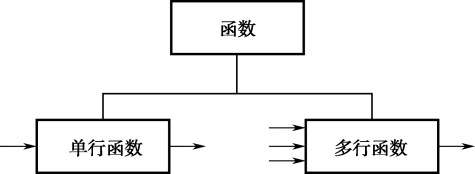</p>  
<p align="center">图3.1  SQL函数分类 </p>  

<p align="center">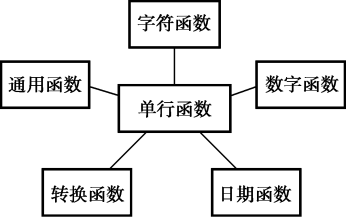</p>  
<p align="center">图3.2  单行函数分类</p>  
​                                            

## 3.2  字符、数字、日期函数

 

&emsp;&emsp;本节介绍单行函数中的字符函数、数字函数和日期函数。


### 3.2.1  字符函数  


&emsp;&emsp;单行字符函数接受字符数据作为输入，既可以返回字符值也可以返回数字值。作为输入的字符数据，既可以是字段名也可以是表达式。下面列举了一些常用的单行字符函数，如表3.1所示，其中输入参数用input表示，代表值为字符的字段名或表达式。

表3.1  单行字符函数

| 函    数                                    | 说    明                                                     |
| ------------------------------------------- | ------------------------------------------------------------ |
| LOWER(input)                                | 将输入字符值全部转换为小写                                   |
| UPPER(input)                                | 将输入字符值全部转换为大写                                   |
| INITCAP(input)                              | 将每个单词的首字母值转换为大写，其他值为小写                 |
| CONCAT(input1,input2)                       | 连接第一个字符值到第二个字符值，等价于连接运算符“\|\|”       |
| SUBSTR(input,m[, n])                        | 获取字符值中指定的字符，从m位置开始，取n个字符长度，如果n被忽略，则取到字符值结尾处 |
| LENGTH(input)                               | 返回字符值的字符数                                           |
| INSTR(input, char [,m] [, n] )              | 返回在字符值中查找字符串char的数字位置。参数m作为查找的开始，参数n代表第n次发现。m和n的默认值是1，即默认从开始位置查找，并且报告第一个发现的位置 |
| REPLACE(input, char1,char2)                 | 从字符值中查找字符串char1，找到则替换成char2                 |
| LPAD(input, n, char)   RPAD(input, n, char) | 从左边（或右边）对字符值使用指定的字符char进行填充，直到满足参数n的长度要求 |

 

&emsp;&emsp;单行字符函数和Java中的字符串函数类似，比较简单，这里不逐一使用SQL语句演示，下面通过一些简单的示例，如表3.2所示，来介绍各个函数的作用。

表3.2  单行字符函数示例

| 函    数                              | 结    果       |
| ------------------------------------- | -------------- |
| CONCAT('Oracle', 'DB')                | OracleDB       |
| SUBSTR('OracleDB',1,6)                | Oracle         |
| LENGTH('OracleDB')                    | 8              |
| INSTR('OracleDB', 'DB')               | 7              |
| REPLACE('OracleDB', 'DB', 'Database') | OracleDatabase |
| LPAD('OracleDB', 12, '*')             | ****OracleDB   |

 

&emsp;&emsp;现在需要从雇员表中获取雇员编号、姓名（包括first_name和last_name，字段标题为Name）、EMAIL、EMAIL长度、EMAIL中@符号的位置信息，且仅获取职位编号从第四个字符开始，之后的字符串是REP的雇员，其SQL语句如下：


```
SELECT employee_id, CONCAT(first_name || ' ', last_name) AS "Name", EMAIL,LENGTH (EMAIL), INSTR (EMAIL, '@') 

FROM employees 

WHERE SUBSTR(job_id,4)  =  'REP'
```


&emsp;&emsp;执行SQL语句，部分显示结果如图3.3所示，因为EMAIL字段仅保存了@符号之前的内容，未保存@符号及之后的域名，所以EMAIL中@符号的位置信息结果均为0。


<p align="center">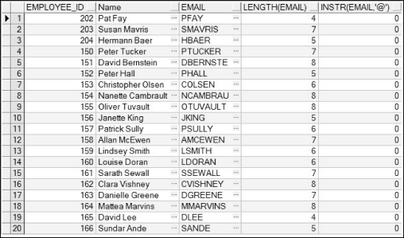</p>  
<p align="center">图3.3  单行字符函数综合使用</p>  


### 3.2.2  数字函数  

&emsp;&emsp;数字函数，接受数字输入并且返回数字值。下面列举了一些常用的单行数字函数，如表3.3所示，其中输入参数用input表示，代表值为数字的字段名或表达式。

表3.3  单行数字函数

| 函  数  名           | 说    明                                                     |
| -------------------- | ------------------------------------------------------------ |
| ROUND(input[,   n])  | 将数字值四舍五入，参数n表示小数位，如果n被忽略，无小数位     |
| TRUNC(input   [, n]) | 将数字值截断，参数n表示截断到的小数位，如果n被忽略，则默认为0 |
| MOD(m,n)             | 返回m除以n的余数                                             |

 

&emsp;&emsp;先看下面这个SQL语句，执行该SQL语句的结果如图3.4所示。


```
SELECT ROUND(123.45678),ROUND(123.45678,2),ROUND(123.45678,-1) FROM dual
```


<p align="center">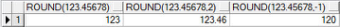</p>  
<p align="center">图3.4  ROUND函数的使用</p>  


&emsp;&emsp;这个案例中的ROUND函数很简单，这里不做解释，需要指出的是，该SQL语句中出现了一个dual表，对于这个表，需要读者有所了解。dual表的所有者是用户SYS，并且可以被所有的用户访问。它只包含一列DUMMY和带有值X的一行。dual表通常用于在没有目标表的情况下，为了达到SELECT语法完整性要求（SELECT子句必须包括FROM子句），而使用的一个不需要从表中真实取数值的表。

&emsp;&emsp;下面通过一些简单的示例，如表3.4所示，介绍数字函数的使用。

表3.4  单行数字函数示例

| 函    数           | 结    果 | 函    数            | 结    果 |
| ------------------ | -------- | ------------------- | -------- |
| TRUNC(123.45678)   | 123      | TRUNC(123.45678,-3) | 0        |
| TRUNC(123.45678,3) | 123.456  | TRUNC(123.45678,-2) | 100      |
| MOD(21,5)          | 1        | MOD(-21,5)          | -1       |

### 3.2.3  日期函数  

&emsp;&emsp;在Oracle数据库中，以数字格式存储日期值，分别表示世纪、年、月、日、小时、分和秒。对于日期，Oracle默认显示和输入格式是DD-MON-RR，例如17-JUN-13。但在其他客户端工具中，可能会以不同的格式显示，比如在PL/SQL Dev中，显示格式为YYYY/MM/DD，例如2013/6/17。

&emsp;&emsp;虽然默认的显示和输入格式是DD-MON-RR，但是存储在数据库的日期不是这种格式，所有日期和时间的组成部分都会被存储。也就是说，17-JUN-13显示的是日、月和年，但日期和时间的信息也包含在日期类型里。一个完整的日期类型如下：2013年6月17日11:22:33。

&emsp;&emsp;日期函数SYSDATE，它返回当前数据库服务器的日期和时间（在SQL Server中使用GETDATE()方法）。可以执行如下的SQL语句，获取数据库服务器的日期：


```
SELECT SYSDATE FROM dual
```


&emsp;&emsp;既然Oracle数据库以数字方式存储日期，也就可以用算术运算符对日期类型进行计算。在日期上加或减一个数，得到的是增加或减少该天数后的日期类型，而用两个日期类型相减，得到的是这两个日期相差的天数。

&emsp;&emsp;例如想知道雇员表中，部门编号为60的雇员，截止到今天共工作了多少周，则可以使用如下的SQL语句（获得工作周的基本思路是用今天的日期减去雇佣日期，除以7后的结果就是工作周。不过此时的工作周带有小数，为了显示整数，所以在该结果的基础上，使用了ROUND函数进行了四舍五入）：


```
SELECT first_name || ' ' || last_name AS "Name",ROUND((SYSDATE-hire_date)/7) AS "Weeks"

FROM employees

WHERE department_id = 60
```


&emsp;&emsp;执行该SQL语句，运行结果如图3.5所示。


<p align="center"></p>  
<p align="center">图3.5  SYSDATE函数的使用</p>  


&emsp;&emsp;日期函数对Oracle日期类型进行操作，下面列举了一些常用的日期函数，如表3.5所示，除了MONTHS_BETWEEN返回一个数字值，所有日期函数都返回一个日期数据类型。

表3.5  日期函数

| 函    数                    | 说    明                                                     |
| --------------------------- | ------------------------------------------------------------ |
| MONTHS_BETWEEN(date1,date2) | 两个日期之间的月数                                           |
| ADD_MONTHS(date,n)          | 添加n个日历月后的日期                                        |
| NEXT_DAY(date,   char)      | 计算在指定日期之后的下一个周char的指定天的日期，char值可以是一个表示星期的数或字符串 |
| LAST_DAY(date)              | 计算包含指定日期所在月的最后一天的日期                       |
| ROUND(date[,'fmt'])         | 按格式化模式fmt四舍五入到指定单位的日期，如果格式化模式 fmt 被忽略，则四舍五入到天 |
| TRUNC(date[,'fmt'])         | 按格式化模式fmt截断到指定单位的日期，如果格式化模式fmt被忽略，则截断到天 |

 

&emsp;&emsp;上面有些函数的说明不容易看懂，接下来通过一些具体的示例，如表3.6所示，会更容易明白。

表3.6  日期函数示例

| 函    数                                 | 结    果         |
| ---------------------------------------- | ---------------- |
| MONTHS_BETWEEN ('17-JUN-13','21-JAN-11') | 28.8709677419355 |
| ADD_MONTHS ('17- JUN-13',10)             | '17- APR-14'     |
| NEXT_DAY('17- JUN-13', 'SUNDAY')         | '24- JUN-13'     |
| LAST_DAY('17- JUN-13')                   | '30- JUN-13'     |

 

&emsp;&emsp;在英文系统中，月用三个字母作为缩写，1到12月分别是JAN、FEB、MAR、APR、MAY、JUN、JUL、AUG、SEP、OCT、NOV、DEC，周用具体的英文字母表示，周日、周一到周六分别是SUNDAY、MONDAY、TUESDAY、WEDNESDAY、THURSDAY、FRIDAY、SATURDAY。在中文系统（字符集）下，月和周的表示方式更简单，直接用1月、2月……12月，星期一、星期二……星期日表示。

&emsp;&emsp;接下来结合雇员表看一个稍微复杂点的例子。假设在中文系统中，要查询所有受雇日期在2007年1月1日到2007年6月30日的雇员，需要查询的信息包括雇员编号、雇佣日期、已雇佣的月数、三个月试用期结束日期、提交入职资料日期（雇佣日后下一周的周一）、首月结薪日期（到受雇月最后一天）的信息，其SQL语句如下：


```
SELECT employee_id AS "员工编号", hire_date AS "入职日期", MONTHS_BETWEEN (SYSDATE, hire_date) AS "雇佣月数", ADD_MONTHS (hire_date, 3)  AS "试用期结束日期", NEXT_DAY (hire_date, '星期一') AS "资料提交日期", LAST_DAY(hire_date) AS "首月结薪日期"

FROM employees 

WHERE hire_date BETWEEN '1- 1月-07' AND '30- 6月-07'
```


&emsp;&emsp;执行SQL语句，结果如图3.6所示。


<p align="center">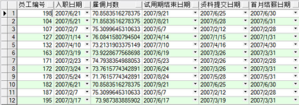</p>  
<p align="center">图3.6  日期函数的使用</p>  


&emsp;&emsp;ROUND和TRUNC函数用于日期时，这些函数按指定的格式化模板四舍五入或截断，默认到日，也可以四舍五入或截断到月或年。再来看一些示例，如表3.7所示。


表3.7  日期函数示例

| 函数（假定SYSDATE值为'17- JUN-13'） | 结    果     |
| ----------------------------------- | ------------ |
| ROUND(SYSDATE, 'MONTH')             | '01- JUL-13' |
| ROUND(SYSDATE, 'YEAR')              | '01- JAN-13' |
| TRUNC (SYSDATE, 'MONTH')            | '01- JUN-13' |
| TRUNC (SYSDATE, 'YEAR')             | '01- JAN-13' |

 

&emsp;&emsp;注意，在对月份进行四舍五入时，日期1日到15日结果在当前月的第一天，日期16日到31日结果在下月的第一天；如果对年进行四舍五入，1月到6月结果在当前年的1月1日，7月到12 月的结果在下年的1月1日。

 


## 3.3  上机任务


#### 目标：完成本章3.2节的任务。

 


时间：30分钟。

 


形式：每个学员独立完成，小组组长检查。

 


工具：PL/SQL Dev。

 

 

 

 

 


## 3.4  转换函数

 

&emsp;&emsp;和Java语言类似，既然SQL语言中有数据类型，那么就会存在数据类型转换。

&emsp;&emsp;在某些情况下，Oracle数据库需要使用某种数据类型的数据，而实际提供的却是另外一种数据类型，如果Oracle能自动将提供的数据类型数据转换为期望的数据类型的数据，这就是隐式数据类型转换。

&emsp;&emsp;在Oracle中，对于直接赋值，Oracle数据库能够自动将VARCHAR2或CHAR转换到NUMBER和DATE类型，也可以将NUMBER和DATE自动转换到VARCHAR2类型。

&emsp;&emsp;隐式数据类型转换，不只可以在上面提到的数据类型之间进行，在另一些数据类型之间也可以进行隐式转换，比如VARCHAR2可以被隐式地转换成ROWID。

&emsp;&emsp;除了隐式数据类型转换，另外一种就是使用转换函数，显式地将某种数据类型转换成另外一种数据类型，也就是本节的重点。

&emsp;&emsp;SQL语言提供了三种函数，实现从一种数据类型数据转换到另一种类型，它们分别是TO_CHAR、TO_NUMBER和TO_DATE。

### 3.4.1  对日期使用TO_CHAR函数  

&emsp;&emsp;之前，所有 Oracle 日期值默认都以 DD-MON-RR 格式显示，现在用TO_CHAR函数，将日期从默认格式转换为指定的格式，其语法形式如下：


```
TO_CHAR(date[, 'fmt'])
```


&emsp;&emsp;在使用该方法时，需要注意：格式模板必须放在单引号中，并且是大小写敏感的，格式模板可以包括任意日期格式元素。先来看一个例子，直接认识一下如何对日期使用TO_CHAR函数，其SQL语句如下：


```
SELECT TO_CHAR(SYSDATE,'YYYY/MM/DD,HH24-MI-SS') FROM dual
```


&emsp;&emsp;执行该SQL语句，结果为2013/06/17,15-44-06。在这个例子中，'YYYY/MM/DD,HH24- MI-SS' 即格式模板，格式模板中的YYYY、MI这些称为格式元素。下面列举了日期格式的部分常用元素，如表3.8所示，其中“结果”一列是针对值为2013/06/17,15-44-06的日期类型按相应格式元素输出的结果。

表3.8  日期格式元素

| 格式元素   | 说    明                 | 结    果   |
| ---------- | ------------------------ | ---------- |
| CC         | 世纪                     | 21         |
| YYYY       | 年                       | 2013       |
| YYY、YY、Y | 年的最后三、二、一个数字 | 013、13、3 |
| Y,YYY      | 年，在指定位置带逗号     | 2,013      |

 

 

续表

| 格式元素   | 说    明                                 | 结    果                   |
| ---------- | ---------------------------------------- | -------------------------- |
| YEAR       | 拼写年                                   | TWENTY   THIRTEEN          |
| BC、AD     | 根据日期自动设置为BC、AD                 | AD                         |
| B.C.、A.D. | 根据日期自动设置为B.C.、A.D.             | A.D.                       |
| Q          | 季度                                     | 2                          |
| MM         | 月：两位数字值                           | 06                         |
| MONTH      | 月份的全拼，右端补齐空格，总长为九个字符 | JUNE                       |
| Mon        | 月份的前三个字母，首字母大写             | Jun                        |
| RM         | 罗马数字月                               | VI                         |
| WW、W      | 在本年或本月的第几周                     | 24、3                      |
| DAY        | 周几的全拼，右端补齐空格，总长为九个字符 | MONDAY                     |
| DY         | 周几，前三个字母缩写                     | MON                        |
| DDD或DD或D | 在本年、本月或本周的第几天               | 168、17、2（周日为第一天） |

 

&emsp;&emsp;接下来看看fm、th和sp这三个元素的使用。

&emsp;&emsp;fm元素的作用就是用来删除填补的空或者前导0，对下面两个例子进行比较，就能很快明白。


```
SELECT TO_CHAR(SYSDATE,'YYYY/MM/DD,HH24-MI-SS') FROM dual
```


&emsp;&emsp;执行该SQL语句，结果为2013/06/17,15-44-06。


```
SELECT TO_CHAR(SYSDATE,'fmYYYY/MM/DD,HH24-MI-SS') FROM dual
```


&emsp;&emsp;执行该SQL语句，结果为2013/6/17,15-44-6。

&emsp;&emsp;th和sp元素的作用是指定后缀来影响数字的显示，th加在数字后面表示序数，sp加在数字后面让数字以英文的形式显示，两个元素也可以结合起来使用。

&emsp;&emsp;接下来列举时间格式的部分常用元素，如表3.9所示，其中“结果”一列是针对值为2013/06/17,15-44-06的日期类型按相应格式元素输出的结果。

表3.9  时间格式元素

| 格式元素       | 说    明                                                     | 结    果   |
| -------------- | ------------------------------------------------------------ | ---------- |
| AM、PM         | 根据时间自动设置为 AM 或   PM                                | PM         |
| A.M.或P.M.     | 根据时间自动设置为 A.M. 或   P.M.                            | P.M.       |
| HH、HH12、HH24 | 12小时格式（1～12）、12小时格式（1～12）、24小时格式（0～23） | 03、03、15 |
| MI             | 分钟（0～59）                                                | 44         |
| SS             | 秒（0～59）                                                  | 06         |
| SSSSS          | 从午夜12点以来经过的秒数                                     | 56656      |

 

&emsp;&emsp;为了达到更好的输出效果，可以在格式模板中直接使用标点符号，作为各元素之间的间隔。还可以在格式模板中增加字符串，增加时需要用双引号括起来。

&emsp;&emsp;假设现在需要显示雇员表中的雇员名字和雇佣日期，且雇佣日期以“Seventh of 6月 2013 15:44:6”格式显示，仅查询部门编号为60的雇员信息，其SQL语句如下：


```
SELECT first_name, TO_CHAR(hire_date, 'fmDdspth "of" Mon YYYY fmHH24:MI:SS') AS "雇佣日期" 

FROM employees

WHERE department_id = 60
```


&emsp;&emsp;该SQL语句中还同时演示了sp和th元素的使用，执行SQL语句，显示结果如图3.7所示。


<p align="center">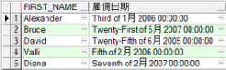</p>  
<p align="center">图3.7  对日期使用TO_CHAR函数</p>  


### 3.4.2  对数字使用TO_CHAR函数  

&emsp;&emsp;当数字与字符串混用且输出是字符串时，应该使用TO_CHAR函数将数字转换为需要的字符串（VARCHAR2），其语法形式如下：


```
TO_CHAR(number[, 'fmt'])
```


&emsp;&emsp;表3.10列举了将数字转换为字符时，一些常用的格式元素，其中“结果”一列是针对“输入”类的数据，按格式元素输出的结果。

表3.10  数字转换为字符格式元素

| 格式元素 | 说    明                        | 输    入     | 举    例                   | 结    果                |
| -------- | ------------------------------- | ------------ | -------------------------- | ----------------------- |
| 9        | 数字宽度（9的个数决定显示宽度） | 2468         | 999999                     | 2468（前面有两个空格）  |
| 0        | 显示前导0                       | 099999       | 002468                     |                         |
| $        | 美元符号                        | $999999      | $2468（前面有两个空格）    |                         |
| L        | 本地货币符号                    | L9999        | ￥2468                     |                         |
| .        | 指定小数点位置                  | 999999.99    | 2468.00（前面有两个空格）  |                         |
| ,        | 指定逗号位置                    | 999,999      | 2,468（前面有两个空格）    |                         |
| MI       | 将负数右边显示负号              | -2468        | 999999MI                   | 2468-（前面有两个空格） |
| PR       | 将负数加上括号                  | 9999PR       | <2468>                     |                         |
| EEEE     | 科学计数法                      | 99.99999EEEE | -2.46800E+03（前面无空格） |                         |
| V        | 乘n个10，n由V后 9 的个数决定    | 999999V99    | -246800（前面有两个空格）  |                         |

 

&emsp;&emsp;假设需要显示雇员表中的雇员名字和薪水，且薪水以“$17,000.00”格式显示，仅查询部门编号为90的雇员信息，其SQL语句如下：


```
SELECT first_name AS "姓名", TO_CHAR(salary, '$99,999.99') AS "薪水" 

FROM employees

WHERE department_id = 90
```


&emsp;&emsp;执行SQL语句，显示结果如图3.8所示。


<p align="center">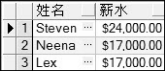</p>  
<p align="center">图3.8  对数字使用TO_CHAR函数</p>  


### 3.4.3  TO_NUMBER函数  

&emsp;&emsp;在使用SQL语言的数据类型转换过程中，不可能总是向字符类型转换，有时也需要将字符串转换成数字，这时候就需要使用TO_NUMBER函数，这个函数的语法形式如下：


```
TO_NUMBER(char[, 'fmt'])
```


&emsp;&emsp;如表3.11所示，通过一些简单的示例，介绍TO_NUMBER这个函数的使用，其中最后一个示例是先将一个日期类型转换成一个字符类型，再将字符类型转换为数字类型。

表3.11  TO_NUMBER函数示例

| 函    数                                  | 结    果 |
| ----------------------------------------- | -------- |
| TO_NUMBER('2468',   '9999')               | 2468     |
| TO_NUMBER('2468',   '999')                | 报错     |
| TO_NUMBER('2468',   '999999')             | 2468     |
| TO_NUMBER('246a', '9999')                 | 报错     |
| TO_NUMBER(TO_CHAR(SYSDATE,'YYYY'),'9999') | 2013     |

 

&emsp;&emsp;TO_NUMBER('2468', '999')这个函数报错的原因是格式模板是'999'，要求转换后的数字在-999～999范围之间，而对'2468'使用TO_NUMBER函数，其结果是2468，超过了这个范围，所以报错。TO_NUMBER('246a', '9999')这个函数报错的原因是强制对一个不能转换为数字的字符进行转换。

### 3.4.4  TO_DATE函数  

&emsp;&emsp;在将字符转换为数字时，如果该字符不能转换为数字时会报错；同样的，如果将一个不能转换为日期类型的字符进行强制转换，也会报错。

&emsp;&emsp;将字符类型转换为日期类型，需要使用TO_DATE函数，这个函数的语法形式如下：


```
TO_DATE(char[, 'fmt'])
```


&emsp;&emsp;来看一个不带格式模板的简单例子：


```
SELECT TO_DATE('17-JUN-13') FROM dual
```


&emsp;&emsp;该SQL语句在PL/SQL Dev上执行，显示的结果是2013/6/17，表明成功转换成日期类型。

&emsp;&emsp;TO_DATE函数的格式模板中可以有一个fx元素，该元素指示对需要转换的字符类型和TO_DATE函数的格式模板必须精确匹配，包括标点符号和空格。来看一个精确匹配的例子：


```
SELECT  TO_DATE('Jan 03, 2006', 'fxMon DD, YYYY') FROM dual
```

&emsp;&emsp;PL/SQL Dev上执行的结果是2006/1/3，成功转换成日期类型。稍稍调整上面的SQL语句如下（其中第一行是将字符类型中天数的“03”调整为“3”，第二行是将格式模板的“YYYY”后增加了一个空格，第三行是将格式模板的“DD”和“YYYY”之后原来的逗号改成了分号）：


```
SELECT  TO_DATE('Jan 3, 2006', 'fxMon DD, YYYY') FROM dual

SELECT  TO_DATE('Jan 03, 2006', 'fxMon DD, YYYY ') FROM dual

SELECT  TO_DATE('Jan 03, 2006', 'fxMon DD; YYYY') FROM dual
```


&emsp;&emsp;分别执行这三条SQL语句时都会报错，不能进行转换，可去掉fx这个元素，也就是说不需要再精确匹配。再次执行这三条SQL语句，都能正常显示出2006/1/3的结果。

&emsp;&emsp;假设需要查询雇员表中雇佣日期为2006年1月3日的雇员，显示雇员的名字和雇佣日期信息，其SQL语句如下：


```
SELECT first_name, hire_date

FROM employees

WHERE hire_date = TO_DATE('Jan 03, 2006', 'fxMon DD, YYYY')
```


&emsp;&emsp;执行该SQL语句，显示结果如图3.9所示。


<p align="center"></p>  
<p align="center">图3.9  TO_DATE函数</p>  


&emsp;&emsp;同样是上面的需求，可以换一个SQL语句的写法，执行结果一样。


```
SELECT first_name, hire_date

FROM employees

WHERE TO_CHAR(hire_date,'YY/MM/DD') = '06/01/03'
```


&emsp;&emsp;比较这两个SQL语句，其中第一个在WHERE子句中是将字符类型转换为日期类型，然后将两个日期类型进行比较；而第二个SQL语句则是将日期类型转换为字符类型，将两个字符类型进行比较，其结果是一样的。

 

 


## 3.5  上机任务


#### 目标：完成本章3.4节的任务。

 


时间：40分钟。

 


形式：每个学员独立完成，小组组长检查。

 


工具：PL/SQL Dev。

 

 

 


## 3.6  通用函数


&emsp;&emsp;前面主要介绍了字符类型、数字类型和日期类型的函数，以及这三种类型之间的转换。接下来，将介绍一些可以用于任意数据类型（且适用于空值）的通用函数。本小节中，主要介绍NVL、NVL2和COALESCE这三个函数。对其他一些函数，例如NULLIF、DECODE函数以及CASE表达式，有兴趣的读者可以自己学习。

### 3.6.1  NVL函数  

&emsp;&emsp;NVL函数就是用一个实际的值替换一个空值，其语法形式如下：


```
NVL(expr, value)
```


&emsp;&emsp;其中expr是可能包含空值的字段名或表达式，而value是要替换的实际值。可以使用 NVL 函数来转换任何数据类型，即expr可以是任何数据类型，但返回值通常必须和expr的数据类型相同。

&emsp;&emsp;在第2章中，使用过算术运算符计算过年薪，当时年薪的计算方式为“月薪\*12+过节费500”。实际上这样的年薪计算方式是有问题的，因为在公司中，有一部分雇员是按照刚才的方式发放全年薪酬的，还有一些雇员需要发放佣金，其佣金数额为月薪\*12\*佣金百分比。对于能发佣金的雇员，其佣金百分比字段有数值，而对于没有佣金的雇员，佣金百分比字段为空。所以，公司雇员的年薪计算方式应为“月薪\*12+过节费500+月薪\*12\*佣金百分比”，没有佣金的雇员佣金百分比按0计算。其中，没有佣金的雇员佣金百分比按0计算转换为SQL语句即NVL(commission_pct,0)。要重新计算、显示雇员的年薪，其SQL语句如下（只查询出部门编号为80或90的雇员）：


```
SELECT first_name AS "名字",(salary*12) + 500 + (salary*12*NVL(commission_pct,0)) AS "年薪", commission_pct AS "佣金比例"

FROM employees

WHERE department_id IN('80','90')
```


&emsp;&emsp;执行该SQL语句，部分显示结果如图3.10所示。


<p align="center">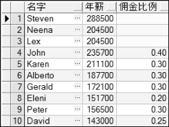</p>  
<p align="center">图3.10  NVL函数</p>  


### 3.6.2  NVL2函数  

&emsp;&emsp;NVL2函数是在NVL函数的基础上再推进了一步，其语法形式如下：


```
NVL2(expr, value1, value2)
```


&emsp;&emsp;该函数的作用在于检查第一个参数，如果该参数的值不为空，则该函数返回第二个参数的值，否则返回第三个参数的值。

&emsp;&emsp;继续调整计算年薪的案例。假设过节费不再是固定值500，而是根据雇员薪酬发放方式以及底薪的不同确定过节费。其中针对没有佣金的雇员，过节费为底薪的50%，而有佣金的雇员，过节费为底薪的30%。那么过节费的数额就可以通过采用NVL2函数来确定，具体形式为NVL2(commission_pct, salary*30%, salary*50%)。重新计算、显示部门编号为80或90的雇员的年薪，其SQL语句如下：


```
SELECT first_name AS "名字",NVL2(commission_pct, salary*0.3, salary*0.5) AS "过节费",(salary*12) + NVL2(commission_pct, salary*0.3, salary*0.5) + (salary*12*NVL(commission_pct, 0)) AS "年薪",commission_pct AS "佣金比例"

FROM employees

WHERE department_id IN('80','90')
```


&emsp;&emsp;执行该SQL语句，部分显示结果如图3.11所示。


<p align="center"></p>  
<p align="center">图3.11  NVL2函数</p>  


### 3.6.3  COALESCE函数  

&emsp;&emsp;COALESCE函数比NVL函数功能强大，它能够接受多个交替的值，其语法形式如下：


```
COALESCE (expr1, expr2… exprn)
```


&emsp;&emsp;该函数的作用是，如果expr1为非空，则返回expr1的值；如果expr1为空，则返回expr2的值，依次类推，如果前面的表达式都为空，则返回exprn的值。

&emsp;&emsp;现在有这样的需求，针对雇员表进行查询，显示的结果需要有这样一列数据，如果该雇员是有佣金的雇员，则该列显示该雇员的佣金百分比，否则显示该雇员经理的编号，如果该雇员没有佣金，且没有管理他的经理，则该雇员是老板，该列显示“老板”即可，其SQL语句如下：


```
SELECT first_name,COALESCE(commission_pct, manager_id,'老板') AS COALESCE列 

FROM employees

WHERE department_id IN('80','90')
```


&emsp;&emsp;执行该SQL语句，提示数据类型不一致，应为NUMBER，但实际返回CHAR。探其原因，COALESCE函数的第一、第二个表达式都是数字类型，而第三个表达式的值“老板”是字符型的，数据类型不一致，所以报错。解决的方法很简单，将第一、第二个表达式的数字类型都强制性地转换成字符型即可，其SQL语句如下： 


```
SELECT first_name,COALESCE (TO_CHAR(commission_pct) , TO_CHAR (manager_id) ,'老板') AS COALESCE列 

FROM employees

WHERE department_id IN('80','90')
```


&emsp;&emsp;执行该SQL语句，部分显示结果如图3.12所示。


<p align="center">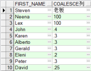</p>  
<p align="center">图3.12  COALESCE函数</p>  


## 3.7  上机任务


#### 目标：完成本章3.6节的任务。

 


时间：20分钟。

 


形式：每个学员独立完成，小组组长检查。

 


工具：PL/SQL Dev。

 

 


## 3.8  多表查询


&emsp;&emsp;在employees表中，雇员的职位是通过job_id记录的，而这个职位的具体信息存放在jobs表里。对用户而言，往往并不清楚每个job_id的含义，而是希望能直接看到每个雇员详细的职位信息，这时候就需要将两个或两个以上的表进行关联查询，以获得需要的结果。

### 3.8.1  等值连接  

&emsp;&emsp;当需要的数据需从多个表中查询得到时，需要采用多表连接查询，其语法形式如下：


```
SELECT  table1.column,  table2.column

FROM  table1,  table2

WHERE  table1.column1  =  table2.column2
```


&emsp;&emsp;其中SELECT子句中可选择多个表的多个字段，FROM子句中表明字段来自多个表，而WHERE子句为连接条件，table1.column1=table2.column2即具体的连接条件。

&emsp;&emsp;在多表连接查询的SELECT子句中，字段名前面用表名可以使语义清楚，并且加快数据库访问，提高性能；如果相同的字段名出现在多个表中，字段名必须加表名，否则会引起冲突。为了将N 个表连接在一起，至少需要N-1个连接条件。

&emsp;&emsp;首先介绍最简单也最常用的等值连接，等值连接也常被称为简单连接。

&emsp;&emsp;为了确定一个雇员的职位信息，需要比较employees表中的job_id字段和jobs表中的 job_id 字段的值，当两个表中job_id 字段的值相等时，才可连接出雇员的具体职位信息，完成该案例的等值连接SQL语句如下：


```
SELECT employees.first_name, jobs.job_title, employees.salary

FROM employees, jobs

WHERE employees.job_id = jobs.job_id
```


&emsp;&emsp;执行该SQL语句，部分显示结果如图3.13所示。


<p align="center">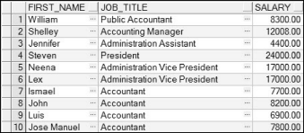</p>  
<p align="center">图3.13  等值连接</p>  


### 3.8.2  表别名  

&emsp;&emsp;为了提高性能、避免字段名冲突，在多表连接查询的SELECT子句中，应该以“表名.字段名”的方式命名。不过按照此规则编写，如果是在所选字段比较多的情况下，SELECT子句往往冗长，可以使用表别名解决这个问题。

&emsp;&emsp;和给字段起别名一样，表别名就是给表起了另外一个名字。不过两者的不同点在于，字段别名通常是为了显示的字段标题易于理解而起的，而表别名是为了让SQL语句简单、易读。

&emsp;&emsp;修改上面的SQL语句，给employees表起别名为e，给jobs表起别名为j，修改完的SQL语句如下：


```
SELECT e.first_name, j.job_title, e.salary

FROM employees e, jobs j

WHERE e.job_id = j.job_id
```


&emsp;&emsp;两段SQL语句相比，使用了表别名的看起来更简单、易读。

&emsp;&emsp;在使用表别名时，要注意表别名最多可以有30个字符，不过相信没有哪个程序开发人员会写出这么长的表别名；表别名的作用范围在整个SELECT语句中，离开这个SELECT语句即无效。

### 3.8.3  多表等值连接  

&emsp;&emsp;前面在讲等值连接时，将employees表和jobs表通过job_id进行了等值连接。如果还想在对employees表进行查询时显示雇员的部门名称（department_name），而不是部门编号（department_id），该怎么操作呢？

&emsp;&emsp;解决方法就是使用多个连接条件，进行多表的等值连接，具体SQL语句如下：


```
SELECT e.first_name, j.job_title,d.department_name, e.salary

FROM employees e, jobs j,departments d

WHERE e.job_id = j.job_id AND e.department_id = d.department_id
```


&emsp;&emsp;在SQL语句的WHERE子句里，用AND将两个连接条件结合起来。执行该SQL语句，部分显示结果如图3.14所示。


<p align="center"></p>  
<p align="center">图3.14  多表等值连接</p>  


&emsp;&emsp;分析该多表连接，其核心表是employees表，分别通过job_id和jobs表关联连接（其中jobs表中的job_id字段是主键，employees表中的job_id字段是外键），通过department_id和departments表关联连接（其中departments表中的department_id字段是主键，employees表中的department_id字段是外键）。

&emsp;&emsp;如果还需要在对employees表进行查询时显示雇员所在的城市，该如何实现呢？通过分析，employees表中没有和城市相关联的字段，但和employees表关联的departments表中有所在地编号（location_id），而通过location_id可关联到locations表，该表中有城市的信息。所以，可以继续在departments表上进行多表等值连接，其SQL语句如下：


```
SELECT e.first_name, j.job_title,d.department_name, l.city, e.salary

FROM employees e, jobs j,departments d,locations l 

WHERE e.job_id = j.job_id AND e.department_id = d.department_id AND d.location_id = l.location_id
```


&emsp;&emsp;为了更好地介绍多表连接，图3.15显示了四个表之间的关系。


<p align="center">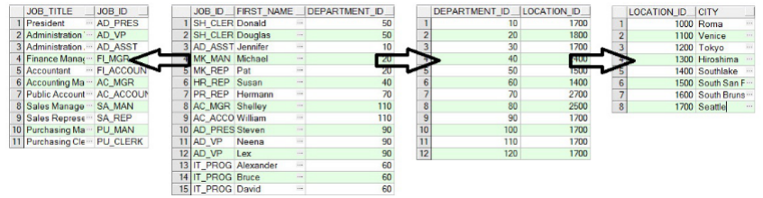</p>  
<p align="center">图3.15  多表连接示意图</p>  


### 3.8.4  自然连接、USING子句和ON子句  

&emsp;&emsp;如果两个表中，有相同的字段名且字段的数据类型相同，则可以使用Oracle的自然连接实现两表之间的等值连接，自然连接是一种特殊的等值连接。

&emsp;&emsp;在第3.8.2节中，实现employees表和jobs表的等值连接的SQL语句如下：


```
SELECT e.first_name, j.job_title, e.salary

FROM employees e, jobs j

WHERE e.job_id = j.job_id
```


&emsp;&emsp;这两个表都用相同的字段名job_id，且这两个字段的数据数型都是VARCHAR2类型，满足自然连接的条件。可以将上面的SQL语句调整如下，用自然连接（NATURAL JOIN）的方式完成等值连接。


```
SELECT e.first_name, j.job_title, e.salary

FROM employees e 

NATURAL JOIN jobs j
```


&emsp;&emsp;在使用自然连接的时候需要注意，如果两个表中的字段名相同，但数据类型不同，用自然连接会返回一个错误。

&emsp;&emsp;上面采用NATURAL JOIN关键字实现了自然连接，也可以不使用自然连接，而使用USING子句明确指定连接字段，其SQL语句如下：

 

 


```
SELECT e.first_name, j.job_title, e.salary

FROM employees e JOIN jobs j

USING(job_id)
```


&emsp;&emsp;另外有一点需要注意的是，不管是自然连接还是使用USING子句，在使用连接字段时，都不能在前面加上表的前缀，因为此时这个字段已经是连接字段，不再属于某个单独的表。

&emsp;&emsp;除了可以用USING子句指定连接字段外，还可以使用ON子句完成类似的功能，上面使用USING子句的SQL语句，等价的使用ON子句的SQL语句如下：


```
SELECT e.first_name, j.job_title, e.salary

FROM employees e JOIN jobs j

ON (e.job_id = j.job_id)
```


&emsp;&emsp;ON子句比USING子句更为灵活，因为USING子句里只有一个字段名，也就是只有两个表中都有相同的字段名时，才能使用USING子句指定连接字段。而ON子句和等值连接一样，用于连接的两个字段，其字段名可以不同。

&emsp;&emsp;上面介绍了自然连接、USING子句和ON子句，接下来继续给employees表和departments表建立自然连接，其SQL语句如下：


```
SELECT e.first_name, d.department_name, e.salary

FROM employees e

NATURAL JOIN departments d
```


&emsp;&emsp;执行该SQL语句，返回32条记录，如图3.16所示。该自然连接等价的等值连接的SQL语句如下：


```
SELECT e.first_name, d.department_name, e.salary   

FROM employees e,departments d

WHERE e.department_id = d.department_id
```


&emsp;&emsp;执行等值连接SQL语句，却返回了106条记录，如图3.17所示。这说明这两段SQL语句不等价，但问题出在哪里呢？


<p align="center">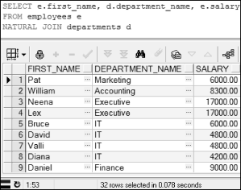</p>  
<p align="center">图3.16  自然连接</p>  

<p align="center"></p>  
<p align="center">图3.17  等值连接</p>  
​                                              

&emsp;&emsp;通过查看这两个表的表结构后发现，两表中不仅有一个department_id字段名和类型相同，还有一个manager_id字段名和类型相同。所以在自然连接时，等价于对这两个字段同时进行了等值连接，所以该自然连接等价的等值连接，其SQL语句如下：


```
SELECT e.first_name, d.department_name, e.salary   

FROM employees e,departments d

WHERE e.department_id = d.department_id AND e.manager_id = d.manager_id
```


&emsp;&emsp;执行该SQL语句，返回和自然连接一样的32条记录。

&emsp;&emsp;之前的自然连接都是在两个表之间的，接下来的SQL语句实现了employees表、departments表和locations表之间的自然连接，也称为三向连接：


```
SELECT e.first_name, d.department_name, l.city, e.salary    

FROM employees e

NATURAL JOIN departments d

NATURAL JOIN locations l
```


&emsp;&emsp;其等价等值连接的SQL语句如下：


```
SELECT e.first_name, d.department_name, l.city, e.salary    

FROM employees e,departments d,locations l

WHERE e.department_id = d.department_id AND e.manager_id = d.manager_id AND d.location_id = l.location_id
```


### 3.8.5  自关联 

&emsp;&emsp;我们还可以通过自关联，用一张表实现多表查询，SQL语句如下：
```
--查询员工姓名和相应的领导姓名

SELECT e.first_name 员工的姓名,b.first_name 老板姓名 FROM employees e, employees b

WHERE e.manager_id=b.employee_id
```
&emsp;&emsp;上述SQL语句中，将同一张employees表通过别名看成了两张不同的表：将别名为e的表看成员工表，将别名为b的表看成领导表，再在员工表和领导表之间进行多表查询。

 

## 3.9  外连接

 

&emsp;&emsp;在介绍外连接之前，先要了解什么是内连接以及内连接和等值连接的关系。在标准SQL中，将两个表连接，仅返回匹配条件的行的连接称为内连接。等值连接是内连接的一种，因为等值连接仅返回满足等值条件的行。相对于等值连接而言，另外一种内连接就是非等值连接，也就是说连接条件不是“=”，而返回的行仅为满足这个非“=”连接条件的行。

### 3.9.1  非等值内连接  

&emsp;&emsp;为了演示非等值内连接的效果，为HR用户新建了一个表，其表结构和表内容分别如图3.18和图3.19所示。具体如何创建表，在后面的内容中将会详细介绍。


<p align="center">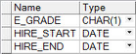</p>  
<p align="center">图3.18  员工分类表结构</p>  

<p align="center">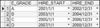</p>  
<p align="center"> 图3.19  员工分类表内容</p>  
​                              

&emsp;&emsp;从图3.18和图3.19可以看出，公司将员工分为A、B、C、D四类，分类依据为雇员的雇佣日期。现在需要查询出雇员的名字、薪水和所属分类，其SQL语句如下：


```
SELECT e.first_name, e.salary, eg.e_grade 

FROM employees e,egrade eg

WHERE e.hire_date BETWEEN eg.hire_start AND eg.hire_end
```


&emsp;&emsp;这段SQL语句的比较条件是判断日期是否在一个范围内，不是“=”，所以不是等值连接，其返回的结果仅为满足比较条件的行，所以该连接是非等值内连接。执行该SQL语句，部分显示结果如图3.20所示。


<p align="center">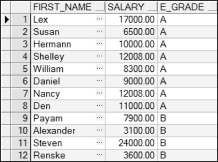</p>  
<p align="center">图3.20  非等值内连接</p>  


### 3.9.2  左外连接、右外连接、全外连接、笛卡儿积  

- 左外连接

&emsp;&emsp;左外连接又称左连接，指在两个表之间的连接，返回内连接的结果，同时还返回左表中未匹配的行，右表中相应字段置空。接下来对employees表和departments表进行左连接， employees表作为左表，departments表作为右表，使用左连接的SQL语句如下：


```
SELECT e.first_name, e.department_id, d.department_name

FROM employees e

LEFT OUTER JOIN departments d 

ON (e.department_id = d.department_id) 
```


&emsp;&emsp;执行该SQL语句，部分显示结果如图3.21所示。


<p align="center">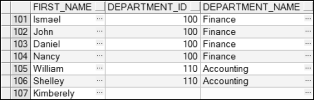</p>  
<p align="center">图3.21  左外连接</p>  


&emsp;&emsp;从图3.21中可以看出，左连接在内连接的基础上，将左表（employees）中未匹配的行也查询出来，右表中相应字段为空。

&emsp;&emsp;上面是一种左连接的写法，看起来略微有些复杂，下面的SQL语句同样完成了上面左连接的功能，不过在书写和阅读上都容易许多。


```
SELECT e.first_name, e.department_id, d.department_name

FROM employees e,departments d

WHERE e.department_id = d.department_id(+)
```


&emsp;&emsp;这段SQL语句和等值连接类似，只是在等号的某一边加上了一个“(+)”，这个“(+)”应该被放置在不需要增加未匹配的行的表的一侧。采用“(+)”进行外连接，不存在左表和右表之分，并且不可以在比较条件的两边都放“(+)”。

- 右外连接

&emsp;&emsp;右外连接又称右连接，和左连接正好相反。接下来仍然对employees表和departments表进行右连接，employees表作为左表，departments表作为右表，使用右连接的SQL语句如下：


```
SELECT e.first_name, department_id, d.department_name

FROM employees e

RIGHT OUTER JOIN departments d

USING(department_id)
```


&emsp;&emsp;执行该SQL语句，部分显示结果如图3.22所示。


<p align="center"></p>  
<p align="center">图3.22  右外连接</p>  


&emsp;&emsp;用“(+)”代替右外连接，SQL语句的具体写法如下：


```
SELECT e.first_name, e.department_id, d.department_name

FROM employees e,departments d

WHERE d.department_id = e.department_id(+)
```


- 全外连接

&emsp;&emsp;所谓全外连接，也称全连接，是指两个表在返回内连接结果的基础上，还返回左表及右表中未匹配的行，右表及左表中相应字段置空，其SQL语句如下：


```
SELECT e.first_name, department_id, d.department_name

FROM employees e

FULL OUTER JOIN departments d

USING(department_id)
```
&emsp;&emsp;执行该SQL语句，部分显示结果如图3.23所示。


<p align="center">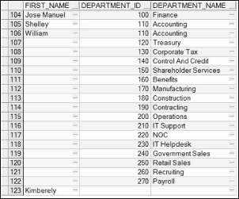</p>  
<p align="center">图3.23  全连接</p>  


- 笛卡儿积

&emsp;&emsp;截止到现在，所介绍的多表连接查询都有连接条件，通过连接条件对连接进行限制。如果连接条件无效或者遗漏，其结果是一个笛卡儿积，其中所有行的组合都被显示出来，即第一个表中的所有行连接到第二个表中的所有行。

&emsp;&emsp;笛卡儿积会产生大量的行，例如第一个表中假设有100条记录，第二个表中有200条记录，使用笛卡儿积，结果就是两者相乘的20000条记录。这样的笛卡儿积一般来说没有什么用，所以除非有特殊的需求，应该保证连接条件正确有效，不要出现笛卡儿积的情况。

 

 


## 3.10  上机任务


#### 目标：完成本章3.8节和3.9节的任务。

 


时间：40分钟。

 


形式：每个学员独立完成，小组组长检查。

 


工具：PL/SQL Dev。

 

 


## 3.11  本章练习

 

1  下列（    ）字符函数可以实现“将每个单词的首字母值转换为大写，其他值为小写”的功能。（选择一项）

&emsp;&emsp;A．LOWER

&emsp;&emsp;B．UPPER

&emsp;&emsp;C．INITCAP

&emsp;&emsp;D．CONCAT

2  函数TRUNC（SYSDATE, 'MONTH'）的执行结果是（    ）（假定SYSDATE值为'23-JUN-13'）。（选择一项）

&emsp;&emsp;A．'01- JUL-13'

&emsp;&emsp;B．'01- JAN-13'

&emsp;&emsp;C．'01- JUN-13'

&emsp;&emsp;D．'01- JAN-13'

3  如果想让Oracle中日期类型的显示结果为“2013/6/23,22-7-16”，其格式模板的写法应该是    。

 

4  请描述fm、fx、th和sp这四个元素的作用。

 

 

 

5  请描述什么是内连接和外连接。

 

 

 

6  请描述什么是左连接、右连接和全连接。

 
