## 本章简介
&emsp;&emsp;第3章首先介绍了单行函数，之后又介绍了多表查询。本章反过来，先介绍查询，之后再介绍组函数和分组。不过本章介绍的查询是子查询，也就是说在SELECT语句中再包含SELECT语句，或者说SELECT语句中嵌套SELECT语句。第3章介绍的函数是单行函数，而本章会介绍基于多行数据集的函数，以及如何使用GROUP BY子句进行分组。

 

 

 

## 4.1  子查询

 

&emsp;&emsp;所谓子查询，就是查询中的查询。比如可以在一个SQL 语句的 WHERE 子句中写子查询，以获得所需要且之前未知的条件值。本节将介绍单行子查询和多行子查询。

### 4.1.1  子查询引入  

&emsp;&emsp;假设想要获取在部门编号为90的部门中，有哪些人的月薪比Abel（Abel是姓，即last_name）的月薪高，并把他们的姓氏显示出来。为了解决这个问题，需要分两个步骤：第一个步骤是获得Abel的月薪，第二个步骤是拿Abel的月薪值作为比较条件中的值，在部门编号为90的部门中查询。

&emsp;&emsp;上面的两个步骤实际上就是两个SELECT查询，可以用组合两个查询的方式解决这个问题，就是说把一个查询放到另一个查询中。通常将放进去的那个查询称为子查询或内查询，外面的查询称为主查询或外查询。SQL语句先执行子查询，并用子查询的结果作为主查询需要的值。完成上述功能的SQL语句如下：


```
SELECT last_name FROM employees

WHERE salary > (SELECT salary FROM employees WHERE last_name = 'Abel') AND department_id = 90
```


&emsp;&emsp;该SQL语句首先执行“SELECT salary FROM employees WHERE last_name = 'Abel'”，获得结果值6000；之后再执行“SELECT last_name FROM employees WHERE salary > 6000 AND department_id = 90”，运行结果如图4.1所示。


<p align="center">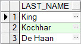</p>  
<p align="center">图4.1  子查询</p>  

&emsp;&emsp;总结子查询的语法形式：


```
SELECT select_list1 FROM table1

WHERE expr operator(SELECT select_list2 FROM table2)
```


&emsp;&emsp;子查询是一个SELECT语句，它是嵌在另一个 SELECT 语句中的子句。使用子查询可以用简单的语句构建功能强大的语句，当需要从表中获取依赖于表本身的数据选择行时，子查询是非常有用的。

&emsp;&emsp;子查询可以放在WHERE子句中，也是本节要介绍的重点。同时也可以放在FROM子句以及之后要介绍的UPDATE 语句、INSERT语句、CREATE VIEW 语句、CREATE TABLE 语句、HAVING子句、INTO 子句和UPDATE语句的SET 子句中。

### 4.1.2  单行子查询  

&emsp;&emsp;从子查询中只返回一行结果的查询，称为单行子查询；对应的，如果返回多行的结果，就是多行子查询。另外还有多列子查询，即从查询语句中返回多列的查询。

&emsp;&emsp;单行子查询是从子查询返回一行的查询，对单行子查询的结果可以使用单行比较操作符。例如要显示编号为105的雇员所在部门所有人员的编号、姓氏和薪水，就可以使用子查询先查出编号为105的雇员的部门编号，再根据部门编号查出部门所有雇员的编号、姓氏和薪水。其SQL语句如下：


```
SELECT employee_id,last_name, salary FROM employees

WHERE department_id = (SELECT department_id FROM employees WHERE employee_id = 105)
```


&emsp;&emsp;该SQL语句是针对一个表使用了子查询，执行结果如图4.2所示。


<p align="center">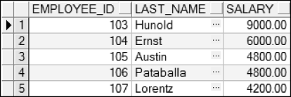</p>  
<p align="center">图4.2  单行子查询</p>  

&emsp;&emsp;上面的SQL语句查出的是这个部门所有雇员，如果仅想查出该部门中薪水高于编号105的雇员的信息，则需要再增加一个比较条件用于比较薪水，且具体的比较值由另一个子查询完成。其SQL语句如下：


```
SELECT employee_id,last_name, salary FROM employees

WHERE department_id = (SELECT department_id FROM employees WHERE employee_id = 105)

AND salary > (SELECT salary FROM employees WHERE employee_id = 105)
```


&emsp;&emsp;执行该SQL语句，运行结果如图4.3所示。


<p align="center"></p>  
<p align="center">图4.3  多个单行子查询</p>  

&emsp;&emsp;刚才查询的是该部门中薪水高于编号105的雇员信息，如果想查询出薪水大于公司雇员平均薪水的该部门雇员的信息，其SQL语句如下：


```
SELECT employee_id,last_name, salary FROM employees

WHERE department_id = (SELECT department_id FROM employees WHERE employee_id = 105)

AND salary >= (SELECT AVG(salary) FROM employees)
```


&emsp;&emsp;注意，在该语句的第二个子查询中，使用AVG(salary)函数求出了公司雇员平均薪水（6461.83元），AVG函数是组函数，本章后半部分会详细介绍。执行该SQL语句，运行结果如图4.4所示。


<p align="center">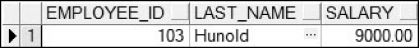</p>  
<p align="center">图4.4  加入组函数的单行子查询</p>  

### 4.1.3  多行子查询  

&emsp;&emsp;子查询返回多行被称为多行子查询，对多行子查询要使用多行运算符而不是单行运算符，例如IN、ANY和ALL三个多行运算符。

l IN运算符

&emsp;&emsp;假设想知道在公司的所有雇员中，哪些雇员的薪水和部门编号为60的IT部门里雇员（雇员人数大于1人）的薪水相同，其SQL语句如下：


```
SELECT employee_id,last_name, salary,department_id FROM employees

WHERE salary IN (SELECT salary FROM employees WHERE department_id = 60)
```


&emsp;&emsp;执行该SQL语句，运行结果如图4.5所示。

&emsp;&emsp;分析一下这个多行子查询，先看子查询语句“SELECT salary FROM employees WHERE department_id = 60”，执行该语句返回结果如图4.6所示。


<p align="center"></p>  
<p align="center">图4.5  多行子查询</p>  
<p align="center"></p>  
<p align="center">图4.6  子查询结果</p>  


&emsp;&emsp;主查询在子查询结果的基础上执行，等价于执行如下的SQL语句，返回结果和图4.6相同。


```
SELECT employee_id,last_name, salary,department_id FROM employees

WHERE salary IN (9000,6000,4800,4800,4200)
```


- ANY运算符（同SOME运算符）和ALL运算符

&emsp;&emsp;ANY 运算符用于比较一个值与子查询返回的任一个值，而ALL 运算符用于比较一个值与子查询返回的每一个值。

&emsp;&emsp;< ANY子查询：小于子查询的最大值。

&emsp;&emsp;\> ANY子查询：大于子查询的最小值。

&emsp;&emsp;= ANY子查询：等同于IN子查询结果。

&emsp;&emsp;< ALL子查询：小于子查询的最小值。

&emsp;&emsp;\> ALL子查询：大于子查询的最大值。

&emsp;&emsp;如果想查询公司的所有雇员中，哪些雇员的薪水小于部门编号为60的IT部门里薪水最高的雇员的薪水，其SQL语句如下：


```
SELECT employee_id,last_name, salary, department_id FROM employees

WHERE salary < ANY(SELECT salary FROM employees WHERE department_id = 60)
```


&emsp;&emsp;执行该SQL语句，返回80行记录，部分运行结果如图4.7所示。


<p align="center">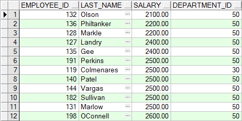</p>  
<p align="center">图4.7  ANY运算符使用</p>  


## 4.2  上机任务


目标：完成本章4.1节的任务。

 


时间：30分钟。

 

形式：每个学员独立完成，小组组长检查。

 


工具：PL/SQL Dev。

 


## 4.3  组函数

 

&emsp;&emsp;第3章介绍过单行函数，是针对每行数据计算出结果。而本章介绍的组函数，是对多行的数据集合进行操作，对每组给出一个结果。如果没有对数据集合进行分组的话，则是把整个数据集合当作一组，给出一个结果。

### 4.3.1  组函数引入  

&emsp;&emsp;上述查询公司所有雇员中，薪水小于IT部门里最高薪水的所有雇员，其SQL语句如下：


```
SELECT employee_id,last_name, salary, department_id FROM employees

WHERE salary < ANY(SELECT salary FROM employees WHERE department_id = 60)
```


&emsp;&emsp;在该SQL语句中，使用了“< ANY子查询”的方式完成了案例要求。虽然完成了案例要求，但可以有更便捷的方法。也就是可以通过MAX组函数，直接获得IT部门里薪水最高的员工的薪水值，让这个查询作为单行子查询，放入主查询中直接进行比较，其SQL语句如下：


```
SELECT employee_id,last_name, salary, department_id FROM employees

WHERE salary < (SELECT MAX(salary) FROM employees WHERE department_id = 60)
```


&emsp;&emsp;执行该SQL语句，也返回80行记录。从SQL语句的子查询中可以看出，MAX(salary)函数直接获得了IT部门中最高的薪水值。

### 4.3.2  组函数概述  

&emsp;&emsp;组函数是对多行数据进行操作，在操作时有如下注意事项：

- 组函数忽略空值。为了用一个值代替空值，用 NVL、NVL2 或 COALESCE 函数。

- 组函数默认考虑重复值。为了让组函数不考虑重复值，可以使用DISTINCT关键字。 

- 用于函数参数的数据类型可以是CHAR、VARCHAR2、NUMBER 或 DATE。

&emsp;&emsp;下面列举了一些常用的组函数，如表4.1所示，其中输入参数用input表示，代表字段名或表达式。

表4.1  常用组函数

| 函    数          | 说    明                                 |
| ----------------- | ---------------------------------------- |
| AVG(input)        | 求平均值，忽略空值且考虑重复值（以下同） |
| SUM(input)        | 求和                                     |
| MAX(input)        | 求最大值                                 |
| MIN(input)        | 求最小值                                 |
| COUNT(\* &#124; input) | 求行数（用\*则包括空值的行）              |
| STDDEV(input)     | 求标准差                                 |
| VARIANCE(input)   | 求方差                                   |

 

&emsp;&emsp;因为雇员表中的记录比较多，为了方便演示，所以仅选了部门编号为60的雇员信息参与计算，先看一下图4.8显示的该部门雇员信息。


<p align="center">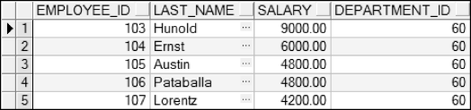</p>  
<p align="center">图4.8  IT部门雇员信息</p>  

&emsp;&emsp;对该数据集使用MAX、MIN、AVG和SUM这四个组函数，SQL语句如下，运行结果如图4.9所示。


```
SELECT MAX(salary) AS "最高薪", MIN(salary) AS "最低薪", AVG(salary) AS "平均薪水", SUM(salary) AS "薪水总和" 

FROM employees WHERE department_id = 60
```


<p align="center">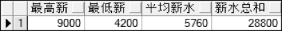</p>  
<p align="center">图4.9  组函数使用</p>  

&emsp;&emsp;修改该SQL语句，将AVG(salary)和SUM(salary)这两个组函数修改为AVG(DISTINCT salary)和SUM(DISTINCT salary)，运行结果如图4.10所示。


<p align="center">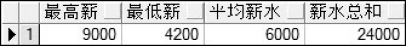</p>  
<p align="center">图4.10  组函数使用</p>  

&emsp;&emsp;使用DISTINCT关键字的目的是去除重复，SUM(DISTINCT salary)函数仅对不重复的行进行求和。图4.8中，编号为105和106的员工薪水重复，所以仅取一行数据参与求和，故AVG(DISTINCT salary)实际是对9000、6000、4800和4200求和，得到的结果是24000。同理，AVG(DISTINCT salary)函数也仅对这四个数求平均值，结果为6000。

&emsp;&emsp;需要注意的是，MAX和MIN函数不仅可以使用在数字类型上，还可以用于任意数据类型。而AVG、SUM以及STDDEV和VARIANCE仅能用在数字类型上。

&emsp;&emsp;接下来介绍COUNT函数，COUNT函数的参数除了可以是字段值和表达式外，还可以是“*”。如果是字段值或表达式，则和其他组函数一样，忽略空值且考虑重复值；如果是“*”，则计算所有的行，也包括空值。

&emsp;&emsp;如果想获取公司中所有雇员的人数、有佣金的雇员人数以及共有多少种佣金百分比，其SQL语句如下：


```
SELECT COUNT(*) AS "总人数",COUNT(commission_pct) AS "拿佣金人数" ,COUNT(DISTINCT commission_pct) AS "佣金种数" 

FROM employees
```


&emsp;&emsp;执行该SQL语句，结果如图4.11所示。


<p align="center">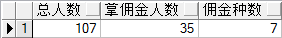</p>  
<p align="center">图4.11  COUNT组函数使用</p>  

&emsp;&emsp;上面的例子中，统计雇员总人数时，是对“*”进行COUNT。如果COUNT函数里的参数是字段manager_id，执行SQL语句后，统计出的人数是106名，并不是正确的数值。其原因在于，雇员表中老板这条记录的manager_id字段为空，COUNT(manager_id)是忽略空值的，所以没有统计老板。

&emsp;&emsp;为了解决这个问题，可以使用NVL函数将空值置为某值，使组函数在进行统计、计算时，不忽略该行，具体SQL语句如下：


```
SELECT COUNT(NVL(manager_id,0)) AS "总人数" FROM employees
```


&emsp;&emsp;执行该SQL语句，统计出总人数为107人。

### 4.3.3  创建分组  

&emsp;&emsp;直到现在，所有的组函数都是针对整个数据集进行的操作。接下来，会将整个数据集分成若干个分组，针对每个分组使用组函数进行操作。

&emsp;&emsp;用GROUP BY子句可以把表中的数据集合划分为若干个组。GROUP BY 子句后面的表达式用于指定分组的依据。GROUP BY 子句置于WHERE子句后、ORDER BY子句前，后面的表达式必须包含字段，且不能使用列的别名。

&emsp;&emsp;在使用GROUP BY进行分组时，必须注意，如果SELECT子句中包含了组函数，就不能选择单独的字段，除非这个字段出现在GROUP BY子句后面。

&emsp;&emsp;假设想获得每个部门最高的薪水值，并显示出部门编号和薪水，其SQL语句如下：


```
SELECT department_id,MAX(salary) 

FROM employees GROUP BY department_id
```


&emsp;&emsp;执行该SQL语句，显示结果如图4.12所示。


<p align="center">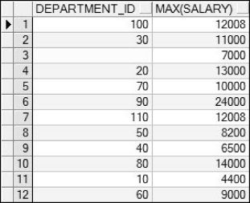</p>  
<p align="center">图4.12  GROUP BY使用</p>  

&emsp;&emsp;注意，在SELECT子句中，只可以有组函数和分组字段（包括对分组字段的操作），如果包括其他字段会报错。另外，如果GROUP BY子句后要包括ORDER BY子句，则ORDER BY子句用于排序的字段必须是分组字段或组函数。例如要将刚才获取的结果按照各部门最高薪水值进行从高到底的排序，其SQL语句如下：


```
SELECT department_id, MAX(salary) FROM employees 

GROUP BY department_id ORDER BY MAX(salary) DESC
```


&emsp;&emsp;执行SQL语句，运行结果如图4.13所示。


<p align="center">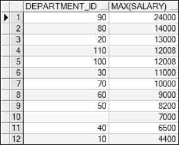</p>  
<p align="center">图4.13  对分组结果进行排序</p>  

&emsp;&emsp;读者可以尝试一下，修改上面的SQL语句，分别在SELECT子句和ORDER BY子句中增加salary或其他字段，执行SQL语句，看看会出现什么样的结果。

### 4.3.4  分组中再分组  

&emsp;&emsp;前面对所有雇员按照部门进行了分组，在每个部门中还有不同的职位，有时需要在部门分组的基础上再对职位进行分组，这就是分组中再分组。

&emsp;&emsp;假设现在想算出每个部门每个职位中哪个雇员的薪水最高，并显示出部门编号、职位编号和薪水，显示时按部门编号和职位编号升序排序，其SQL语句如下：


```
SELECT department_id, job_id, MAX(salary) 

FROM employees GROUP BY department_id, job_id

ORDER BY department_id, job_id
```


&emsp;&emsp;执行该SQL语句，部分显示结果如图4.14所示。


<p align="center"></p>  
<p align="center">图4.14  分组中再分组</p>  
&emsp;&emsp;同样的，SELECT子句和ORDER BY子句中只能包括分组字段和组函数。

### 4.3.5  约束分组结果  

&emsp;&emsp;之前的案例，算出了公司每个部门的最高薪水。如果只想获得部门编号为50、60、80、90这四个部门的最高薪水，可以通过WHERE子句限定选择的行，然后在这些选择行的基础上再进行分组，SQL语句如下，运行结果如图4.15所示。


```
SELECT department_id, MAX(salary) FROM employees 

WHERE department_id IN(50,60,80,90) GROUP BY department_id
```


<p align="center">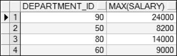</p>  
<p align="center">图4.15  分组前使用WHERE子句约束行</p>  

&emsp;&emsp;这里需要强调的是，WHERE子句必须在GROUP BY子句前，而且从含义上来说，也是先进行约束之后再进行分组。所以，WHERE子句中选择的字段，并非必须为分组字段，但也肯定不能是组函数。

&emsp;&emsp;那如果要对分组后的结果进行约束，比如说只显示最高薪水大于12000元的结果，该如何操作呢？这时候就需要使用HAVING子句对分组结果进行约束。HAVING子句必须在GROUP BY子句之后，在ORDER BY子句之前。完成上面需求的SQL语句如下：


```
SELECT department_id, MAX(salary) FROM employees 

WHERE department_id IN(50,60,80,90) 

GROUP BY department_id HAVING MAX(salary) > 12000
```


&emsp;&emsp;执行该SQL语句，运行结果如图4.16所示。


<p align="center">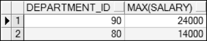</p>  
<p align="center">图4.16  HAVING子句使用</p>  

&emsp;&emsp;请读者思考一下，可以在HAVING子句中使用非分组字段、组函数吗？


## 4.4  上机任务


目标：完成本章4.3节的任务。

 


时间：30分钟。

 


形式：每个学员独立完成，小组组长检查。

 


工具：PL/SQL Dev。

 


## 4.5  本章练习

 

1  “> ANY子查询”代表的含义，下面（    ）说法是正确的。（选择一项）

&emsp;&emsp;A．小于子查询的最大值

&emsp;&emsp;B．大于子查询的最小值

&emsp;&emsp;C．小于子查询的最小值

&emsp;&emsp;D．大于子查询的最大值

2  下列（    ）组函数实现了求平均值的功能。（选择一项）

&emsp;&emsp;A．AVG

&emsp;&emsp;B．COUNT

&emsp;&emsp;C．SUM

&emsp;&emsp;D．MIN

3  请描述COUNT组函数的参数“*”和表达式之间的区别。

 

 

4  请描述在使用GROUP BY进行分组之后，SELECT子句或ORDER BY子句在选择字段时需要注意什么。

 

 

5  请描述在使用GROUP BY进行分组的SQL语句中，WHERE子句和HAVING子句的作用有什么区别。

 

 

6  有如下表：

&emsp;&emsp;S(SNO,SNAME)学生表，SNO为学号，SNAME为学生姓名；

&emsp;&emsp;C(CNO,CNAME)课程表，CNO为课程号，CNAME为课程名；

&emsp;&emsp;SC(SNO,CNO,SCGRADE)选课成绩表，SCGRADE为成绩。

&emsp;&emsp;使用SQL语句查询下面条件给出的信息：

&emsp;&emsp;Q1：有两门以上（含两门）不及格课程的学生姓名及其平均成绩。

&emsp;&emsp;Q2：既学过“语文”又学过“英语”的所有学生姓名。