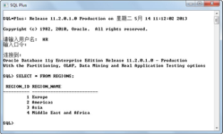
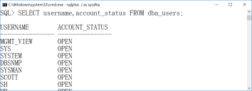
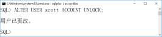

## 本章简介
&emsp;&emsp;从这本书开始，我们将系统地学习与数据库相关的知识。本章作为数据库的第1章，首先介绍了数据、数据库、数据库管理系统和数据库系统的概念，之后介绍了数据库系统的发展史，并简要介绍了现今比较流行的Oracle、MySQL、SQL Server和DB2数据库。本章采用图解的形式介绍了如何安装Oracle 11g数据库，并简要介绍了Oracle企业管理器、SQL*Plus和PL/SQL Developer工具的使用。

 

 

 

## 1.1  数据库概述

 

&emsp;&emsp;目前，全球数据量正以约50%的年增长率飞速增长，而当前数据总量的80% 都是最近两年产生的。2016年，思科发布云计算市场展望报告称，到2020年时，云数据流量很可能将增长2.7倍，从2015年的每年3.9 ZB增长到2020年的每年14.1ZB。

&emsp;&emsp;大量的数据、信息在不断产生，伴随而来的就是如何安全有效地存储、检索、管理它们。对数据的有效存储、高效访问、方便共享和安全控制等问题成了信息时代非常重要的问题。

&emsp;&emsp;使用数据库可以结构化存储大量的数据信息，方便用户进行有效的检索和访问，可以有效地保持数据信息的一致性、完整性，降低数据冗余，可以满足数据应用的共享和安全方面的要求，同时还能方便智能化地分析数据，产生新的有用信息。

### 1.1.1  数据、数据库  

&emsp;&emsp;了解数据库概念之前，先来看一看数据的概念。在大多数人的头脑中，数据就是数字。其实，数字只是最简单的一种数据，是对数据传统、狭义的理解。从广义上理解，数据种类很多，包括文字、图形、图像、音频、视频等，这些都是数据。

&emsp;&emsp;可以这样定义数据：数据是描述事务的符号记录。这种描述事务的符号可以是数字，也可以是文字、图形等。在日常生活中，人们可以通过自然语言的记录形式来描述。比如可以记录这样一小段话：1991年3月28日出生的刘静涛同学，性别女，2009年由安徽考入北京航空航天大学，专业是计算机科学与技术。通过这一小段话，简单记录了该学生的信息。

&emsp;&emsp;作为计算机，为了更好地存储和处理这些事务，就需要抽象出一组描述事务的特征，通过这个特征来描述具体的事务。例如上面的例子，就可以抽象出姓名、性别、出生日期、入学省份、入学年份、专业，具体可以描述为：刘静涛，女，1991年3月28日，安徽，2009，计算机科学与技术。这里对学生信息的记录就是通常所说的计算机中记录的数据。

&emsp;&emsp;数据库，顾名思义就是存放数据的仓库。这个仓库将数据按照一定的格式，存储在计算机的存储设备上。数据库是长期存储在计算机内有组织、可共享的数据集合。数据库中的数据按一定的数据模型组织、描述和存储，具有较小的数据冗余度、较高的数据独立性和易扩展性，并为各种用户所共享。数据库可以存储数据，重要的是在需要的时候可以从数据库大量的数据中快速找到用户自己需要的数据，甚至可以帮用户分析出更有用的信息。

### 1.1.2  数据库管理系统  

&emsp;&emsp;了解了数据和数据库的概念之后，接下来就需要了解数据库如何科学、有效地存放数据，从而能保证高效、快速地获取数据。完成这个任务的就是数据库管理系统（Database Management System，DBMS）。

&emsp;&emsp;数据库管理系统是一个系统软件。系统软件是区别于操作系统和应用软件的一种软件分类。数据库管理系统位于操作系统和应用软件之间，主要提供了如下功能。

- 数据定义

&emsp;&emsp;DBMS提供数据定义语言（Data Definition Language，DDL），用户通过DDL可以方便地对数据库中的对象（例如表、视图、存储过程等）进行定义。DDL主要用于建立、修改数据库的库结构，DDL所描述的库结构仅仅给出了数据库的框架，数据库的框架信息被存放在数据字典（对数据库对象信息进行描述）中。

- 数据操作

&emsp;&emsp;DBMS提供数据操作语言（Data Manipulation Language，DML），供用户实现对数据的添加（INSERT）、删除（DELETE）、更新（UPDATE）、查询（SELECT）等操作，也就是“增删改查”。

- 数据库的运行管理

&emsp;&emsp;数据库的运行管理功能是指DBMS的运行控制、管理功能，包括多用户环境下的并发控制、安全性检查和存取限制控制、完整性检查和执行，运行日志的组织管理、事务的管理和自动恢复，这些功能保证了数据库系统的正常运行。

- 数据组织、存储与管理

&emsp;&emsp;DBMS要分类组织、存储和管理各种数据，包括用户数据、数据字典等，需确定以何种文件结构和存取方式在存储设备上组织这些数据，以及实现数据之间的联系。数据组织和存储的基本目标是提高存储空间利用率，选择合适的存取方法提高存取效率。

- 数据库保护

&emsp;&emsp;数据库中的数据是信息社会的战略资源，所以数据的保护至关重要。DBMS对数据库的保护通过四个方面来实现：数据库的恢复、数据库的并发控制、数据库的完整性控制、数据库的安全性控制。

- 数据库维护

&emsp;&emsp;数据库维护包括数据库的数据载入、转换、转储、数据库重构以及性能监控等功能，这些功能分别由各个程序来完成。

 

## 1.2  数据库系统发展史

 

&emsp;&emsp;数据库系统从20世纪50年代萌芽，60年代中期产生，到如今，已经超过60年的历史。短短60多年，数据库系统已从第一代的层次型、网状数据库系统，第二代的关系型数据库系统，发展到第三代以面向对象模型为主要特征的数据库系统。其中，数据库技术与网络通信技术、人工智能技术、面向对象程序设计技术、并行计算技术等互相渗透，互相结合，成为当前数据库技术发展的主要特征。

### 1.2.1  文件系统  

&emsp;&emsp;文件系统是数据库系统的萌芽阶段，出现在20世纪中期，可以提供简单的数据存取功能，但无法提供完整、统一的数据管理功能，例如复杂查询等。所以在管理较少、较简单的数据或者只是用来存取简单数据，没有复杂操作的情况下，会使用文件系统。

### 1.2.2  层次型、网状数据库系统   

&emsp;&emsp;从20世纪60年代开始，第一代数据库系统（层次型数据库系统、网状数据库系统）相继问世，它们为统一管理和共享数据提供了有力的支撑。在这个时期，由于数据库系统的蓬勃发展，形成了著名的“数据库时代”。当然，这两种类型的数据库系统也有一定的不足，最主要表现在它们均脱胎于文件系统，因此，受文件物理结构的影响较大，用户在使用数据库时，需要对数据的物理结构有详细的了解，这对使用数据库带来了许多麻烦。同时，数据库中表示数据模式的结构方式过于烦琐，也影响了数据库应用中越来越多的复杂要求的实现。

&emsp;&emsp;在这个阶段，网状数据库由于其复杂性、专用性，没有被广泛使用。而在层次型数据库中，IBM公司的IMS（Information Management System，信息管理系统）层次型数据库系统则得到了极大的发展，一度成为最大的数据库管理系统，拥有巨大的客户群。

### 1.2.3  关系型数据库系统  

&emsp;&emsp;20世纪70年代初，关系型数据库系统开始走上历史舞台，并一直保持着蓬勃的生命力。

&emsp;&emsp;自1970年IBM研究员德加•考特发表论文，阐述了关系模型的概念后，IBM大力投入关系型数据库系统的研究。关系型数据库底层实现起来比较容易，所以很快被采用，并进入了众多商业数据库的研发计划。Oracle就是当时因关系数据模型的出现，而成立的一家专做关系型数据库系统的公司，之后IBM公司的关系型数据库系统DB2问世。这时关系型数据库系统开始逐步取代层次型数据库系统，成为占主导地位的数据库系统。到目前为止，关系型数据库系统仍占有数据库系统的主导地位。

&emsp;&emsp;关系型数据库系统使用结构化查询语言（Structured Query Language，SQL）作为数据库定义语言DDL和数据库操作语言DML。这种语言和普通的面向过程的语言（如C语言）以及面向对象的语言（如Java）不同，它一诞生，就成为关系型数据库的标准语言。可以这么说，要想学习数据库，必须学习关系型数据库系统，要想学习关系型数据库系统就必须学习SQL结构化查询语言。

### 1.2.4  面向对象数据库系统  

&emsp;&emsp;由于计算机应用的发展，计算机已从传统的科学计算、事务处理等领域，逐步扩展到工程设计统计、人工智能、多媒体、分布式等领域，这些新的领域需要有新的数据库支撑，而传统关系型数据库系统是以商业应用、事务处理为背景而发展起来的，它并不完全适用于新领域。

&emsp;&emsp;另外程序设计开发也逐渐从面向过程编程转向面向对象编程，从面向对象的角度设计、编写程序。把面向对象的方法和数据库技术结合起来，可以使数据库系统的分析、设计最大限度地与人们对客观世界的认识相一致，并且能够有效地为面向对象程序提供更好的数据库支撑。所以面向对象数据库系统是为了满足新的数据库应用需要而产生的新一代数据库系统。

&emsp;&emsp;除了面向对象数据库系统，新一代数据库系统还包括分布式数据库系统、并行数据库系统、多媒体数据库系统等，这里不再一一讲述。

 

## 1.3  主流数据库简介

 

&emsp;&emsp;所谓主流数据库，代表着成熟的数据库技术、广泛的市场用户。经过了20世纪末激烈的数据库市场竞争之后，Oracle、MySQL、DB2和SQL Server等一批数据库有幸获得主流数据库的称号。

&emsp;&emsp;在介绍主流数据库之前，先来了解数据库、数据库管理系统和数据库系统之间的区别。在后面的课程以及人们的日常描述中，“常用数据库”一词代表数据库管理系统或数据库系统，需要大家注意。

&emsp;&emsp;简单地说，数据库系统包括数据库、数据库管理系统、应用系统、数据库管理员，所以数据库系统是个大的概念。数据库是长期存储在计算机内的有组织、可共享的大量的数据集合，而数据库管理系统是对数据库进行统一的管理和控制，以保证数据库的安全性和完整性。

### 1.3.1  Oracle数据库  

&emsp;&emsp;Oracle数据库是Oracle（甲骨文）公司的数据库产品。Oracle公司从数据库起家，现已经成为世界上最大的企业软件公司，向全球用户提供数据库、工具和应用软件以及相关的咨询、培训和支持服务。

&emsp;&emsp;Oracle数据库是世界上使用最广泛的数据库之一，它以能保证分布式信息的安全性、完整性、一致性，具有并发控制和恢复的能力，具有管理超大规模数据库的能力而著称于世。它在管理信息系统、企业数据处理、因特网及电子商务等领域使用非常广泛，在数据安全性和完整性方面性能优越，并且具有跨操作系统和硬件平台的数据互操作能力。

&emsp;&emsp;随着网络浪潮的到来，Oracle推出了Oracle 9i这个版本，全面支持Internet应用，在面向网络的企业级应用领域，保持自己的优势地位。Oracle 10g是Oracle公司为迎接“网格计算”时代的来临而提供的数据库解决方案。

&emsp;&emsp;Oracle 11g是Oracle公司在2007年7月推出的数据库系统，相对过往版本而言，Oracle 11g具有了与众不同的特性，比如说：数据库重演、SQL重演、计划管理、自动诊断知识库等。不过对于普遍开发人员而言，这些新特性并不需要掌握。

&emsp;&emsp;如今使用最广泛的Oracle数据库是2012年发布的Oracle 12c,该版本引入了一个新的多承租方架构，使用该架构可轻松部署和管理数据库云。

&emsp;&emsp;目前，Oracle产品已经覆盖了包括个人计算机在内的大、中、小型机等几十个机型。Oracle公司在数据库领域一直处于领先地位，其数据库核心相当优秀，是学习数据库体系结构的首选，也是本书重点介绍的数据库。


### 1.3.2  MySQL数据库  

&emsp;&emsp;MySQL是一个开放源代码的关系型数据库系统，通常也被认为是一个中小型的关系型数据库系统。由于MySQL是开放源代码的，因此任何人都可以在相关协议的许可下下载并根据个性化的需要对其进行修改。虽然功能未必很强大，但因为它的开源、广泛传播，使得很多人都了解这个数据库。

&emsp;&emsp;2008年初，MySQL被Sun公司收购，而Sun又在2009年被Oracle收购，所以现在的MySQL也属于Oracle公司。

&emsp;&emsp;MySQL因其速度、可靠性和适应性而备受关注，由于其灵活、快速、健壮、易用以及较小的硬件开销而被许多中小型系统采用。在今后的项目实战中，也会采用MySQL作为数据库系统为应用程序提供数据支持。

### 1.3.3  SQL Server简介  

&emsp;&emsp;SQL Server是微软公司的数据库产品，也是一个关系型数据库管理系统，以Transact-SQL（简称T-SQL）作为它特有的语言。T-SQL是标准结构化查询语言的增强版，用来让应用程序与SQL Server进行沟通。T-SQL提供标准结构化查询语言的DDL和DML功能，加上延伸的函数以及控制语句（例如IF和WHILE），让操作数据库更有弹性。

&emsp;&emsp;SQL Server数据库脱胎于Sybase，原因是当时微软与Sybase以及另外一家公司合作，共同开发这款数据库产品。1988年SQL Server问世，不过当时是基于OS/2系统的版本。当微软在操作系统方面推出了Windows NT系统以后，微软与Sybase在SQL Server的开发上已经分道扬镳。微软将SQL Server移植到Windows NT平台上，并开始专注于推广基于自己操作系统的SQL Server数据库系统。

&emsp;&emsp;1996年，微软公司推出了SQL Server 6.5，1998年又推出了SQL Server 7.0，2000年8月推出了SQL Server 2000。SQL Server 2000是微软公司推出的一个比较成功的SQL Server 数据库版本，该版本继承了SQL Server 7.0 版本的优点，同时又比SQL Server 7.0增加了许多更实用的功能。如今，使用比较多的版本是SQL Server 2005和SQL Server 2008，其中2005最大的特性是使用集成的商业智能工具，提供了企业级的数据管理，为企业构架和部署商业智能解决方案，为企业分析、决策提供数据支持。SQL Server 2008是微软数据库产品的一个重要的版本，这个产品可以满足数据爆炸和数据驱动应用程序的需求，实现企业数据平台、动态开发、关系数据和商业智能。目前SQL Server最新的版本是2016月推出的SQL Server 2016。

&emsp;&emsp;因为微软是一个操作系统产品提供商，所以在数据库产品的设计上，微软SQL Server大量利用了Windows操作系统的底层结构，与操作系统的结合性好。同样，由于对自己操作系统的保护，SQL Server基本不能移植到其他操作系统上，就算勉强移植，也无法得到很好的性能。

&emsp;&emsp;微软SQL Server作为一个商业化的产品，它的优势是微软产品所共有的—易用性。由于Windows操作系统广泛的市场占有率，所以遵循相似操作习惯的SQL Server对用户而言更容易上手，也使得数据库管理员可以更容易、更方便、更轻松地进行管理。


### 1.3.4  DB2简介  

&emsp;&emsp;作为IT行业的蓝色巨人，全球最大的信息技术和业务解决方案公司，IBM也有自己研发的一款大型关系型数据库系统—DB2。

&emsp;&emsp;DB2主要应用于大型应用系统，但同时又具有良好的可伸缩性，支持从Windows到UNIX，从中小型机到大型机，从IBM平台到非IBM平台的各种操作系统平台。DB2提供了高层次的数据可用性、完整性、安全性、可恢复性，以及小规模到大规模应用程序的执行能力，具有与平台无关的基本功能和SQL命令。

&emsp;&emsp;DB2有多个不同的服务器版本，它们互为基础。其中DB2 Express-C 是DB2的核心，在DB2 Express-C基础上增加一些功能，就形成了DB2 Express，同样再增加一些功能，就形成了DB2 Workgroup，增加更多的功能，就形成了DB2 Enterprise。选择何种服务器版本取决于用户的需求。例如，对于小型创业公司，最佳选择或许是DB2 Express-C，因为它是免费的；但对于地位稳固的大型企业，如果寻求诸如压缩、高可用性、数据库分区等功能，最佳选择或许是DB2 Enterprise。

&emsp;&emsp;由于IBM公司在商用服务器领域积累的客户资源，以及在系统解决方案方面拥有的优势，在全球500强的企业中，很大一部分企业正在使用或曾经使用过DB2数据库系统。

 

## 1.4  结构化查询语言

 

&emsp;&emsp;结构化查询语言对于数据库非常重要，下面介绍什么是结构化查询语言。

&emsp;&emsp;SQL是关系型数据库的标准语言，用于存取数据以及查询、更新和管理数据库系统。SQL是高级的非过程化编程语言，允许用户在高层数据结构上工作。它不要求用户指定对数据的存放方法，也不需要用户了解具体的数据存放方式，所以针对不同底层结构的不同数据库系统，可以使用相同的结构化查询语言作为数据输入与管理的接口。

&emsp;&emsp;美国国家标准局（ANSI）和国际标准化组织（ISO）制定了SQL标准。SQL 是1986年10 月由美国国家标准局通过的数据库语言美国标准，接着，国际标准化组织颁布了SQL正式国际标准。1989年4月，国际标准化组织提出了具有完整性特征的SQL-89标准，1992年11月又公布了SQL-92标准。

&emsp;&emsp;各种不同的数据库对SQL语言的支持与标准存在着细微的不同。这是因为，有的产品的开发先于标准的公布，另外，各产品开发商为了达到特殊的性能或新的特性，需要对标准进行扩展，所以才会出现不同的SQL版本。

&emsp;&emsp;SQL的标准化是一场革命，是关系型数据库管理系统的转折点。数据库和应用系统都使用SQL作为共同的数据存取语言和标准的接口，使不同数据库系统之间的互操作有了共同的基础，进而实现异构平台、各种操作环境的共享与移植。

&emsp;&emsp;SQL包括以下四个部分。

&emsp;&emsp;数据定义语言（Data Definition Language，DDL），用于定义SQL模式、表、视图、索引等数据库对象结构。

&emsp;&emsp;数据操作语言（Data Manipulation Language，DML），用于插入、删除和更改数据。

&emsp;&emsp;数据查询语言（Data Query Language，DQL），用于查询数据，通常将数据操作语言和数据查询语言统称为数据操作语言。

&emsp;&emsp;数据控制语言（Data Control Language，DCL），用于对表、视图等的授权、完整性规则的描述和事务控制等。

 

## 1.5  Oracle安装

 

&emsp;&emsp;要想掌握Oracle数据库，仅靠理论是完全不够的，最好的学习方式就是带着目的，一边学一边练习，才能在较短的时间内取得良好的效果。接下来开始Oracle数据库学习的第一步，安装Oracle数据库。

&emsp;&emsp;根据Oracle版本的不同，安装Oracle数据库的步骤会有一定的差别，本书将以Oracle 11g Release 2（11.2）for Microsoft Windows（32-Bit）版本在Windows 7操作系统下的安装为例，介绍如何在Windows平台下安装Oracle数据库。

### 1.5.1  下载Oracle数据库  

&emsp;&emsp;在介绍Oracle数据库安装之前，先说一下如何获取Oracle 11g的安装文件。Oracle数据库可以在Oracle官网上下载，具体下载地址会随着Oracle公司官网结构的调整而有所变化，下载页面在Oracle官网上很容易找到。如图1.1所示为Oracle 11g的下载页面。


<p align="center"></p>  
<p align="center">图1.1  Oracle 11g下载页面</p>  


&emsp;&emsp;下载前，需要注册一个Oracle网站用户并使用这个用户登录Oracle网站。成功登录并找到Oracle 11g的下载页面后，首先需要选择接收OTN许可协议，否则不能下载Oracle数据库。根据要求，选择Microsoft Windows（32位）这个Oracle 11g的版本进行下载，需要下载两个文件，合计大小约为2.1GB。安装文件比较大，需要耐心等候。

&emsp;&emsp;也可以单击“查看全部”按钮，能够看到Oracle公司为Microsoft Windows（32位）平台提供的全部下载资料，如图1.2所示（截取部分内容）。内容不仅包括需要下载的两个文件，还包括安装指南、通用文档、客户端库、Oracle数据库示例等资料，可以按需下载。


<p align="center"></p>  
<p align="center">图1.2  Oracle 11g下载全部资料</p>  


### 1.5.2  Oracle 11g安装步骤  

&emsp;&emsp;下载完成后，将两个压缩包解压到同一目录，然后单击该目录下的setup.exe文件进行安装。需要提醒大家的是，在安装Oracle之前，最好将本机IP地址设定为固定IP，避免安装结束之后出现不必要的问题。具体安装步骤如下。

&emsp;&emsp;（1）执行安装程序后，会出现如图1.3所示的控制台窗口。


<p align="center"></p>  
<p align="center">图1.3  Oracle 11g安装步骤1</p>  


&emsp;&emsp;（2）等待片刻之后，会出现如图1.4所示的启动画面。


<p align="center"></p>  
<p align="center">图1.4  Oracle 11g安装步骤2</p>  


&emsp;&emsp;（3）稍许等待，进入如图1.5所示的安装画面。取消默认选中的“我希望通过My Oracle Support接收安全更新。”复选框，然后单击“下一步”按钮继续。


<p align="center"></p>  
<p align="center">图1.5  Oracle 11g安装步骤3</p>  


&emsp;&emsp;（4）出现“选择安装选项”对话框，如图1.6所示。保持默认选择“创建和配置数据库”单选按钮，单击“下一步”按钮继续。


<p align="center"></p>  
<p align="center">图1.6  Oracle 11g安装步骤4</p>  


&emsp;&emsp;（5）出现“系统类”对话框，如图1.7所示。默认选择“桌面类”单选按钮，单击“下一步”按钮继续。


<p align="center"></p>  
<p align="center">图1.7  Oracle 11g安装步骤5</p>  


&emsp;&emsp;（6）出现“典型安装配置”对话框，如图1.8所示。设置Oracle基目录、软件位置和数据库文件位置，选择数据库版本（企业版）和字符集（保持默认值）。同时要设置全局数据库名，本次安装时如图1.8所示，全局数据库名设置为orcl11，需要记住；最后还需要设置管理口令，其格式要求至少包含一个大写字母、一个小写字母和一个数字，否则会提示警告信息。单击“下一步”按钮继续，如果管理口令的设置不符合Oracle建议的标准，安装过程中会再一次弹出一个对话框，提示管理口令不符合要求，是否继续。


<p align="center"></p>  
<p align="center">图1.8  Oracle 11g安装步骤6</p>  


&emsp;&emsp;（7）出现“执行先决条件检查”对话框，如图1.9所示。安装程序为确保目标环境能满足所选Oracle产品的最低安装和配置要求，执行条件检查。检查完成后，单击“下一步”按钮继续。


<p align="center"></p>  
<p align="center">图1.9  Oracle 11g安装步骤7</p>  


&emsp;&emsp;（8）出现“概要”对话框，如图1.10所示。该概要总结了之前对Oracle 11g安装的设置信息，如果安装者发现存在问题，可以通过单击“后退”按钮进行更改；如果没有发现问题，则单击“完成”按钮，开始Oracle 11g的安装。


<p align="center"></p>  
<p align="center">图1.10  Oracle 11g安装步骤8</p>  


&emsp;&emsp;（9）出现“安装产品”对话框，安装画面如图1.11所示，需要等待一段时间。


<p align="center"></p>  
<p align="center">图1.11  Oracle 11g安装步骤9</p>  


&emsp;&emsp;（10）安装产品结束之后，出现“复制数据库文件”对话框，如图1.12所示。该过程需要完成复制数据库文件，创建并启动Oracle实例和创建数据库的工作。


<p align="center"></p>  
<p align="center">图1.12  Oracle 11g安装步骤10</p>  


&emsp;&emsp;（11）数据库创建完成之后，出现“确定”对话框，如图1.13所示。在该对话框中，有一个重要的工作就是给数据库默认账户解锁，并设置账户口令，单击“口令管理”按钮继续。


<p align="center"></p>  
<p align="center">图1.13  Oracle 11g安装步骤1</p>  


&emsp;&emsp;（12）出现“口令管理”对话框，如图1.14所示。Oracle数据库系统提供了多个默认账户，这些默认账户具有不同的数据库对象、角色权限和系统权限等。从图1.14中可以看出，用对号标识的数据库账户处于锁定状态，不能使用。对于解锁的账户，需要设置账户口令，本次安装解锁了HR、SYSTEM、SYS和SCOTT四个账户，并设置了不同的密码，其中解锁HR账户的目的是之后需要通过使用该账户登录Oracle数据库，访问其中的人力资源相关表，达到演示SQL语句作用的目的。


<p align="center"></p>  
<p align="center">图1.14  Oracle 11g安装步骤12</p>  


&emsp;&emsp;（13）最后出现“完成”对话框，提示Oracle数据库安装成功，如图1.15所示，并告知可以通过指定的URL访问Oracle企业管理器数据库控制台。单击“关闭”按钮，安装程序会自动打开一个浏览器窗口，访问企业管理器，使用SYS或SYSTEM账户（HR和SCOTT账户不具备相关权限）登录企业管理器，可以对Oracle数据库进行管理。


<p align="center"></p>  
<p align="center">图1.15  Oracle 11g安装步骤13</p>  


### 1.5.3  Oracle数据库启动与关闭  

&emsp;&emsp;Oracle数据库安装完毕后，会自动启动。即使不做设置，在下次启动系统时，Windows也会自动启动Oracle数据库服务器。Oracle是一个大型的关系型数据库管理系统，启动后会占用大量的系统资源，导致系统速度变慢。如果只想在使用Oracle的时候才启动Oracle数据库，平时不让Oracle随着Windows启动而启动，可以通过手动启动服务的方式达到目的。

&emsp;&emsp;在Windows 7操作系统下，单击“开始”→“控制面板”→“管理工具”→“服务”选项，打开“服务”程序界面。在所列出的服务中找到OracleServiceORCL11（服务名的最后一段字符串为Oracle安装时设置的全局数据库名），右击选中的服务，在弹出的菜单中选择“属性”选项，如图1.16所示。


<p align="center"></p>  
<p align="center">图1.16 “服务”程序界面</p>  


&emsp;&emsp;在弹出的“OracleServiceORCL11的属性”对话框中（见图1.17），单击“停止”或“暂停”按钮，可以将Oracle数据库服务置于停止或暂停状态，之后再单击“启动”或“恢复”按钮，可以重新启动Oracle数据库。将“启动类型”由“自动”改为“手动”，则Oracle数据库服务不会再随着Windows启动而启动，如果想启动Oracle数据库服务，单击“启动”按钮即可。


<p align="center"></p>  
<p align="center">图1.17 “OracleServiceORCL11的属性”对话框</p>  


&emsp;&emsp;OracleServiceORCL11是数据库的主服务，此服务必须启动才能使用Oracle。此外，如果要使用PL/SQL Developer等客户端工具访问数据库，就还需要启动Oracle监听服务：OracleOraDb11g_home1TNSListener。


## 1.6  上机任务


目标：完成本章1.5节安装Oracle 11g的任务。

 


时间：60分钟。

 


形式：每个学员独立完成，小组组长检查。

 


提示：

 

&emsp;&emsp;（1）针对本机的平台环境，选择适合的Oracle版本。

&emsp;&emsp;（2）其他步骤按照本章1.5节的要求完成即可。

 


## 1.7  Oracle初使用

 

&emsp;&emsp;本章第1.5节已经介绍了如何在Windows 7环境下安装Oracle 11g数据库，并介绍了如何启动和关闭Oracle数据库服务器。安装的目的是使用，本节将介绍如何使用不同的工具操作Oracle数据库，其中将重点介绍使用PL/SQL Developer工具。

### 1.7.1  Oracle企业管理器  

&emsp;&emsp;在Oracle 11g安装结束时，会自动打开一个浏览器窗口，使用SYS或SYSTEM账号并以SYSDBA身份登录（见图1.18）以后，可以访问Oracle企业管理器（Oracle Enterprise Manger，OEM），如图1.19所示。


<p align="center"></p>  
<p align="center">图1.18  登录Oracle企业管理器</p>  


&emsp;&emsp;OEM是一个基于Java框架开发的集成化管理工具，采用Web应用方式实现对Oracle运行环境的安全管理。可以对单个Oracle数据库进行管理，包括系统监控、性能诊断与优化、系统维护、对象管理、存储数据、安全管理、作业管理、数据备份和恢复数据移植等，也可对多个Oracle数据库进行集中管理。作为数据库管理员，可以从任何地方通过特定的网络地址访问OEM，并对数据库和其他服务进行各种管理和监控操作。

&emsp;&emsp;访问OEM的URL地址为https://hostname:port/em ，其中hostname为主机名或主机IP地址，port为端口号，默认为1158。如果通过该URL 不能访问OEM，则需检查与Oracle相关的服务是否开启。

&emsp;&emsp;通过OEM，数据库管理员可以操作、管理Oracle数据库。作为软件开发人员，可以通过OEM的“方案”页面，完成操作表、索引、视图等对象的功能，如图1.20所示；通过“服务器”页面，可以完成创建、管理用户，操作表空间等功能，如图1.21所示。关于OEM能实现的对于软件开发人员来说有用的功能，会随着课程的进行而逐步深入学习。

 


<p align="center"></p>  
<p align="center">图1.19  Oracle企业管理器</p>  


<p align="center"></p>  
<p align="center">图1.20  OEM“方案”页面</p>  


<p align="center"></p>  
<p align="center">图1.21  OEM“服务器”页面</p>  


### 1.7.2  SQL*Plus  

&emsp;&emsp;SQL\*Plus是Oracle数据库中执行SQL语句的主要工具之一，它是Oracle公司为执行SQL语句以及编写、处理PL/SQL语言程序（PL/SQL是过程化SQL语言，它是Oracle数据库对SQL语句的扩展，在普通SQL语句的使用上增加了编程语言的特点。PL/SQL是把数据操作和查询语句组织在PL/SQL代码的过程性单元中，通过逻辑判断、循环等操作实现复杂的功能或者计算的程序语言）而提供的一种开发环境。在SQL\*Plus中，可以运行DML、DDL等标准的SQL语句，也可以运行Oracle一些特有的命令，如connect、exit等。

&emsp;&emsp;通过单击“开始”→“所有程序”→“Oracle - OraDb11g_home1”命令，选择“应用程序开发”下的“SQL Plus”选项，即打开SQL\*Plus界面。输入用户名、密码，这里选择输入HR账户的用户名和密码，SQL*Plus提示连接到Oracle数据库，如图1.22所示，表示登录成功。


<p align="center"></p>  
<p align="center">图1.22  SQL*Plus界面</p>  


&emsp;&emsp;当出现SQL>提示符后，直接输入SQL语句，用“;”表示SQL语句结束，按Enter键即可执行SQL语句。系统默认的HR账号可以访问若干个表，其中包括地区表REGIONS，在SQL*Plus中执行SELECT * FROM REGIONS语句的结果如图1.23所示。


<p align="center"></p>  
<p align="center">图1.23  使用SQL*Plus执行SQL语句</p>  


&emsp;&emsp;SQL\*Plus作为一款历史悠久的Oracle工具，具有的功能主要包括：执行SQL和PL/SQL语句，执行、生成SQL脚本，数据库的维护（如启动、关闭等），数据导出，用户管理和权限维护等。

&emsp;&emsp;除了以用户名、密码的验证方式登录外，SYS账户还可以使用DBA角色登录数据库：打开CMD命令，直接输入SQLPLUS / AS SYSDBA即可登录，如图1.24所示。


<p align="center"></p>  
<p align="center">图1.24  以DBA角色登录数据库</p>  


&emsp;&emsp;还可以通过SQL*Plus进行一些简单的查询及其他操作，介绍如下。

- 查询当前数据库名称

&emsp;&emsp;执行以下SQL语句，查询结果如图1.25所示。


```
SELECT name FROM v$database ;
```


- 查询账户状态

&emsp;&emsp;执行以下SQL语句，查询结果如图1.26所示。


```
SELECT username,account_status FROM dba_users ;
```


- 解锁用户

&emsp;&emsp;假定scott用户为锁定状态，就可以使用DBA角色的用户为其解锁，解锁语句：


```
ALTER USER scott ACCOUNT UNLOCK ;
```


&emsp;&emsp;结果如图1.27所示。


<p align="center"></p>  
<p align="center">图1.25  查询当前数据库名称</p>  


<p align="center"></p>  
<p align="center">图1.26  查询账户状态</p>  


<p align="center"></p>  
<p align="center">图1.27  解锁用户</p>  


- 重置密码

&emsp;&emsp;如果需要为某用户修改密码（如scott），也可以使用DBA角色的用户通过以下语句实现，结果如图1.28所示。


```
ALTER USER scott IDENTIFIED BY tiger ;
```


<p align="center"></p>  
<p align="center">图1.28  修改用户密码</p>  


&emsp;&emsp;如此，就将scott用户的密码修改为了tiger。

&emsp;&emsp;再次强调，解锁用户及修改密码操作一定要在DBA角色下执行。

### 1.7.3  为PL/SQL Developer配置网络服务名  

&emsp;&emsp;PL/SQL Developer（以下简称PL/SQL Dev）是一个集成开发环境，专门面向Oracle数据库而开发。使用PL/SQL Dev，作为程序员可以方便地操作、管理Oracle服务器。它运行速度快，占用内存小且稳定，是一个广受程序员喜爱的Oracle客户端工具，也是本书主要使用的Oracle客户端工具。

&emsp;&emsp;Oracle是一款基于客户端/服务器端技术的数据库管理系统。将Oracle数据库安装在服务器端，数据库管理员或者软件开发人员要配置、管理或使用Oracle数据库，通常不在服务器上操作，而是在自己本机上通过一些专用客户端工具（例如PL/SQL Dev）操作数据库。要想本机上的PL/SQL Dev能找到Oracle数据库，则首先需要在本机上安装客户端库（如果本机安装了Oracle服务器，则不需要再安装客户端库），然后通过下面的步骤配置网络服务名，PL/SQL Dev通过网络服务名连接到Oracle数据库服务器。

&emsp;&emsp;单击“开始”→“所有程序”→“Oracle-OraDb11g_home1”命令，选择“配置和移植工具”下的“Net Manager”选项，打开如图1.29所示的Oracle Net Manager工具。


<p align="center"></p>  
<p align="center">图1.29  Oracle Net Manager工具</p>  


&emsp;&emsp;选择“服务命名”选项，单击左上角绿色的“+”图标，出现如图1.30所示的“网络服务名向导”对话框。

&emsp;&emsp;在“网络服务名”文本框中输入一个网络服务名称，以后就可以在PL/SQL Dev等其他客户端工具中通过这个网络服务名称连接到对应的Oracle数据库服务器。

&emsp;&emsp;单击“下一步”按钮，出现“网络服务名向导”的“选择协议”对话框，选择“TCP/IP(Internet协议)”；再单击“下一步”按钮，出现如图1.31所示的“协议设置”对话框，在该对话框中输入Oracle数据库服务器的主机名或IP地址（192.168.1.141），以及Oracle数据库的端口号（默认为1521），单击“下一步”按钮继续。


<p align="center"></p>  
<p align="center">图1.30  网络服务名向导</p>  


<p align="center"></p>  
<p align="center">图1.31  网络服务名向导之协议设置</p>  


&emsp;&emsp;出现“服务”对话框，如图1.32所示，在该对话框中输入服务名。该服务名通常为Oracle数据库服务器安装时设置的全局数据库名，本例中输入orcl11，即所配置的网络服务名将链接到IP地址为192.168.1.141、端口号为1521的Oracle数据库的orcl11这个服务上，单击“下一步”按钮继续。

&emsp;&emsp;出现“连接测试”对话框，单击该对话框上的“测试”按钮，如图1.33所示，提示测试没有成功。再单击“更改登录”，输入之前解锁的Oracle账户的用户名和密码，例如HR账户的用户名和密码，单击“确定”按钮后再单击图1.33中的“测试”按钮，直到出现如图1.34所示的连接测试成功的信息。

&emsp;&emsp;单击“关闭”、“完成”按钮，回到Oracle Net Manager工具主界面，会在“服务命名”下看到刚刚创建的NetOrcl11网络服务名。


<p align="center"></p>  
<p align="center">图1.32  网络服务名向导之服务</p>  


<p align="center"></p>  
<p align="center">图1.33  网络服务名之连接测试失败</p>  


<p align="center"></p>  
<p align="center">图1.34  网络服务名之连接测试成功</p>  


### 1.7.4  PL/SQL Dev使用  

&emsp;&emsp;PL/SQL Dev安装很简单，这里不再赘述。在客户端启动PL/SQL Dev，出现Oracle Logon对话框，如图1.35所示。正确输入HR账户用户名、密码，选择在客户端刚配置的网络服务名NetOrcl11（如果使用PL/SQL Dev在Oracle服务器端登录，则可直接通过Oracle数据库全局服务名访问数据库，不用再配置网络服务名），同时选择作为普通用户身份登录Oracle服务器。


<p align="center"></p>  
<p align="center">图1.35  PL/SQL Dev登录Oracle</p>  


&emsp;&emsp;在PL/SQL Dev主界面中，左侧列出了该登录账户在该Oracle数据库中拥有的对象资源，例如表、视图、索引、存储过程、触发器等。本例中是通过HR这个账号登录的，单击左侧树形结构的Tables文件夹，显示出了HR账号可以访问的所有表，如图1.36所示。右击选中的REGIONS表，选择Query data查询数据，右侧的上部显示了执行的SQL语句，下部显示了执行SQL语句的结果，如图1.36所示。


<p align="center"></p>  
<p align="center">图1.36  PL/SQL Dev主界面</p>  


&emsp;&emsp;关于PL/SQL Dev这个Oracle客户端工具具体如何使用，将在接下来的章节中展开。


## 1.8  上机任务


目标：完成本章1.7节的任务。

 


时间：30分钟。

 


形式：每个学员独立完成，小组组长检查。

 


工具：SQL*Plus、Oracle Net Manager、PL/SQL Dev。

 


## 1.9  本章练习

1  下列（    ）不是主流的数据库系统。（选择一项）

&emsp;&emsp;A．Oracle

&emsp;&emsp;B．MySQL

&emsp;&emsp;C．SQL

&emsp;&emsp;D．DB2

2  Oracle数据库默认的端口号为________。

 

 

3  用自己的语言描述数据库、数据库管理系统和数据库系统的差异。

 

 

 

4  在客户端要使用PL/SQL Developer工具操作、管理Oracle数据库，需要满足什么条件？

 

 

 

5  简要描述数据库设计的三大范式（通过自学获得答案）