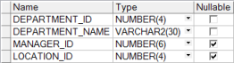

## 本章简介
&emsp;&emsp;前面的三章，都在介绍SQL中的数据查询语言DQL。DQL是软件开发人员使用频率最高的SQL语言，也是企业面试时对程序员的基本要求，在企业面试题中占有不小的比例。

&emsp;&emsp;但在数据库中，仅仅会查询肯定是不够的，本章将介绍数据操纵语言DML，学会如果插入行到表中，如何更新表中的行以及从表中删除行，之后会结合DML简单介绍事务的概念和使用。本章的后半部分，会介绍数据定义语言DDL，重点介绍如何创建并管理表，以及如何创建并维护约束。

 

 

 

## 5.1  数据操纵语言DML

 

&emsp;&emsp;数据操纵语言（Data Manipulation Language，DML）是SQL语言的核心部分之一。在添加、更新或者删除数据库表中的数据时，需要执行DML语句。严格意义上讲，SELECT查询语句属于数据查询语言DQL，不属于数据操纵语言DML，但在实际工作中，多数研发人员、数据库管理员都将SELECT语句归入数据操纵语言中。

### 5.1.1  INSERT语句  

&emsp;&emsp;要将一行数据插入表中，需要使用INSERT语句，其语法形式如下：


```
INSERT INTO table[(column1, column2…)]

VALUES (value1,value2…)
```


&emsp;&emsp;其中table表示的是表名，column1,column2…是字段名列表，用“,”隔开，value1,value2…是字段对应值列表，同样用“,”隔开。

- 插入新行

&emsp;&emsp;假设现在公司新增加了一个部门，该部门的名称为开发部（Development），部门编号按规则设定为280，该部门的经理由IT部门经理兼任（IT部门经理编号为103），部门所在地编号为1700。则在部门表中增加该部门信息的SQL语句如下：


```
INSERT INTO departments(department_id, department_name, manager_id, location_id)

VALUES (280, 'Development', 103, 1700)
```


&emsp;&emsp;执行该SQL语句，提示一条记录被插入。执行下面的SQL语句进行查询（执行查询语句前，执行COMMIT语句，保证之前的操作对数据库起作用；同时需要打开另一个SQL窗口执行查询语句，保证数据显示正确），判断插入是否成功，运行结果如图5.1所示。


```
SELECT * FROM departments WHERE department_id = 280
```


<p align="center"></p>  
<p align="center">图5.1  INSERT语句使用</p>  


&emsp;&emsp;在使用INSERT语句时，字段名列表的顺序可以随意指定，不需要按照表中字段的顺序列出，但对应值列表必须和字段名列表对应。对应值列表中的值如果是字符类型和日期类型，需要使用单引号括起来。

&emsp;&emsp;在使用INSERT语句时，可以省略字段名列表，则对应值列表中必须按照实际表中字段的默认顺序逐个完整地排列。例如上面的INSERT语句可以写成：


```
INSERT INTO departments VALUES (280, 'Development', 103, 1700)
```


&emsp;&emsp;不过对于软件开发人员而言，为了让代码可读性高，建议不要省略字段名列表。

- 插入带空值的行


&emsp;&emsp;在本书第2章，介绍了如何在PL/SQL Dev中查看表的表结构。接下来先看一下部门表结构，如图5.2所示。


<p align="center"></p>  
<p align="center">图5.2  部门表结构</p>  


&emsp;&emsp;从图5.2中可以看出，部门表中经理编号和所在地编号是允许为空的。那么如何插入一个带空值的行呢？有两种方法，一种是隐式插入，另一种是显式插入。

&emsp;&emsp;隐式插入是省略空值的字段列表和值列表，其SQL语句如下：


```
INSERT INTO departments(department_id, department_name)

VALUES (290, 'Development1')
```


&emsp;&emsp;显式插入是在VALUES子句中指定NULL关键字或空字符串' '（针对字符串类型和日期类型），其SQL语句如下：


```
INSERT INTO departments

VALUES (300, 'Development2', NULL, NULL)
```


&emsp;&emsp;需要注意的是，只能对允许为空值的字段插入该字段为空值的行，而且插入新行需要满足该表的其他约束（本章后面的课程会详细介绍）。

- 插入日期值

&emsp;&emsp;假设需要给雇员表中添加一行雇员信息，该雇员信息中包括雇佣日期，其SQL语句如下：


```
INSERT INTO employees

VALUES (207, 'Jacky', 'Wang', 'JackyWang', '515.127.4999',

​        '17-6月-13', 'IT_PROG', 8000, NULL, 103, 60) 
```


&emsp;&emsp;Oracle日期类型默认格式为DD-MON-RR，所以如果以字符类型按日期的默认格式输入，Oracle会自动转换为日期类型。但如果用户输入的日期字符串不是默认的格式，则需要通过TO_DATE函数将字符类型显式地转换为日期类型。例如上面的SQL语句可以进行如下修改：


```
INSERT INTO employees

VALUES (208, 'Jacky', 'Cheng', 'JackyCheng', '515.127.4888',

​    TO_DATE('2013/06/28', 'YYYY/MM/DD')),

​    'IT_PROG', 9000, NULL, 103, 60)
```


&emsp;&emsp;该SQL语句中，通过指定格式模板的方式，将包含日期信息的字符类型转换为日期类型。

&emsp;&emsp;假设，把当前日期作为雇佣日期，添加到表中，则可以直接使用SYSDATE函数获得当期日期，其SQL语句如下：


```
INSERT INTO employees

VALUES (209, 'Jacky', 'Zhang', 'JackyZhang', '515.127.4777',

​    SYSDATE,  'IT_PROG', 7000, NULL, 103, 60)
```


&emsp;&emsp;通过下面的SQL语句，查看上面添加的三条雇员记录是否已经在雇员表中存在，运行结果如图5.3所示。


```
SELECT * FROM employees WHERE employee_id IN(207, 208, 209)
```


<p align="center"></p>  
<p align="center">图5.3  插入日期值</p>  


- 插入多行

&emsp;&emsp;假设因为有一些特殊的需求，需要在数据库中有一个存放IT部门雇员简要信息的表（it_emp），该表中仅有雇员编号、姓氏、雇佣日期和薪水四个字段信息。那么如何将雇员表中IT部门雇员的部分信息按要求插入it_emp表中呢？逐行获取每个雇员，再逐列获取每个字段的数据，然后再拼凑成每个单行插入语句，这个方法可以完成目标，但是其过程太过烦琐。可以通过在INSERT子句后面接SELECT子查询，将SELECT子查询获取的结果一次性插入表中。使用SELECT子查询插入多行的语法形式如下：


```
INSERT INTO table [(column1, column2…)]

SELECT col1, col2… FROM table2…
```


&emsp;&emsp;需要注意的是，INSERT子句中字段名列表的数目和数据类型必须和SELECT子句中选择的字段列表的数目和数据类型相匹配。it_emp表的表结构如图5.4所示，具体SQL语句如下，执行完该SQL语句之后，it_emp表内容如图5.5所示。


```
INSERT INTO it_emp(employee_id, last_name, hire_date, salary)

SELECT employee_id, last_name, hire_date, salary

FROM employees WHERE department_id = 60
```


<p align="center"></p>  
<p align="center">图5.4  it_emp表结构</p>  


<p align="center"></p>  
<p align="center">图5.5  it_emp表内容</p>  


 

###  5.1.2  UPDATE语句  

&emsp;&emsp;使用INSERT语句可以插入数据。在日常的软件开发需求中，经常需要修改数据，比如之前增加了开发部这个部门，增加这个部门时部门经理由编号为103的雇员担任，但经过一段时间之后，由于公司组织结构调整，该部门的经理改为由编号为102的雇员担任，这时候就需要修改数据库中表的记录，其SQL语句如下：


```
UPDATE departments SET manager_id = 102 WHERE department_id = 280
```


&emsp;&emsp;查看部门表中的信息，开发部manager_id字段的值已经修改为102。

&emsp;&emsp;UPDATE语句用于修改已经存在的行，其语法形式如下：


```
UPDATE table

SET column1 = value1, column2 = value2…

[WHERE…]
```


&emsp;&emsp;其中table表示的是表名，column1, column2…是要修改的字段名，value1,value2…是修改后的字段值。使用UPDATE语句时，通常需要使用WHERE子句进行限制，用来确定哪些行需要被更新。如果没有WHERE子句，则该表中的所有行都被更新。

- 更新多个字段

&emsp;&emsp;上面的例子，更新了manager_id这一个字段的值。下面则通过子查询的方式更新多个字段的值。假设需求为更新开发部的部门经理编号和所在地编号，用部门编号为60的IT部门的部门经理编号和所在地编号进行替换，其SQL语句如下：


```
UPDATE departments 

SET manager_id = (SELECT manager_id FROM departments WHERE department_id = 60),

​    location_id = (SELECT location_id FROM departments WHERE department_id = 60) 

WHERE department_id = 280
```


&emsp;&emsp;执行该SQL语句，再通过下面的SQL语句获取部门编号为60和280的部门信息，其结果如图5.6所示。


```
SELECT * FROM departments WHERE department_id IN(60,280)
```


<p align="center"></p>  
<p align="center">图5.6  UPDATE更新多列</p>  


- 字段的完整性约束

&emsp;&emsp;假设现在需要把之前添加的编号为207、208和209的三个雇员的职位编号修改为JAVA_PROG，其SQL语句如下：


```
UPDATE employees 

SET job_id = 'JAVA_PROG'

WHERE employee_id IN(207,208,209)
```


&emsp;&emsp;执行该SQL语句，提示“违反检查约束条件”，具体的原因在之后的课程中会详细介绍。这里简单提示一下，在设计雇员表时，对job_id字段设置了约束条件，要求在该字段里添加的值必须在职位表jobs中也存在，否则不让添加。

### 5.1.3  DELETE语句  

&emsp;&emsp;介绍了插入和更改，接下来要介绍如何从表中删除行。删除行使用的是DELETE语句，其语法形式如下：


```
DELETE  [FROM]  table

[WHERE…]
```


&emsp;&emsp;需要注意的是，DELETE语句执行前没有确认提示，但是该删除操作在数据处理的事务（后面会详细介绍）被提交之前并没有在数据库中被真正执行，如果发现出错，可提前执行ROOLBACK语句撤销该删除操作。

&emsp;&emsp;使用DELETE语句时，WHERE子句非常重要，因为如果DELETE语句中没有WHERE子句，则删除整个表可能造成严重后果。

&emsp;&emsp;下面来看一个案例，要删除部门表中部门编号为290和300的两个部门，其SQL语句如下：


```
DELETE departments

WHERE department_id IN(290,300)
```


&emsp;&emsp;执行该SQL语句，提示两行记录被删除。再次执行如下的SQL查询语句，观察删除后的结果（之前不执行COMMIT语句，同时在另一个SQL窗口中执行查询语句），运行结果如图5.7所示。


```
SELECT * FROM departments WHERE department_id > 270
```


<p align="center"></p>  
<p align="center">图5.7  DELETE语句使用结果</p>  


&emsp;&emsp;从运行结果可以看出，在没有执行COMMIT语句之前，虽然提示了两行记录已被删除，但实际数据库中仍然包含着部门编号为290和300的两个部门。要想让所做的删除立刻对数据库起作用，需要执行COMMIT语句，之后再执行查询编号大于270的部门，就只会显示一条记录了。

&emsp;&emsp;如果要在部门表中删除部门编号为90的部门记录，其SQL语句如下：


```
DELETE FROM departments WHERE department_id = 90
```


&emsp;&emsp;执行该SQL语句，提示“违反完整约束条件”，原因为雇员表中的部门编号对应部门表中的部门编号，雇员表中有department_id为90的雇员信息，所以不能删除部门表中department_id为90的部门信息数据。之前能够删除部门编号为290和300的两个部门，是因为雇员表中没有这两个部门编号的雇员。


## 5.2  上机任务


#### 目标：完成本章5.1节的任务。

 


时间：30分钟。

 


形式：每个学员独立完成，小组组长检查。

 


工具：PL/SQL Dev。

 


&emsp;&emsp;注意：在执行INSERT、UPDATE和DELETE语句后，要想让这些语句立即对数据库起作用，需要执行COMMIT语句。

 

## 5.3  事务处理


&emsp;&emsp;事务（Transaction）是数据库中一个非常重要的概念，作为软件开发人员，在用程序操作数据库时，常用到事务。事务的主要任务是确保数据的一致性，使程序员可以更加灵活地执行对数据库的操作，避免数据库中出现数据错误。

&emsp;&emsp;事务由一组DML语句组成，完成一个相对完整的功能。例如，当一个银行客户从一个活期卡账户转账一定的数额形成一个定期账户时，这对于数据库而言就是一个事务。该事务由三部分单独的操作组成，减少活期账户余额，创建定期账户和记录交易信息。作为数据库，必须保证组成事务的三部分操作全部完成，才能维护数据的一致性。当因为某种原因，导致其中的一个操作失败时，其他的操作也会被撤销。

### 5.3.1  事务分类  

&emsp;&emsp;SQL语言按其功能分为四大类：数据查询语言DQL、数据操纵语言DML、数据定义语言DDL、数据控制语言DCL。事务是为了保持数据的一致性，而数据查询语言只是从数据库中查询数据，不会引起一致性问题。所以，根据SQL语言的分类情况，可以将事务分为针对DML的事务、针对DDL的事务和针对DCL的事务。

&emsp;&emsp;当执行第一个DML SQL语句时或一个事务结束之后下一个SQL语句开始时，事务开始。当碰到一个COMMIT（提交）语句或ROLLBACK（回滚）语句时，事务结束。尤其需要注意的是，DDL语句（例如创建表）和DCL语句（例如给用户授权）执行时自动提交事务，不需要显式提交，在此之前的DML语句也一并被隐式提交。另外，在数据库客户端程序退出或者数据库崩溃时，为了保持数据一致性，也会结束事务。

### 5.3.2  事务控制  

&emsp;&emsp;下面列举了事务控制语句，如表5.1所示。

表5.1  事务控制语句

| 语    句           | 说    明                                                     |
| ------------------ | ------------------------------------------------------------ |
| COMMIT             | 提交当前事务，使之前做的改变永久作用于数据库                 |
| ROLLBACK           | 回滚当前事务，丢弃所有未决的数据改变                         |
| SAVEPOINT   name   | 在当前事务中标记保存点（非ANSI SQL标准）                     |
| ROLLBACK   TO name | 回滚当前事务到指定的保存点从而丢弃保存点后对数据库的任何改变 |

 

- COMMIT和ROLLBACK语句

&emsp;&emsp;接下来演示一下COMMIT和ROLLBACK的使用。假设需要删除雇员编号为209的雇员，执行下面的SQL语句：


```
DELETE FROM employees WHERE employee_id = 209
```


&emsp;&emsp;在新SQL窗口中执行如下的SQL语句进行查询，其结果如图5.8所示。


```
SELECT employee_id, last_name,salary FROM employees WHERE employee_id = 209
```


<p align="center"></p>  
<p align="center">图5.8  事务控制</p>  


&emsp;&emsp;此时，删除操作并没有永久作用于数据库，可以使用ROLLBACK语句回滚整个事务，撤销该删除操作，或使用COMMIT语句提交事务，让删除操作永久作用于数据库。在原SQL窗口中，先执行回滚，再执行提交，其SQL语句如下：


```
ROLLBACK;

COMMIT;
```


&emsp;&emsp;在新SQL窗口中，再次在雇员表中查询雇员编号为209的雇员信息，仍然可以查到该雇员信息。原因是先回滚，再提交，删除操作已被取消，编号为209的雇员仍在数据库中。

&emsp;&emsp;另外，还有一种情况，就是出现了客户端工具意外退出的情况或发生系统故障，此时整个事务会被自动回滚。该回滚防止不必要的数据改变错误发生，保证Oracle数据的完整性。

&emsp;&emsp;执行DML语句且没有结束事务时，如果需要查询数据库的真实改变情况，则要求在一个新SQL窗口中执行查询语句。为什么这样呢？

&emsp;&emsp;因为事务中所做的每一个操作在事务被提交之前都是临时的，在COMMIT或ROLLBACK语句执行之前，DML语句首先影响该用户的数据库缓冲区，因此这些操作可以被恢复，而且因为是在该用户的数据缓冲区，所以在原SQL窗口中查询得到的是数据缓冲区的结果，不是数据库真实的数据。要想拿到数据库真实的数据，需要在新SQL窗口中执行查询语句。这样，针对不同的用户，Oracle服务器用读一致性来确保每个用户看到的数据和上次提交时的数据相同。

&emsp;&emsp;另外，在一个用户执行DML语句（未结束事务）影响数据库中相关的行时，受影响的行被锁定，其他用户不能改变受影响的行中的数据，直到事务结束时为止。

&emsp;&emsp;假设现在雇员表中还存在雇员编号为209的这个雇员信息，执行下面的SQL语句，目的是删除编号为209的雇员记录。


```
DELETE FROM employees WHERE employee_id = 209
```


&emsp;&emsp;此时在一个新SQL窗口中执行如下的SQL语句，用于更改雇员编号为209的雇员的薪水。


```
UPDATE employees SET salary = 10000 WHERE employee_id = 209
```


&emsp;&emsp;PL/SQL Dev执行时的结果：显示该语句一直在执行，但始终没有执行结果。这就说明了该行数据已被锁定，其他用户不能改变该行中的数据。

&emsp;&emsp;在原窗口中执行COMMIT语句，提交当前事务，使删除操作永久作用于数据库。此时，新SQL窗口立刻显示0行记录被更新，说明该行已被解锁，且因为已被删除，故没有数据被更新。

- SAVEPOINT语句

&emsp;&emsp;在当前事务中用SAVEPOINT name语句创建一个标记，该标记称为保存点标记，它可以把事务分成更小的部分，使用ROLLBACK TO name语句，丢弃保存点之后的所有未决的数据改变。其语法形式如下：


```
DML A…

SAVEPOINT sp;

DML B…

ROLLBACK TO sp;
```


&emsp;&emsp;当执行ROLLBACK TO sp语句时，DML B段的操作将会被撤销。


## 5.4  上机任务


目标：完成本章5.3节的任务。

 


时间：30分钟。

 


形式：每个学员独立完成，小组组长检查。

 


工具：PL/SQL Dev。

 


&emsp;&emsp;注意：需要在不同的SQL窗口中执行对应的SQL语句。

## 5.5  表

 

&emsp;&emsp;从接触数据库开始，就一直在和表打交道。查询数据、插入数据、更改数据和删除数据，都是在操作数据库表中的数据。从本节开始，要介绍使用数据定义语言DDL创建并修改表。

### 5.5.1  表概述  

- 表

&emsp;&emsp;表是数据库中最重要的对象，是数据库的基础，是基本存储单元，用来存储数据，由行（记录）和列（字段）组成。

&emsp;&emsp;在被授权的情况下，数据库用户可以创建表，并且创建表的用户对该表具有“增删改查”的权限。一个数据库表，可以有多达1000个字段，表名和字段名必须符合命名规则。表在创建时没有数据，只是一个表结构，之后可以通过INSERT语句单行或多行添加数据。 

&emsp;&emsp;如同Java语言变量有命名规则一样，Oracle数据库的表和字段的命名有如下规则：

&emsp;&emsp;（1）必须以字母开始。

&emsp;&emsp;（2）必须是1～30个字符长度。

&emsp;&emsp;（3）只能包含字母、数字、下画线“_”、美元符“$”和井号“#”。

&emsp;&emsp;（4）不能使用Oracle的关键字。

&emsp;&emsp;（5）同一个用户所拥有的对象之间不能重名。

- 用户表和数据字典表

&emsp;&emsp;Oracle数据库中的表包括两种类型：一种是用户表，由用户创建和维护的表，存放用户需要存放的信息；另一种是数据字典表，由Oracle服务器创建和维护的表，包括与数据库相关的信息。

&emsp;&emsp;全部数据字典表的所有者是用户SYS。数据字典表的基表很少被用户访问，因为其中的信息不容易理解，因此，用户一般是访问数据字典视图，因为视图中的信息是以容易被理解的格式表示的。存储在数据字典中的信息包括Oracle数据库用户的名字、被授予用户的权限、数据库对象名、表结构等信息。

&emsp;&emsp;有四种数据字典视图，每一种都有一个特定的前缀来反映其不同的目的，如表5.2所示。

表5.2  数据字典视图

| 前    缀 | 说    明                                                 |
| -------- | -------------------------------------------------------- |
| USER_    | 包含关于用户所拥有对象的信息                             |
| ALL_     | 包含所有用户可访问的表   （对象表和相关的表） 的信息     |
| DBA_     | 受限制的视图，它们只能被分配有   DBA 角色的用户所访问    |
| V$       | 动态执行的视图，包含数据库服务器的性能、存储器和锁的信息 |

 

 

- 查询数据字典

&emsp;&emsp;要显示HR这个用户所拥有的表的名称，可以使用如下的SQL语句（以HR用户登录），其中user_tables就是记录用户表的数据字典视图。


```
SELECT table_name FROM user_tables
```


&emsp;&emsp;执行该SQL语句，运行结果如图5.9所示。


<p align="center"></p>  
<p align="center">图5.9  获取用户拥有的表的名称</p>  


&emsp;&emsp;如果想了解HR这个用户所拥有的表、视图、序列等对象，可以使用如下的SQL语句：


```
SELECT table_name,table_type FROM user_catalog
```


&emsp;&emsp;执行结果如图5.10所示。


<p align="center"></p>  
<p align="center">图5.10  获取用户拥有的数据库对象</p>  


&emsp;&emsp;其中第二列TABLE_TYPE中，显示为TABLE的表示前面是一个表，显示为SEQUENCE的表示前面是一个序列，显示为VIEW的表示前面是一个视图。

### 5.5.2  创建表  

- 语法形式

&emsp;&emsp;创建表，需要使用CREATE TABLE语句，该语句是读者接触的第一个数据定义语言。为了创建表，用户必须有创建表的权限，并且有存储区域用来存储表这个数据库对象。创建表的语法形式如下：


```
CREATE TABLE [schema.]table

(col1 type1 [DEFAULT1], col2 type2 [DEFAULT2]…coln typen [DEFAULTn])
```


&emsp;&emsp;schema（方案）是对象的集合，方案对象直接反映数据在数据库中的逻辑结构，方案对象包括表、视图、同义词、序列、存储过程、索引、集群等。默认情况下，方案名等于用户的名字。

&emsp;&emsp;在Oracle中，一个用户一般对应一个方案，该用户的方案名等于用户名，并作为该用户默认的方案。如果一个表不属于本用户，那么必须通过“方案名.表名”引用这个表，也就是通过用“用户名.表名”引用这个表。

&emsp;&emsp;另外，语法形式中table代表表名，coln代表第n个字段名，typen代表第n个字段的数据类型和长度，DEFAULTn代表第n个字段的默认值。默认值可以是字符、表达式或SQL函数（例如SYSDATE），主要目的是防止插入时将空值输入字段中，但默认值不能是另一个字段的名字或伪列，且默认值必须与字段的数据类型相匹配。

- 创建表

&emsp;&emsp;假设现在需要新建一个部门表depts，该部门表有四个字段，分别是部门编号dept_id、部门名称dept_name、部门经理名字manager_fname和所在地dept_loc，其SQL语句如下：


```
CREATE TABLE depts

​     (dept_id                  NUMBER(4),

​     dept_name                       VARCHAR2(20),

​     manager_fname                   VARCHAR2(14),

​     dept_loc            VARCHAR2(30));
```


&emsp;&emsp;执行该SQL语句（因为CREATE TABLE语句属于DDL，该语句执行时会发生一个自动提交），数据库中创建了该表。通过PL/SQL Dev查看被创建的depts表的表结构，如图5.11所示。


<p align="center"></p>  
<p align="center">图5.11  创建表的表结构</p>  


&emsp;&emsp;以上是用SQL语句创建了depts表，这种方法比较适用于对SQL语言熟悉的数据库管理员创建表，或者软件开发人员需要在程序中动态地创建表的情况。也可以使用PL/SQL Dev这类可视化工具直接创建表，这样操作起来相对简单。在PL/SQL Dev中创建表的步骤如下。

&emsp;&emsp;（1）用鼠标右键选中左侧的Tables文件夹，在弹出的菜单中选择New…，如图5.12所示。


<p align="center"></p>  
<p align="center">图5.12  新建表</p>  


&emsp;&emsp;（2）如图5.13所示，在General选项卡中，Owner后面需要选择该表的拥有者，默认为登录用户，Name栏里需要填写表名，其他的内容暂时不填。


<p align="center"></p>  
<p align="center">图5.13  新建表</p>  


&emsp;&emsp;（3）选择Columns选项卡，如图5.14所示，按照图5.11的内容逐行添加每个字段，添加完成后单击下面的Apply按钮创建表。需要注意的是，该窗口中的Keys、Checks、Indexes、Privileges选项卡分别是设置表的键、约束、索引和权限的，之后在涉及此类内容时，可以通过SQL语句操作，也可以通过PL/SQL Dev的可视化窗口操作。


<p align="center"></p>  
<p align="center">图5.14  新建表</p>  


l 用子查询创建表

&emsp;&emsp;前面通过CREATE TABLE语句和PL/SQL Dev可视化工具这两种方式创建了表，此时创建的表是一个空表，里面没有任何的数据。接下来通过使用子查询的方式创建表，并同时插入数据行。用子查询创建表的语法如下：


```
CREATE TABLE table[(col1, col2…)]

AS SELECT…
```


&emsp;&emsp;新建表后面的字段列表，如果有的话，字段的数目必须等于子查询所选字段的数目，如果没有，则新建表的字段名使用子查询的字段名。另外，定义新表的字段属性，只能定义字段名和默认值。通过子查询创建表，完整性约束不会被传递到新表中，但字段的数据类型会被引用。

&emsp;&emsp;假设需要创建一个部门表depts_temp，该部门表有四个字段，分别是部门编号dept_id、部门名称dept_name、部门经理编号manager_id和所在地编号loc_id，且depts_temp表的数据来源于departments部门表（仅取部门编号为60、80和90的部门数据），其SQL语句如下：


```
CREATE TABLE depts_temp(dept_id, dept_name, manager_id, loc_id)

AS 

​    SELECT department_id, department_name, manager_id, location_id

​    FROM departments

​    WHERE department_id IN(60, 80, 90)
```


&emsp;&emsp;执行该SQL语句，并查询新建表depts_temp里的所有数据，结果如图5.15所示。


<p align="center"></p>  
<p align="center">图5.15  用子查询新建表</p>  


&emsp;&emsp;假设希望通过子查询创建表，但并不将数据插入新表中，那么可以让子查询的WHERE子句永远为假，这样就只创建了表，但没有插入数据。具体的SQL语句如下：


```
CREATE TABLE depts_temp2

AS 

​    SELECT department_id, department_name, manager_id, location_id

​    FROM departments

​    WHERE 1 = -1
```


### 5.5.3  修改表  

- 语法形式

&emsp;&emsp;创建一个表后，可能需要改变表的结构，例如要添加或删除一个字段或修改某个字段的定义，这时可以用ALTER TABLE语句来完成这些任务。用ALTER TABLE语句添加字段、修改字段和删除字段的语法形式如下，其中，ADD、MODIFY和DROP是修改的类型。


```
ALTER TABLE table

​    ADD(col1 type1 [DEFAULT1], col2 type2 [DEFAULT2]…)

ALTER TABLE table

​    MODIFY(col1 type1 [DEFAULT1], col2 type2 [DEFAULT2]…)

ALTER TABLE table

​    DROP(col)
```


- 添加字段

&emsp;&emsp;假设现在需要给之前创建的depts表中增加一个字段—部门编制人数num_limit，数据类型为数字型，默认值为10人，其SQL语句如下：


```
ALTER TABLE depts

​    ADD(num_limit NUMBER(2) DEFAULT 10)
```


&emsp;&emsp;执行该SQL语句之后，查询该表的表结构，结果如图5.16所示。


<p align="center"></p>  
<p align="center">图5.16  修改表添加新字段</p>  


&emsp;&emsp;在图5.16中，num_limit字段被添加到该表的最后一个字段。需要注意的是，添加的新字段在该表的最后一列，不能指定字段位置。同时如果被添加的表中已包含有行，则所有行的新字段被初始化为空或默认值。

- 修改字段

&emsp;&emsp;在ALTER TABLE语句后，可以用MODIFY子句修改一个字段，字段的修改包括修改字段的数据类型（仅在列中只有空值时才可以修改）、大小和默认值，不过对默认值的修改只会影响后来插入表的数据，对之前的数据不会产生影响。

&emsp;&emsp;例如发现原先设定的depts表中部门所在地字段dept_loc的字符长度为30不够使用，需要调整为50，则其SQL语句如下：


```
ALTER TABLE depts

​    MODIFY(dept_loc VARCHAR(50))

```

&emsp;&emsp;执行该SQL语句之后，查询该表的表结构，结果如图5.17所示。


<p align="center"></p>  
<p align="center">图5.17  修改表修改字段</p>  


- 删除字段

&emsp;&emsp;在ALTER TABLE语句后，可以用DROP子句删除一个字段。删除一个字段时，不论表中已有行的这个字段是否有数据，这点和修改字段数据类型时不同。另外，和添加字段、修改字段不同的是删除字段一次只能有一个字段被删除。当然，在删除字段时，被修改的表至少要保留一个字段。

&emsp;&emsp;例如要删除刚刚创建的部门编制人数字段num_limit，其SQL语句如下：


```
ALTER TABLE depts

​    DROP(num_limit)

```

&emsp;&emsp;再次查看该表的表结构时，部门编制人数字段num_limit已被删除。

### 5.5.4  删除表及其他  

- 删除表

&emsp;&emsp;DROP TABLE语句用于删除Oracle表，只有表的创建者或具有删除任何表权限的用户才可以删除表。在删除一个表时，数据库丢失表中所有的数据，并且所有与其相关的索引也被删除（视图和同义词被保留但已无效），未决的事务会被提交。删除表的语法形式如下：


```
DROP TABLE table
```


&emsp;&emsp;假设现在需要删除之前创建的depts_temp2表，其SQL语句如下：


```
DROP TABLE depts_temp2
```


&emsp;&emsp;执行该SQL语句，depts_temp2表被删除。

- 重命名对象

&emsp;&emsp;执行RENAME语句，可以更改一个表、视图、序列或同义词的名字，其语法形式如下：


```
RENAME old_name TO new_name
```


- 截断表

&emsp;&emsp;使用TRUNCATE TABLE语句可以删除表中所有的行，并释放该表所使用的存储空间。DELETE语句也可以从表中删除所有的行，但它不能释放存储空间。相比而言，TRUNCATE TABLE语句更快一些，因为TRUNCATE语句是数据定义语句，直接提交，不会产生回滚信息，并且不会触发表的删除触发器。截断表的语法形式如下：


```
TRUNCATE TABLE table
```


## 5.6  上机任务


目标：完成本章5.5节的任务。

 


时间：40分钟。

 


形式：每个学员独立完成，小组组长检查。

 


工具：PL/SQL Dev。

## 5.7  内置约束

 

&emsp;&emsp;在本章前面的内容中，已经涉及了约束的概念。比如说插入空值时，只可以对允许为空值的字段插入；例如更新雇员表时，如果设置的job_id的值不在职位表jobs中存在，则提示“违反检查约束条件”；再例如在删除部门表的某个部门时，雇员表中有这个部门的雇员，则提示“违反完整约束条件”，不允许删除。本节将详细地介绍约束的相关内容。

### 5.7.1  约束概述  

&emsp;&emsp;Oracle数据库使用约束（constraints）来防止无效的数据进入表中，保护数据的实体完整性。约束规则定义在表级，如果表和表之间有从属关系，约束也可以防止表的删除。通过约束，强制用户在插入、更新或删除数据时必须遵循一定的规则。

&emsp;&emsp;约束可以在创建表的时候定义，也可以在创建表之后定义。所有的约束存储在数据字典中，可以用USER_CONSTRAINTS数据字典视图查看对一个表的约束的定义。

&emsp;&emsp;给约束起一个有意义的名字（例如DEPT_NAME_NN代表部门名不能为空的约束），易于约束的引用。如果不显式地命名约束，Oracle数据库将用格式SYS_Cn产生一个系统约束名字，这里的n 是一个唯一的整数，所以约束名是唯一的。

&emsp;&emsp;表5.3列举了一些常用的数据一致性约束。

表5.3  数据一致性约束

| 约    束      | 说    明                                                   |
| ------------- | ---------------------------------------------------------- |
| NOT NULL      | 指定字段不能是空值                                         |
| UNIQUE        | 指定字段的值（或字段组合的值）对于表中所有的行必须是唯一的 |
| PRIMARY   KEY | 指定表的每行的唯一性标识，即主键                           |
| FOREIGN   KEY | 在指定字段和引用表的一个字段之间建立强制外键关系，即外键   |
| CHECK         | 指定一个必须为真的条件                                     |

 

### 5.7.2  约束使用  

- 创建表时定义约束

&emsp;&emsp;下面给出了在创建表的同时定义约束的语法：


```
CREATE TABLE [schema.]table

​    (col1 type1 [DEFAULT1]  [col1_constraint],

​    col2 type2 [DEFAULT2]  [col2_constraint],

​    …

​    [table_constraint])
```


&emsp;&emsp;其中col1_constraint是一个给col1字段定义的完整性约束，而table_constraint是作为表table定义的完整性约束。

&emsp;&emsp;约束可以在两个级别上定义，分别是字段级别约束和表级别约束，其中字段级别约束值涉及一个单个的字段，能够定义完整性约束的任何类型；而表级别约束涉及一个或多个字段，不能定义NOT NULL这个约束。

&emsp;&emsp;假设现在需要新建一个部门表depts_temp3，该部门表有四个字段，分别是部门编号dept_id、部门名称dept_name、部门经理名字manager_fname和所在地dept_loc。其中部门编号和部门名称不能为空，并且部门编号是该表的主键（主键名为dept3_id_pk）。

&emsp;&emsp;其SQL语句如下：


```
CREATE TABLE depts_temp3

​    (dept_id          NUMBER(4)            NOT NULL,

​    dept_name        VARCHAR2(20)                  NOT NULL,

​    manager_fname   VARCHAR2(14),

​    dept_loc          VARCHAR2(50)

​    CONSTRAINT  dept3_id_pk  PRIMARY KEY(dept_id)

​    );
```


&emsp;&emsp;执行该SQL语句，之后通过PL/SQL Dev查看该表的表结构和键，如图5.18和图5.19所示。


<p align="center"></p>  
<p align="center">图5.18  创建表时定义约束</p>  


<p align="center"></p>  
<p align="center">图5.19  创建表时定义主键</p>  


- NOT NULL约束

&emsp;&emsp;NOT NULL约束又称非空约束。NOT NULL约束只能定义在字段级别，不能定义在表级别。上面创建depts_temp3表的SQL语句中定义了两个NOT NULL约束，并且都是由系统产生约束名。如果需要指定DEPT_NAME字段的NOT NULL约束的名字为dept3_name_nn，其SQL语句如下（之前需要执行DROP TABLE depts_temp3删除表）：


```
CREATE TABLE depts_temp3

​      (dept_id                    NUMBER(4)  NOT NULL,

​      dept_name           VARCHAR2(20)  CONSTRAINT dept3_name_nn NOT NULL,

​      manager_fname       VARCHAR2(14),

​      dept_loc             VARCHAR2(50),

​      CONSTRAINT  dept3_id_pk  PRIMARY KEY(dept_id)

​      );
```


&emsp;&emsp;执行该SQL语句，再通过下面的SQL语句（注意DEPTS_TEMP3必须大写），从USER_CONSTRAINTS视图中获取关于depts_temp3表的约束信息，结果如图5.20所示。


```
SELECT * FROM user_constraints WHERE table_name = 'DEPTS_TEMP3'
```


<p align="center"></p>  
<p align="center">图5.20  定义NOT NULL约束</p>  


&emsp;&emsp;从图5.20中可以看出，针对dept_id字段定义的约束因为没有显式命名，Oracle系统定义了SYS_C0011119的名字，另外两个约束都被显式地命名了。另外，没有显式命名的非空约束，使用PL/SQL Dev在Checks约束选项卡中是看不到的，这点需要注意。

- UNIQUE约束

&emsp;&emsp;UNIQUE约束又称唯一键约束，要求字段或者字段的组合（键）的每个值是唯一的，定义UNIQUE约束的字段（或字段组合）被称为唯一键（unique key）。对于无非空约束的字段，唯一键约束允许输入空值，且包含空值的行可以是任意数目，因为空不等于任何值。UNIQUE约束既可以在字段级也可以在表级定义，使用表级定义时，一个复合唯一键被创建。

&emsp;&emsp;如果要给depts_temp3表增加一个部门描述的字段dept_desc，且此字段是唯一键，键名为dept3_desc_uk，SQL语句如下：


```
ALTER TABLE depts_temp3

​    ADD(dept_desc VARCHAR(100) CONSTRAINT dept3_desc_uk UNIQUE)
```


&emsp;&emsp;该段SQL语句采用了在添加字段的同时给该字段定义约束的形式。执行该SQL语句，通过PL/SQL Dev查看该表的表结构和键，发现dept_desc字段被添加，且增加了一个唯一键约束。

- 主、外键约束

&emsp;&emsp;主键和外键是设置表和表之间关联的对象，在介绍多表查询时就是通过表的主键和外键的关系建立其表和表之间的连接。例如，部门表中部门编号是主键，雇员表中雇员的部门编号是外键，通过这一对主外键关系，将两个表建立关联。

&emsp;&emsp;PRIMARY KEY约束为表创建一个主键，每个表只能创建一个主键，主键是表的每一行的唯一性标识，该约束强制字段或字段组合的唯一性，并且确保作为主键一部分的字段不能包含空值。对于一个主键字段，UNIQUE索引被自动创建。主键可以定义在列级别，也可以定义在表级别，用表级别定义的主键通常是字段组合主键。

&emsp;&emsp;之前创建depts_temp3表时，通过“CONSTRAINT dept3_id_pk PRIMARY KEY (dept_id)”语句将dept_id字段定义为主键。需要注意的是，一个表只能定义一个主键约束，但同时可以有多个唯一键约束。

&emsp;&emsp;FOREIGN KEY约束是引用完整性约束，指明一个字段或者字段的组合作为一个外键，这个外键和另一个表的主键（或唯一键）建立起一个关系。在雇员表employees（依赖表或子表）中，部门编号字段department_id被定义为外键，它引用部门表departments（引用表或父表）中的部门编号字段department_id（主键）。

&emsp;&emsp;一个外键值必须匹配一个在父表中存在的值，所以在子表中，不能在外键字段中输入一个没有引用的值；同时在父表中，不能删除这样的行，该行的主键正被子表所引用。本节开始时提到的三个约束，其中后面两个约束就是这方面的主外键约束。

&emsp;&emsp;现在要创建一个临时雇员表emps，字段包括雇员编号emp_id、姓氏last_name、薪水salary和部门编号dept_id，其中部门编号dept_id是外键，引用depts_temp3表中的部门编号dept_id。


```
CREATE TABLE emps

​    (emp_id      NUMBER(6)              NOT NULL,

​    last_name   VARCHAR2(25)        NOT NULL,

​    salary         NUMBER(8,2),

​    dept_id       NUMBER(4),

​    CONSTRAINT emps_dept_fk FOREIGN KEY(dept_id) REFERENCES depts_temp3(dept_id),

​    CONSTRAINT emps_id_pk PRIMARY KEY(emp_id)

​    );

```

&emsp;&emsp;执行该SQL语句，之后通过PL/SQL Dev查看该表的键，如图5.21所示。


<p align="center"></p>  
<p align="center">图5.21  主外键约束</p>  


- CHECK约束

&emsp;&emsp;CHECK约束是一种灵活的约束，定义每行都必须满足的条件。一个字段可以定义多个CHECK约束。

&emsp;&emsp;假设要求临时雇员表emps中的salary字段的值必须大于等于零，则可以通过下面的SQL语句，给emps中的salary字段添加约束。


```
ALTER TABLE emps

​    ADD CONSTRAINT emps_salary_min CHECK(salary >= 0)
```


&emsp;&emsp;该段SQL语句没有采用创建表时添加约束的形式，而是在创建表以后直接添加约束。其语法形式和修改表字段的语法形式类似，只是这里操作的是约束而不是字段。执行该SQL语句，之后通过PL/SQL Dev查看该表的Checks选项卡，其结果如图5.22所示。


<p align="center"></p>  
<p align="center">图5.22  CHECK约束</p>  


- 添加约束

&emsp;&emsp;除了在创建表时给字段或表创建约束外，也可以直接给表添加、删除、启用或禁用约束。上面的例子就是采用了直接给表添加约束的形式。给表直接添加约束的语法形式如下：


```
ALTER TABLE table 

​    ADD [CONSTRAINT cname]  type(column)
```


&emsp;&emsp;其中cname是约束名，type是约束类型，column是受影响的字段名。约束名在语法中是一个可选项，如果不命名约束，系统会产生一个约束名，不过还是建议命名约束。

- 删除约束

&emsp;&emsp;删除约束的语法形式如下：


```
ALTER TABLE table

​    DROP PRIMARY KEY | UNIQUE(column) | CONSTRAINT cname [CASCADE]
```


&emsp;&emsp;为了删除约束，可以先从USER_CONSTRAINTS数据字典视图中确定约束的名字，然后使用带DROP子句的ALTER TABLE语句进行删除。DROP子句的CASCADE选项将会导致任何与其相依赖的约束也被删除。

&emsp;&emsp;例如要删除depts_temp3表中的dept3_desc_uk约束，其SQL语句如下：


```
ALTER TABLE depts_temp3

​    DROP CONSTRAINT dept3_desc_uk
```


&emsp;&emsp;例如要删除depts_temp3表中的主键约束（dept_id），并且删除相关联的emps表中dept_id字段上的外键约束，SQL语句如下：


```
ALTER TABLE depts_temp3

​    DROP PRIMARY KEY CASCADE
```


&emsp;&emsp;执行该SQL语句，之后通过PL/SQL Dev查看depts_temp3表的主键和emps表的外键，主外键均被删除。

l 启用或禁用约束

&emsp;&emsp;作为软件开发人员，启用或禁用约束很少用到，这里只列出它们的语法形式，读者有所了解即可。

&emsp;&emsp;禁用约束的语法形式如下：


```
ALTER TABLE table 

​    DISABLE CONSTRAINT cname  [CASCADE]
```


&emsp;&emsp;启用约束的语法形式如下：


```
ALTER TABLE table

​    ENABLE CONSTRAINT cname 
```


## 5.8  上机任务


目标：完成本章5.7节的任务。

 


时间：40分钟。

 


形式：每个学员独立完成，小组组长检查。

 


工具：PL/SQL Dev。

 


## 5.9  本章练习

 

1  从严格意义上讲，下列（    ）语句不属于数据操纵语句DML。（选择一项）

&emsp;&emsp;A．INSERT

&emsp;&emsp;B．DELETE

&emsp;&emsp;C．UPDATE

&emsp;&emsp;D．SELECT

2  用子查询创建一个表时，定义新表的字段属性，只能定义        和        。

 

 

3  请描述什么是事务，其最大的特点是什么。并说明一个事务在什么情况下会结束。

 

 

4  通过自学的方式，完成使用SQL命令查询一个表的表结构。

 

 

5  请描述数据库中有哪些常用内置约束。

 

 

