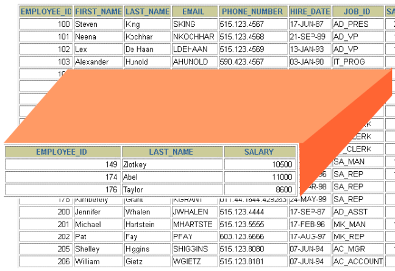
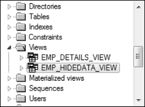
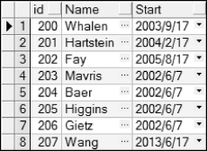
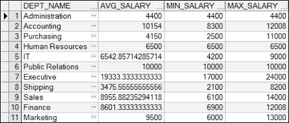
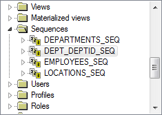
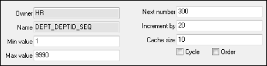
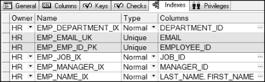
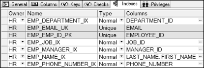
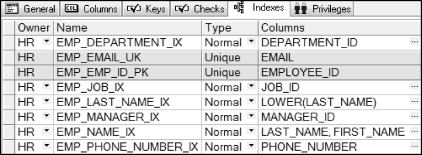

## 本章简介
&emsp;&emsp;第5章介绍了创建并管理表，并使用约束防止无效的数据进入表中。表是数据库的基础，是数据库最重要的对象，在学完这个对象之后，接下来要介绍三个重要的数据库对象，它们分别是视图（View）、序列（Sequence）和索引（Index）。

 

 

 

## 6.1  视图

&emsp;&emsp;本节主要介绍什么是视图，为什么要使用视图，视图的分类，以及如何创建视图，修改视图的定义和删除视图。

### 6.1.1  视图概述  

- 什么是视图

&emsp;&emsp;视图是表现数据的逻辑子集或数据的组合。视图是基于表或另一个视图的逻辑表，一个视图并不包含真实的数据，它提供了另一个视角查看或改变表中的数据，如图6.1所示。视图本质上就是一个SELECT语句。


<p align="center"></p>  
<p align="center">图6.1  视图概念</p>  


&emsp;&emsp;图6.1的视图由下面的SQL语句创建：


```
CREATE VIEW emp_view

AS 

​         SELECT employee_id, last_name, salary

​         FROM employees
```


- 为什么要使用视图

&emsp;&emsp;视图有两个方面的作用非常明显，使得其在数据库中广为使用。

&emsp;&emsp;其一是视图可以起到隐藏数据的功能。因为视图可以选择性地显示表中的字段和行。比如雇员表，里面包括雇员编号、名字、姓氏、EMAIL、电话和薪水等字段，假设针对某类用户，希望这些用户可以看到除雇员薪水以外的其他字段的信息，可以使用视图达到隐藏数据的功能。创建一个视图，该视图包括除薪水以外的其他字段，然后将这个视图授权给这类用户访问，并取消这类用户对雇员表的访问权限，这样就达到了隐藏雇员薪水的目的。

&emsp;&emsp;其二是视图可以将复杂的多表连接查询的结果构成一个简单的表结构提供给用户。出于数据库设计的考虑，需要把雇员相关的信息存放到多个表中。比如最核心的表是雇员表，之后通过雇员表中的部门编号连接到部门表，通过部门表中的所在地编号连接到所在地表，通过国家编号连接到国家表，通过大洲编号连接到大洲表。但在数据库把雇员相关的信息展现给用户（包括程序开发人员）的时候，往往需要把相关信息通过多表查询的方式连接成一个大的逻辑表方便用户使用，而这个大的逻辑表就是视图。

&emsp;&emsp;视图还有一些其他的作用，比如相同的数据可以展现出不同的视图，提供用户访问等。

- 视图的分类

&emsp;&emsp;视图是一个逻辑表，并不是一个真实存在的表。通过视图，是否可以进行DML操作（包括插入、更新和删除，不包括查询）将是对视图进行分类的重要依据。

&emsp;&emsp;视图可以分为简单视图和复杂视图，两者的区别如表6.1所示。

表6.1  视图分类

| 特    性                    | 简单视图 | 复杂视图  |
| --------------------------- | -------- | --------- |
| 涉及表的数目                | 1个      | 1个或多个 |
| 是否包含函数                | 不包含   | 包含      |
| 是否包含数据分组            | 不包含   | 包含      |
| 是否可以通过视图进行DML操作 | 可以     | 不可以    |

 

- 视图的存储与执行

&emsp;&emsp;视图的本质是一个SELECT语句，可以通过查询数据字典视图USER_VIEWS来查看视图的名字和视图定义，构成视图的SELECT语句的文本被存储在一个LONG字段中。通过下面的SQL语句，可以获取数据字典视图USER_VIEWS的信息。


&emsp;&emsp;
SELECT * FROM USER_VIEWS
&emsp;&emsp;


&emsp;&emsp;执行该SQL语句，选择一个视图，单击TEXT字段LONG右边的小按钮，弹出视图的SELECT语句，如图6.2所示。


<p align="center"></p>  
<p align="center">图6.2  获取视图信息</p>  


&emsp;&emsp;当用户从视图中查询数据时，Oracle数据库将从数据字典视图USER_VIEWS中获得视图的定义，然后检查对视图基表的数据存储权限，之后将针对视图的查询转换成针对基表的查询操作。

### 6.1.2  简单视图  

- 语法形式

&emsp;&emsp;使用CREATE VIEW语句可以创建视图，其语法形式如下：


```
CREATE [OR REPLACE] [FORCE|NOFORCE] VIEW view[(aliaslist)]

AS subquery

[WITH CHECK OPTION [CONSTRAINT cname]]

[WITH READ ONLY]
```


&emsp;&emsp;其中，OR REPLACE表示如果视图已经存在则重新创建，FORCE表示创建视图而不管基表是否存在，NOFORCE表示只有在基表存在的情况下才创建视图（默认情况），view表示视图名，aliaslist表示别名列表（别名之间用逗号隔开，别名的个数需要和查询中选择的字段或表达式的个数一致），subquery表示子查询，WITH CHECK OPTION表示只有可访问的行在视图中才能被插入或更新，cname表示为CHECK OPTION约束指定的名称，WITH READ ONLY表示在该视图中不可执行DML操作。

&emsp;&emsp;视图的核心是子查询，在视图中，子查询可以包含复杂的SELECT语句，但不可以包含ORDER BY子句（如想排序，可以从视图中取数据时进行排序）。

- 创建视图

&emsp;&emsp;视图的作用之一就是隐藏数据，下面就针对雇员表创建一个视图，隐藏其他数据，只显示雇员编号、姓氏和雇佣日期这三个字段的信息，且它们的别名分别设置为id、Name和Start，其SQL语句如下：


```
CREATE OR REPLACE VIEW emp_hidedata_view("id", "Name", "Start")

AS SELECT employee_id, last_name, hire_date FROM employees
```


&emsp;&emsp;执行该SQL语句，之后通过PL/SQL Dev查看Views文件夹，如图6.3所示，显示视图已经创建成功。

&emsp;&emsp;右击该视图，选择Query data选项获取数据，部分显示结果如图6.4所示。


<p align="center"></p>  
<p align="center">图6.3  Views文件夹</p>  


<p align="center"></p>  
<p align="center">图6.4  获取视图内容</p>  

​                                        

&emsp;&emsp;删除视图非常简单，只要执行DROP VIEW vname语句即可，其中vname代表视图名。该语句从数据库中删除视图定义，但不影响用于建立视图的基表，但基于已删除视图上的其他视图或应用程序将无效。

- 查询视图

&emsp;&emsp;对于创建好的视图，可以像从表中查询数据一样从视图中获取数据，例如可以执行如下的SQL语句：


```
SELECT * FROM emp_hidedata_view

WHERE "id" BETWEEN 200 AND 207
```


&emsp;&emsp;执行该SQL语句，运行结果如图6.5所示。


<p align="center"></p>  
<p align="center">图6.5  从视图中查询数据</p>  


### 6.1.3  复杂视图  

&emsp;&emsp;复杂视图是子查询中涉及表的数目超过一个，或包含函数，或包含数据分组的视图。假设现在要创建这样一个视图，该视图包括部门名称、部门平均薪水、最低薪水和最高薪水（别名分别是dept_name、avg_salary、min_salary和max_salary），而这些数据是通过对雇员表employees分组计算得来的。创建视图的SQL语句如下：


```
CREATE OR REPLACE VIEW dept_salary_view(dept_name, avg_salary, min_salary, max_salary)

AS 

​         SELECT d.department_name, AVG(e.salary), MIN(e.salary), MAX(e.salary)

​         FROM employees e, departments d

​         WHERE e.department_id = d.department_id 

​         GROUP BY d.department_name
```


&emsp;&emsp;执行该SQL语句，之后通过PL/SQL Dev查看dept_salary_view视图的数据，如图6.6所示。


<p align="center"></p>  
<p align="center">图6.6  获取复杂视图数据</p>  


## 6.2  视图的DML操作

 

&emsp;&emsp;针对简单视图可以进行DML操作，而针对复杂视图不可以进行DML操作。之前创建emp_hidedata_view是一个简单视图，接下来尝试对这个视图进行删除、更新和插入操作。

- 删除简单视图行

&emsp;&emsp;执行下面针对视图emp_hidedata_view的删除语句，并提交事务，经确认，雇员表中编号为208的记录（确定之前插入了该记录）被删除，说明针对简单视图的删除操作对视图的基表起了作用。


```
DELETE FROM emp_hidedata_view WHERE "id" = 208
```


- 更新简单视图行

&emsp;&emsp;执行下面针对视图emp_hidedata_view的更新语句，并提交事务，经确认，雇员表中编号为207的雇员（确定之前插入了该记录），其姓氏从“Wang”变成了“Wan”，如图6.7所示。这说明针对简单视图的更新操作也对视图的基表起了作用。


```
UPDATE emp_hidedata_view 

SET  "Name" = 'Wan'

WHERE "id" = 207
```


<p align="center"></p>  
<p align="center">图6.7  更新简单视图行</p>  


- 插入简单视图行

&emsp;&emsp;执行下面针对视图emp_hidedata_view的插入语句，Oracle提示无法将NULL插入雇员表的EMAIL字段，插入简单视图行不成功。


```
INSERT INTO emp_hidedata_view

VALUES(210,'Jiang','17-6月-13')
```


&emsp;&emsp;插入不成功的原因在于，在创建emp_hidedata_view视图时，选择了雇员表employees的雇员编号、姓氏和雇佣日期，并没有选择EMAIL等其他字段。这些没有选择的字段在雇员表employees中有非空字段，而当向emp_hidedata_view视图插入行时，最终是要给雇员表employees插入行，但实际插入的数据不包括这些非空字段的值，所以插入时出错。

&emsp;&emsp;假设针对部门表departments创建下面的视图dept_hidedata_view，包括部门表中的部门编号和部门名称两个非空字段，不包括经理编号和所在地编号两个可以为空的字段，其SQL语句如下：


```
CREATE OR REPLACE VIEW dept_hidedata_view

AS SELECT department_id, department_name FROM departments
```


&emsp;&emsp;针对这个简单视图dept_hidedata_view插入行，SQL语句如下，提交事务，经确认，部门表中已经插入了编号为310的部门信息。


```
INSERT INTO dept_hidedata_view

VALUES(310,'Department3')
```
- DML操作规则

&emsp;&emsp;可以通过视图对基表进行DML操作，但针对不同的操作，需要符合下面的规则。如果视图中包含下面的内容，就不可以从视图中删除数据：

&emsp;&emsp;（1）组函数。

&emsp;&emsp;（2）GROUP BY子句。

&emsp;&emsp;（3）DISTINCT关键字。

&emsp;&emsp;（4）伪列ROWNUM关键字。

&emsp;&emsp;如果视图中包含下面的内容，就不可以在视图中更新数据：

&emsp;&emsp;（1）组函数。

&emsp;&emsp;（2）GROUP BY子句。

&emsp;&emsp;（3）DISTINCT关键字。

&emsp;&emsp;（4）伪列ROWNUM关键字。

&emsp;&emsp;（5）用表达式定义的字段。

&emsp;&emsp;如果视图中包含下面的内容，就不可以在视图中插入数据：

&emsp;&emsp;（1）组函数。

&emsp;&emsp;（2）GROUP BY子句。

&emsp;&emsp;（3）DISTINCT关键字。

&emsp;&emsp;（4）伪列ROWNUM关键字。

&emsp;&emsp;（5）用表达式定义的字段。

&emsp;&emsp;（6）基表中的NOT NULL字段不在视图中。

- WITH CHECK OPTION和WITH READ ONLY

&emsp;&emsp;WITH CHECK OPTION子句指出，通过视图执行的插入和更新的操作，不能产生视图不能选择的行。该子句是在数据插入或更新时进行完整性约束和数据验证检查，WITH CHECK OPTION子句后面可以跟约束名。

&emsp;&emsp;例如针对雇员表employees创建了如下的视图，要求部门编号必须为60，其SQL语句如下：


```
CREATE OR REPLACE VIEW emp_dept60_view

AS SELECT * FROM employees WHERE department_id = 60

WITH CHECK OPTION CONSTRAINT emp_dept60_ck
```


&emsp;&emsp;针对该视图执行如下的更新操作，将会显示错误，提示“视图WITH CHECK OPTION WHERE子句违规”。


```
UPDATE emp_dept60_view

SET department_id = 310

WHERE employee_id = 207
```


&emsp;&emsp;其原因在于，创建视图时WHERE子句中要求部门编号为60的数据才会被选中。而通过UPDATE更新视图后，将部门编号更改为非60，即产生了视图不能通过WHERE子句选择的行，所以提示错误。

&emsp;&emsp;WITH READ ONLY比较简单，通过添加WITH READ ONLY选项，能够确保无DML操作发生。


## 6.3  上机任务


#### 目标：完成本章6.1节和6.2节的任务。

 


时间：40分钟。

 


形式：每个学员独立完成，小组组长检查。

 


工具：PL/SQL Dev。

 

 

 


## 6.4  序列

 

&emsp;&emsp;作为程序开发人员，开发程序时往往要求数据库表中使用唯一的数字作为主键的值。可以在应用程序中产生这个数字提供给数据库进行保存，也可以让数据库通过序列产生这样一个唯一的数字。

### 6.4.1  创建序列  

&emsp;&emsp;序列是数据库对象，独立于表存储，可以为多个表使用。序列最主要的用途就是创建一个主键的值，并能确保这个主键的唯一性。

- 语法形式

&emsp;&emsp;用CREATE SEQUENCE语句可以定义一个序列，自动产生序列数，其语法形式如下：


```
CREATE SEQUENCE sequence

[INCREMENT BY n]

[START WITH n]

[{MAXVALUE n| NOMAXVALUE}]

[{MINVALUE n| NOMINVALUE}]

[{CYCLE | NOCYCLE}]

[{CACHE n| NOCACHE}];
```


&emsp;&emsp;sequence：序列的名字。

&emsp;&emsp;INCREMENT BY n：序列号之间的间隔（又称步长），n是一个整数，默认为1，如果该值为负值，该序列为降序序列。

&emsp;&emsp;START WITH n：第一个序列数，n默认为1。

&emsp;&emsp;MAXVALUE n：序列最大值，如果序列达到最大值，且不是继续循环产生序列值，则会提示序列超过最大值，序列最小值与此类似。

&emsp;&emsp;NOMAXVALUE：无最大值，默认对于升序序列最大值为1027，降序序列为-1。

&emsp;&emsp;MINVALUE n：序列最小值。

&emsp;&emsp;NOMINVALUE：无最小值，默认对于升序序列最小值为1，降序序列为-1026。

&emsp;&emsp;CYCLE|NOCYCLE：序列在到达它的最大或最小值之后，是否继续循环产生，默认不循环产生，如果序列用于主键值，为了避免破坏唯一性，应不使用循环产生。

&emsp;&emsp;CACHE n| NOCACHE：指定Oracle数据库预先分配多少值保存在内存中，默认为20个值。在内存中，缓冲序列可以提高对序列的存取速度，在第一次使用到序列时，一定数量的序列值被存入缓存，之后针对下一个序列值的请求可以直接从缓存中获取，提高性能。

- 创建序列

&emsp;&emsp;不知道读者是否已经注意到，部门表的部门编号起于10，之后都是20、30、40…保持着一定的规律。程序开发人员可以通过插入数据时按此规律编辑部门编号的方式完成这样的要求，同时也可以采用数据库序列的方式做到这点。

&emsp;&emsp;下面创建一个序列，命名为dept_deptid_seq，用于给部门表设置主键，创建序列的SQL语句如下（需要删除掉之前添加的部门编号大于270的部门）：


```
CREATE SEQUENCE dept_deptid_seq

INCREMENT BY 10

START WITH 280

MAXVALUE 9990

NOCYCLE

NOCACHE
```


&emsp;&emsp;执行该SQL语句，之后通过PL/SQL Dev查看Sequences文件夹，如图6.8所示，显示序列已经创建成功。


<p align="center"></p>  
<p align="center">图6.8  Sequences文件夹</p>  


&emsp;&emsp;序列的相关信息被存储在数字字典中，可以通过访问数据字典视图USER_SEQUENCES来查看序列的相关信息，例如可以通过下面的SQL语句获得所有序列的序列名、最后值、最小值、最大值和步长，结果如图6.9所示。


```
SELECT sequence_name, last_number, min_value, max_value, increment_by

FROM user_sequences
```


<p align="center"></p>  
<p align="center">图6.9  获取序列信息</p>  


&emsp;&emsp;从查询的结果可以看出，刚创建的序列dept_deptid_seq和该数据库中原有的departments_seq序列类似，这也就说明了为什么部门表中的部门编号有之前所说的规则。

### 6.4.2  使用序列  

&emsp;&emsp;前面只是创建了序列，并没有将这个序列应用到任何一张表中。接下来，将介绍如何通过NEXTVAL和CURRVAL这两个伪列，将序列应用到表中。

- NEXTVAL、CURRVAL

&emsp;&emsp;NEXTVAL伪列返回下一个可用的序列值（针对不同的用户值也是返回一个不同的唯一值），可以通过“序列名.NEXTVAL”引用这个值，此时一个新的序列值被产生并存到CURRVAL中。

&emsp;&emsp;CURRVAL伪列获得当前的序列值，NEXTVAL必须在CURRVAL引用前，在用户当前的会话中产生一个序列数，然后通过“序列名. CURRVAL”引用这个值。

&emsp;&emsp;通常可以在如下地方使用NEXTVAL、CURRVAL这两个伪列：

&emsp;&emsp;（1）SELECT语句中的字段列表（非子查询）。

&emsp;&emsp;（2）INSERT语句中子查询的字段列表。

&emsp;&emsp;（3）INSERT语句中的VALUES子句。

&emsp;&emsp;（4）UPDATE语句中的SET子句。

- 使用序列

&emsp;&emsp;假设要重新在部门表中插入开发部（Development）这个部门，其部门经理编号为103，部门所在地编号为1700，使用序列值产生部门编号，其SQL语句如下：


```
INSERT INTO departments

VALUES (dept_deptid_seq.NEXTVAL, 'Development', 103, 1700)
```


&emsp;&emsp;执行该SQL语句，并提交事务，经确认，部门表中增加了表示开发部的一条记录，部门编号为280，如图6.10所示。


<p align="center"></p>  
<p align="center">图6.10  使用序列插入数据</p>  


&emsp;&emsp;需要注意的是，此时dept_deptid_seq.CURRVAL的值为280。如果需要将这个新建部门的雇员信息插入雇员表employees中，则可以使用如下的SQL语句（需要删除之前添加的雇员编号大于107的雇员）：


```
INSERT INTO employees (employee_id, department_id, ...) 

VALUES (employees_seq.NEXTVAL, dept_deptid_seq.CURRVAL, ...)
```


&emsp;&emsp;此时dept_deptid_seq.CURRVAL的值为280，代表的是开发部的雇员。在该SQL语句中，又使用了序列employees_seq，这是本数据库中原有的序列，在图6.9中可以了解到该序列的信息。

&emsp;&emsp;需要注意的是，序列可能产生间隙。尽管序列可以按照间隔无间隙产生序列值，但序列的产生不依赖于事务结束，也就是说，如果有一个DML语句从序列中获取了序列值并执行，但因为其他原因该DML语句被回滚，而序列不跟着回滚，该序列值将会丢失，产生序列的间隙。另外一种情况就是系统崩溃产生序列间隙，这里不展开讲述。

### 6.4.3  修改和删除序列  

- 修改序列

&emsp;&emsp;修改序列的语法和创建序列类似，只是将CREATE改成了ALTER，且START WITH选项不可以修改，具体语法形式如下： 


```
ALTER SEQUENCE sequence

[INCREMENT BY n]

[{MAXVALUE n| NOMAXVALUE}]

[{MINVALUE n| NOMINVALUE}]

[{CYCLE | NOCYCLE}]

[{CACHE n| NOCACHE}];
```


&emsp;&emsp;修改序列的用户，必须是被修改序列的所有者或者用户具有ALTER权限，使用ALTER SEQUENCE修改序列，只有以后的序列值会受到影响，之前的不受影响。并且修改序列的部分选项不能使原有序列产生错误，例如不能将序列的最大值修改为小于当前的序列值。

&emsp;&emsp;例如要修改刚才创建的序列dept_deptid_seq，将间隔改为20，并开启序列缓存，保存10个值，其SQL语句如下：


```
ALTER SEQUENCE dept_deptid_seq

INCREMENT BY 20

CACHE 10
```


&emsp;&emsp;执行该SQL语句，之后通过PL/SQL Dev查看Sequences文件夹，右击如图6.8所示的dept_deptid_seq序列对象，并选择编辑，打开如图6.11所示的结果。从图中可以看出，间隔已经调整为20，且开启了保存10个值的序列缓存。


<p align="center"></p>  
<p align="center">图6.11  修改序列</p>  


- 删除序列

&emsp;&emsp;似乎所有的创建、修改都比较麻烦，而删除总是那么简单。同样的，序列的删除也是一样，只要使用DROP SEQUENCE sequence语句即可。 


## 6.5  上机任务


#### 目标：完成本章6.4节的任务。

 


时间：30分钟。

 


形式：每个学员独立完成，小组组长检查。

 


工具：PL/SQL Dev。

 

 

 

 

 

 


## 6.6  索引

 

&emsp;&emsp;什么是索引？这个问题在大家没有接触索引之前，比较难用一个定义解释清楚。不过可以通过一个形象的例子让大家理解什么是索引。如果把书当作一个数据库的表，那么书前的目录就是该表的索引。通过目录可以快速地找到所需要的内容，同样，通过索引可以快速地查询到所需要的数据。

### 6.6.1  索引概述  

&emsp;&emsp;索引也是数据库对象，通过指针的形式提高查询的速度。可以显式地创建索引，索引也可以被自动创建。如果没有给表建立索引，那么查询表中的记录，将会发生全表扫描，速度会比较慢。

&emsp;&emsp;索引提供了对表中行的直接和快速的访问，目的是通过已索引的路径快速定位数据，以减少磁盘输入/输出操作，提高速度。索引由Oracle数据库维护，在对一个表进行DML操作时，Oracle会自动维护索引。

&emsp;&emsp;索引可以提高查询速度，但同时Oracle数据库要维护索引，也会带来系统开销。所以对于一个表而言，是否创建索引，创建多少个索引，在哪些字段创建索引，是数据库管理员根据对该表的常用操作而做的决策。简单来说，如果一个数据量比较大的表经常被查询而较少地被插入或删除，则可以建立索引；相反，小表或经常被插入、删除记录的表，则不建议建立多个索引。具体在哪些字段建立索引，主要的依据是，对表的常用查询操作WHERE子句中的字段或多表查询中连接条件的字段。

&emsp;&emsp;数据库表中，伪列ROWID是一个十六进制的串，包含数据对象编号、文件编号、块编号和行编号，访问任何指定行的最快方法是引用它的ROWID。

&emsp;&emsp;图6.12显示了雇员表employees中已有的索引，从图中可以看出，emp_name_ix是一个基于两个字段的索引。


<p align="center"></p>  
<p align="center">图6.12  雇员表employees的索引</p>  


### 6.6.2  操作索引  

- 创建索引

&emsp;&emsp;前面已经提到过，创建索引有两种形式，一种是自动创建，另一种是手动显式创建。在一个表中，如果一个字段被定义为主键（PRIMARY KEY）或者定义了唯一性约束（UNIQUE），一个唯一索引被自动创建。如果是用户想建立一个唯一索引，通常的做法是定义一个唯一约束，从而自动创建索引。用户也可以在字段上创建一个非唯一索引来加快对该字段的查询速度。

&emsp;&emsp;创建索引的语法形式如下：


```
CREATE  [UNIQUE]  INDEX index

ON table(col1, col2…)
```


&emsp;&emsp;其中，UNIQUE表示建立的是唯一索引还是非唯一索引，index表示索引的名字，table表示该索引建立在哪个表上，col1和col2表示表中被索引的字段名称。

&emsp;&emsp;为了改善雇员表employees中电话号码字段PHONE_NUMBER的查询速度，可以给雇员表的电话号码字段建立一个索引，其SQL语句如下：


```
CREATE INDEX emp_phone_number_ix

ON employees(phone_number)
```


&emsp;&emsp;执行该SQL语句，之后通过PL/SQL Dev查看雇员表employees的Indexes选项卡，如图6.13所示，显示索引已经创建成功。


<p align="center"></p>  
<p align="center">图6.13  索引创建成功</p>  


- 创建基于函数的索引

&emsp;&emsp;上面创建的索引是针对字段的，下面创建一个基于函数的索引，其SQL语句如下：


```
CREATE INDEX emp_last_name_ix

ON employees(LOWER(last_name))
```


&emsp;&emsp;执行该SQL语句，再次打开Indexes选项卡，如图6.14所示，该索引创建成功，且Columns列里显示的是带函数的内容“LOWER(LAST_NAME)”。


<p align="center"></p>  
<p align="center">图6.14  基于函数的索引</p>  


&emsp;&emsp;当用户针对雇员表执行下面的SQL语句时，该索引将起到提高查询速度的作用。


```
SELECT * FROM employees WHERE LOWER(last_name) = 'grant'
```


- 删除索引

&emsp;&emsp;不能直接修改索引，所以要想修改原索引的话，必须先删除索引然后再创建它。使用DROP INDEX index语句可以从数据字典中删除索引。

## 6.7  上机任务


#### 目标：完成本章6.6节的任务。

 


时间：30分钟。

 


形式：每个学员独立完成，小组组长检查。

 


工具：PL/SQL Dev。

 

 

 

 

 


## 6.8  本章练习

 

1  下列（    ）表示当前的序列值。（选择一项）

&emsp;&emsp;A．CURRENT

&emsp;&emsp;B．NEXT

&emsp;&emsp;C．NEXTVAL

&emsp;&emsp;D．CURRVAL

2  什么是视图？使用视图可以带来什么好处？

 

 

3  请描述对什么样的视图可以执行DML操作。

 

 

4  请描述什么是序列，主要的作用是什么。

 

 

5  什么是索引？索引有什么好处？在什么情况下需要创建索引？

 

 

6  请描述在什么情况下，索引会被自动创建。

 