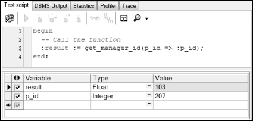

## 本章简介
&emsp;&emsp;本章涉及的内容比较多，也比较杂，既会介绍如何创建用户和角色，如何使用GRANT和REVOKE语句授予和撤销对象权限这些访问控制的问题，也会介绍Oracle过程、函数和触发器这类PL/SQL子程序。

 

 

 

## 7.1  访问控制

 

&emsp;&emsp;在前面的章节中，一直使用HR用户登录数据库，访问并操作数据库对象。本节将介绍如何添加新的用户，赋予不同级别的访问权限，控制对数据库对象的访问。

&emsp;&emsp;Oracle是一个多用户访问的数据库服务器，提供了对数据库级别的访问控制、对数据库对象级别的访问控制，并能授予和撤销对对象的各种访问权限。

&emsp;&emsp;访问数据库并使用数据库对象需要权限，用户需要系统权限来访问数据库，需要对象权限来操作数据库对象。数据库管理员是一个特殊的用户，该用户本身可以访问数据库并操作数据库对象，同时还具有授予用户访问数据库及对象的权限。但并不是所有的授权都是由数据库管理员完成的，他们可以将这种授权的权利分配给其他用户，使其他用户在可授权的范围内进行授权。

### 7.1.1  创建用户  

&emsp;&emsp;要想给用户分配系统权限和对象权限，首先要创建用户。创建用户也需要权限，如果使用HR用户访问Oracle数据库，执行创建用户的SQL语句，Oracle会提示“权限不足”。那么可以使用具有数据库管理员身份的用户SYS来访问数据库，创建用户。

&emsp;&emsp;创建用户的语法形式如下：


```
CREATE USER user

IDENTIFIED BY password
```


&emsp;&emsp;其中user和password就是该用户的用户名和密码。例如通过下面的SQL语句，创建一个用户名为jacky的用户，密码为jacky123456。


```
CREATE USER jacky 

IDENTIFIED BY jacky123456
```


&emsp;&emsp;执行该SQL语句（SYS账户），之后通过PL/SQL Dev查看Users文件夹，如图7.1所示，显示jacky用户创建成功。

&emsp;&emsp;数据库管理员可以使用下面的语法形式给用户重置密码，用户也可以用此语法修改自己的密码。


```
ALTER USER user 

IDENTIFIED BY password
```


<p align="center"></p>  
<p align="center">图7.1  创建用户</p>  

### 7.1.2  系统权限  

&emsp;&emsp;创建了用户jacky之后，数据库管理员就可以给这个用户授予指定的系统权限。给一个用户授权的简要语法形式如下：


```
GRANT privilege1[,privilege2…]

TO user | role | PUBLIC
```


&emsp;&emsp;其中privilege1、privilege2…表示要授予的权限，user表示用户的名字，role表示角色（后面会介绍）名字，PUBLIC表示每一个用户都被授权。

&emsp;&emsp;作为程序开发人员，常被授予的系统权限包括以下五项。

&emsp;&emsp;（1）允许用户登录：CREATE SESSION。

&emsp;&emsp;（2）允许创建表：CREATE TABLE。

&emsp;&emsp;（3）允许创建视图：CREATE VIEW。

&emsp;&emsp;（4）允许创建序列：CREATE SEQUENCE。

&emsp;&emsp;（5）允许创建过程：CREATE PROCEDURE。

&emsp;&emsp;下面的SQL语句实现了将前四个权限授予给jacky用户的目的。


```
GRANT create session, create table, create view, create sequence

TO jacky
```


&emsp;&emsp;执行该SQL语句，相关系统权限被授予jacky用户。在图7.1所示的界面中，右击jacky用户，选择Edit选项，在弹出的窗口中选择System privileges（系统权限）选项卡，结果如图7.2所示，四个权限已经授予了jacky用户，可以使用jacky用户访问数据库了。


<p align="center"></p>  
<p align="center">图7.2  授予系统权限</p>  

&emsp;&emsp;在图7.2中，第二列Grantable的含义是jacky用户是否有权限将第一列相关的系统权限授权给其他用户，默认情况下是不允许的，这个授予权限的权限也需要授权，在PL/SQL Dev图形界面下，直接选中即可。

&emsp;&emsp;还是在图7.2中，刚才选择的是第四个系统权限选项卡，细心的读者已经观察到，第二个Object privileges是对象权限选项卡，第三个Role privileges是角色权限选项卡，打开之后分别能看到jacky用户拥有哪些对象权限和角色权限。

### 7.1.3  角色权限  

&emsp;&emsp;数据库的系统权限、用户权限很多，如果针对每个用户逐个分配每个权限，是一项复杂且容易出错的工作。而且一类用户需要分配的权限往往也是一致的，此时可将相关的一系列的权限组成一个命名的组，这个权限组就是角色。角色拥有的权限称为角色权限，将角色权限授予用户（又称为给用户指定角色），则这个角色权限所拥有的权限就全部授予了这个用户。一个用户可以被指定为多个角色，这个用户就同时拥有这多个角色所拥有的全部权限。

&emsp;&emsp;角色必须由数据库管理员创建，数据库管理员为用户指定角色，创建角色的语法如下：


```
CREATE ROLE role
```


&emsp;&emsp;其中role为角色名，数据库管理员可以使用GRANT语句将权限授予角色，也可以给用户指定角色。下面的SQL语句分别实现了创建角色、将权限授予角色和给用户指定角色。


```
CREATE ROLE developer;

GRANT create table, create view, create sequence, create procedure TO developer;

GRANT developer TO jacky;
```


&emsp;&emsp;执行SQL语句，通过PL/SQL Dev查看Roles文件夹，找到developer角色，右击developer角色，选择Edit选项，在弹出的窗口中单击打开System privileges选项卡，如图7.3所示，确定developer角色拥有被授予的四个权限。再单击打开用户jacky的Role privileges选项卡，确定jacky用户被指定为developer角色，如图7.4所示。


<p align="center"></p>  
<p align="center">图7.3  授予角色权限</p>  
<p align="center"></p>  
<p align="center">图7.4  给用户指定角色</p>  


&emsp;&emsp;Oracle数据库内置了一些角色，可供数据库管理员直接使用。对于程序开发人员使用的Oracle用户，数据库管理员通常给这些用户指定为resource和connect角色，而对于最终用户使用的Oracle用户，通常仅指定为connect角色。关于这两个角色分别具有什么权限，读者可以查询相关的数据字典视图。

### 7.1.4  对象权限  

&emsp;&emsp;对象权限是在指定的表、视图、序列和过程等对象上执行特定操作的权限，这里的特定权限包括INSERT、DELETE、UPDATE和SELECT以及INDEX、ALTER、REFERENCES（引用权限）和EXECUTE（执行权限）。但并不是每个对象都可以被授予这些权限，表7.1列出了各个对象可以被授予哪些权限。

表7.1  对象可被授予的权限

| 对象权限   | 表（Table） | 视图（View） | 序列（Sequence） | 过程（Procedure） |
| ---------- | ----------- | ------------ | ---------------- | ----------------- |
| INSERT     | ●           | ●            |                  |                   |
| DELETE     | ●           | ●            |                  |                   |
| UPDATE     | ●           | ●            |                  |                   |
| SELECT     | ●           | ●            | ●                |                   |
| INDEX      | ●           |              |                  |                   |
| ALTER      | ●           |              | ●                |                   |
| REFERENCES | ●           | ●            |                  |                   |
| EXECUTE    |             |              |                  | ●                 |

 

&emsp;&emsp;用户创建对象，并指定对象的所有者（默认是创建对象的用户）。对象的拥有者有关于该对象的所有权限，可以授予其所拥有对象的权限给另一个用户或角色。而且，如果使用了WITH GRANT OPTION选项，则得到权限的用户可以再将权限授予其他的用户。

&emsp;&emsp;给一个用户授权对象权限的语法形式如下：


```
GRANT object_priv[(columnlist)]

ON object

TO user | role | PUBLIC

[WITH GRANT OPTION]
```


&emsp;&emsp;其中，object_priv表示将被授予的对象权限，可以包括多个对象权限，用逗号隔开。也可以不输入具体的对象权限，直接输入ALL，表示授予该对象所能拥有的所有权限。columnlist表示被指定授权的字段（表和视图中的）的列表，object表示被授权的对象，user表示用户的名字，role表示角色名字，PUBLIC表示每一个用户都被授权，WITH GRANT OPTION表示允许被授予权限的人再授予对象权限给其他用户和角色。

&emsp;&emsp;假设现在需要给jacky用户授予针对雇员表employees的查询和插入权限，因为雇员表的所有者是HR用户，所以用HR用户身份访问Oracle数据库，完成对jacky用户的授权工作。具体的授权SQL语句如下：


```
GRANT select, insert

ON employees

TO jacky
```


&emsp;&emsp;执行该SQL语句，给jacky用户授予了相关权限，通过PL/SQL Dev查看jacky用户的对象权限（用HR用户身份查看），如图7.5所示。

&emsp;&emsp;接下来使用jacky用户登录数据库，执行下面的SQL语句：


```
SELECT * FROM employees
```


<p align="center"></p>  
<p align="center">图7.5  授予对象权限</p>  

&emsp;&emsp;提示“表或视图不存在”，什么原因呢？不是刚刚给jacky用户授予了查询employees表的权限吗？其原因在于，在数据库中，方案（schema）是管理数据库对象的逻辑结构，一个数据库对象的全称应该是“方案名.对象名”（默认情况下方案名等于用户的名字），之前不使用方案名的原因是用户操作的数据库对象是本用户的对象，方案名可以省略。而现在是用jacky用户访问数据库，需要操作HR用户的employees对象，所以必须写全名，故正确的SQL语句如下（执行完后会获得对应的数据）：


```
SELECT * FROM hr.employees
```


&emsp;&emsp;仍然使用jacky用户访问数据库，如果执行的是更新或删除语句，则会提示“权限不足”。另外，在访问数据库对象时，总是带着方案名显然让人觉得不舒服，可以创建一个同义词（SYNONYM，需要有创建同义词的权限），通过同义词进行访问。具体的SQL语句如下：


```
CREATE SYNONYM emps FOR hr.employees;

SELECT * FROM emps;
```


&emsp;&emsp;表7.2列出了部分已授予权限的相关视图，可以通过这些视图了解权限授予的情况。注意使用什么用户身份访问数据库，查询的就是该用户相关权限信息。

表7.2  已授予权限视图

| 数据字典视图        | 说    明                                       |
| ------------------- | ---------------------------------------------- |
| ROLE_SYS_PRIVS      | 显示通过角色授予用户的系统权限                 |
| ROLE_TAB_PRIVS      | 显示通过角色授予用户的对象权限                 |
| USER_COL_PRIVS      | 显示列上的权限，用户是属主、授予者或被授予者   |
| USER_COL_PRIVS_MADE | 显示列上已授予的权限，用户是属主或授予者       |
| USER_COL_PRIVS_RECD | 显示列上已授予的权限，用户是属主或被授予者     |
| USER_ROLE_PRIVS     | 显示已授予给用户的所有角色                     |
| USER_SYS_PRIVS      | 显示已授予给用户的所有系统权限                 |
| USER_TAB_PRIVS      | 显示已授予给用户的所有对象权限                 |
| USER_TAB_PRIVS_MADE | 显示已授予给其他用户的对象权限，用户是属主     |
| USER_TAB_PRIVS_RECD | 显示已授予给其他用户的对象权限，用户是被授予者 |

### 7.1.5  撤销权限  

&emsp;&emsp;既然可以授予权限，同样也可以撤销权限。使用REVOKE语句可撤销已经授予用户的权限，通过WITH GRANT OPTION可以撤销给其他用户授权的权限。具体撤销授权的语法如下：

```

REVOKE privilege1[,privilege2…]

ON object

FROM user | role | PUBLIC

[WITH GRANT OPTION]

```

&emsp;&emsp;例如要撤销给jacky用户针对雇员表employees的插入权限（用HR用户身份操作），其SQL语句如下：

 

```

REVOKE insert

ON employees

FROM jacky

```

 

&emsp;&emsp;执行该SQL语句，针对雇员表的插入权限被撤销。此操作是撤销对象权限，接下来的SQL语句实现了撤销jacky用户创建序列的系统权限的功能。需要注意的是，执行此SQL语句需要用系统管理员账户。


```
REVOKE create sequence

FROM jacky
```


## 7.2  上机任务


#### 目标：完成本章7.1节的任务。

 


时间：40分钟。

 


形式：每个学员独立完成，小组组长检查。

 


工具：PL/SQL Dev。

 


注意：需要以不同的用户身份访问数据库，完成授予和撤销权限的操作。

 

 

 

 


## 7.3  子程序

 

&emsp;&emsp;从本节开始，将简要地介绍一些Oracle PL/SQL编程的概念。虽然PL/SQL编程不是软件开发人员需要学习的重点内容，但其中一些重要的概念必须掌握，因为在企业面试时，经常会被问到。

### 7.3.1  子程序概述  

&emsp;&emsp;子程序是一个数据库对象，存在于数据库中，里面存放的是PL/SQL代码，可以完成一定的功能，能被程序和客户端工具直接调用。子程序类似Java中的方法，可以接收参数，按照是否有返回值的不同，子程序可以分为过程和函数。

&emsp;&emsp;子程序可以被编译和存储在数据库中，它具有模块化、重用性、可维护性、可扩展性、安全性等特点。模块化是将大的代码块分解为较小代码模块，在代码被模块化之后，模块可以被同一个程序重用，或被其他程序调用，而且较小的模块也更容易维护和调试。根据需求，可以将各个小模块组织起来，完成一些特定的功能，增强了系统的可扩展性。另外，子程序也是数据库对象，可以被授权执行，这样只有授权用户才能访问，增强了安全性。

&emsp;&emsp;子程序的程序结构如下：


```
<header>

IS | AS

声明部分

BEGIN

可执行部分

EXCEPTION（可选）

异常部分

END;
```


&emsp;&emsp;程序结构中前两行是子程序说明部分，其中header确定PL/SQL子程序的类型（过程或函数）、名称和参数列表，如果是函数的话，还会有RETURN子句。

&emsp;&emsp;从声明部分开始到最后，属于子程序的主体。在IS | AS和BEGIN之间的是声明部分，BEGIN和END之间是子程序的核心—可执行部分，其中至少包含一条语句，EXCEPTION和END之间是异常部分，这部分用于捕获预先定义的错误。

### 7.3.2  过程  

&emsp;&emsp;本小节将介绍创建过程（也称为存储过程）和调用过程，并通过一个例子让读者对过程有初步的了解。至于详细的参数模式介绍、参数默认值、异常处理等内容，有兴趣的读者可以自己深入初步的学习。

- 创建过程

&emsp;&emsp;创建过程的语法形式如下：


```
CREATE [OR REPLACE] PROCEDURE pname

​    [ (param1        [mode1]        type1,

​    param2         [mode2]        type2,

​    …)]

IS | AS

BEGIN

​    PL/SQL Block

END [pname]
```


&emsp;&emsp;语法解释如下：

&emsp;&emsp;（1）pname：过程名称。

&emsp;&emsp;（2）param1、param2：形参名称。

&emsp;&emsp;（3）mode1、mode2：参数模式，包括IN（默认）、OUT、IN OUT。

&emsp;&emsp;（4）type1、type2：参数数据类型。

&emsp;&emsp;（5）PL/SQL Block：PL/SQL代码块。

&emsp;&emsp;过程的参数模式对于读者来说是一个新的概念，其主要作用在于确定参数是从调用环境传递到过程还是从过程传递到调用环境。参数模式有三种可以选择，如图7.6所示，默认的是IN模式，即参数从调用环境传递到过程，相反的是OUT模式，参数从过程传递到调用环境，IN OUT是兼备IN和OUT两个模式的功能。


<p align="center"></p>  
<p align="center">图7.6  过程参数模式</p>  


&emsp;&emsp;假设现在要创建这样的过程，实现的功能是要给指定的（通过雇员编号指定）雇员加薪，如果雇员编号在200以内加薪10%，雇员编号大于等于200则加薪15%，创建存储过程的SQL语句如下（用HR用户身份创建）：


```
CREATE OR REPLACE PROCEDURE raise_salary

  (p_id IN employees.employee_id%TYPE)

IS

BEGIN

  IF p_id >= 200 THEN

​    BEGIN

​      UPDATE employees

​      SET salary = salary * 1.15

​      WHERE employee_id = p_id;

​    END;

  END IF;

  IF p_id < 200 THEN

​    BEGIN

​      UPDATE employees

​      SET salary = salary * 1.10

​      WHERE employee_id = p_id;

​    END;

  END IF;

END raise_salary;
```


- 调用过程

&emsp;&emsp;编译该过程，再通过PL/SQL Dev查看Procedures文件夹，如图7.7所示，右击RAISE_SALARY，选择Test script选项，在弹出的窗口中对应p_id这个形参输入实参值，如图7.8所示，输入了实参207代表要给雇员编号为207的雇员加薪。


<p align="center"></p>  
<p align="center">图7.7  Procedures文件夹 </p>  
<p align="center"></p>  
<p align="center">图7.8  调用过程</p>  


&emsp;&emsp;之前添加雇员编号为207的雇员雇员时薪水为8000元，因为雇员编号大于等于200，故加薪15%，更新后的薪水应该是9200元。执行该脚本（增加了COMMIT提交语句），再次查询雇员编号为207的雇员薪水，的确更新为9200元。

&emsp;&emsp;在不同的调用环境下，过程的调用方式不完全一致。刚才创建的过程，在SQL*PLUS中被调用的语句为“EXECUTE raise_salary(207)”或“EXEC raise_salary(207)”，而在PL/SQL代码中则直接使用“raise_salary(207)”调用。

&emsp;&emsp;最后需要补充一点，使用过程（包括函数）的好处除了之前提到的诸如重用性之类的好处外，还包括使用过程可以使程序性能比较好，因为存储过程是预编译的，执行速度快；另外从调用环境调用过程，代码简单，传输的数据量小，不需要将过程中的全部代码通过网络传递到数据库服务器，也减轻了网络传输压力。

- 删除过程

&emsp;&emsp;删除存储过程的语法比较简单，如下：

```

DROP PROCEDURE pname;

```

&emsp;&emsp;例如，删除过程raise_salary的SQL语句如下：

```

DROP PROCEDURE raise_salary;

```

### 7.3.3  函数  

&emsp;&emsp;函数与过程很类似，本小节会采用和过程对比的方式介绍函数。函数与过程的区别主要体现在如表7.3所示的几个方面。

表7.3  函数和过程的区别

| 函    数                                                 | 过    程                                    |
| -------------------------------------------------------- | ------------------------------------------- |
| 一般用于计算数据                                         | 完成特定的任务                              |
| 声明为FUNCTION                                           | 声明为PROCEDURE                             |
| 需要描述返回类型，且PL/SQL块中至少有一个有效的RETURN语句 | 无返回类型，可通过OUT、IN OUT参数返回多个值 |
| 不能独立运行，必须作为表达式的一部分                     | 可作为一个独立的PL/SQL语句运行              |
| 在DML和DQL中可调用函数                                   | 在DML和DQL中不可调用过程                    |

 

- 创建函数

&emsp;&emsp;创建函数的语法形式如下：


```
CREATE [OR REPLACE] FUNCTION fname

[ (param1       [mode1]        type1,

param2         [mode2]        type2,

…)]

​         RETURN type

IS | AS

BEGIN

​         PL/SQL Block

END [fname]
```


&emsp;&emsp;其中必须注意的是，在IS | AS之前要确定返回值类型，在PL/SQL Block块中需要有效的返回语句。

&emsp;&emsp;假设要创建一个通过雇员编号获取部门经理编号的函数，其SQL语句如下（用HR用户身份创建）：


```
CREATE OR REPLACE FUNCTION get_manager_id

(p_id IN employees.employee_id%TYPE)

RETURN NUMBER

IS

v_manager_id employees.manager_id%TYPE :=0;

BEGIN

SELECT manager_id INTO v_manager_id

FROM employees WHERE employee_id = p_id;

RETURN v_manager_id;

END get_manager_id;
```


- 调用函数

&emsp;&emsp;编译该函数，再通过PL/SQL Dev查看Functions文件夹，右击get_manager_id函数，选择Test script选项，在弹出的窗口中对应p_id这个形参输入实参207，执行该脚本，显示获得的部门经理编号为103，如图7.9所示。


<p align="center"></p>  
<p align="center">图7.9  调用函数</p>  

&emsp;&emsp;不仅可以通过这种方式调用函数，还可以用如下SELECT语句调用函数：


```
SELECT get_manager_id(207) FROM dual
```


&emsp;&emsp;执行该SQL语句，显示结果为103。

- 删除函数

&emsp;&emsp;删除函数的语法形式如下：

```

DROP FUNCTION fname;

```

&emsp;&emsp;例如，删除函数get_manager_id的语句如下：

```

DROP FUNCTION get_manager_id;

```

### 7.3.4  游标  

&emsp;&emsp;游标又称光标，是SQL的一个内存工作区，由系统或用户以变量的形式定义，主要用于暂时存放受SQL语句影响到的所有数据。换句话说，数据库会将受SQL影响的数据暂时放到一个内存区域的虚表中，这个虚表就是游标。

&emsp;&emsp;游标有两种类型：显式游标和隐式游标。

&emsp;&emsp;隐式游标：单行SELECT...INTO...语句以及对数据库的DML操作都会自动创建隐式游标，用于暂时保存操作结果。简单地讲，凡是能够回滚的操作都会创建隐式游标。

&emsp;&emsp;显式游标：一个显式游标对应一个返回结果为多行多列的SELECT语句，类似于Java语法中的ResultSet对象。如果要提取多行数据，就需要自定义一个显式游标，并用游标保存待提取的多行数据，最后再逐行处理。

&emsp;&emsp;无论是隐式游标还是显式游标，都具有如表7.4所示的四个属性。

表7.4  游标的属性

| 属    性  | 简    介                            |
| --------- | ----------------------------------- |
| %rowcount | 受SQL影响的行数，即游标中包含的行数 |
| %found    | 布尔值，游标中是否还有数据          |
| %notfound | 布尔值，游标中是否已无数据          |
| %isopen   | 游标是否打开                        |

&emsp;&emsp;实际开发中，使用较多的是显式游标，本节也主要讲解显式游标的使用。

&emsp;&emsp;显式游标的使用需要经过以下四个步骤。

- 声明游标

&emsp;&emsp;在DECLEAR部分按以下格式声明游标：

```

CURSOR cname[(参数1 数据类型[，参数2 数据类型...])]

IS SELECT语句;

l 打开游标

在可执行部分，按以下格式打开游标：

OPEN cname[(实际参数1[，实际参数2...])];
```

- 提取数据

&emsp;&emsp;在可执行部分，按以下格式将游标工作区中的数据提取到变量中：

```

FETCH cname INTO 变量名1[，变量名2...];

```

&emsp;&emsp;前面说过，游标中可以保存多行数据。因此，如果要依次使用游标中的每一行数据，就需要使用FETCH关键字将每一行的数据提取到当前的变量中。

- 关闭游标

&emsp;&emsp;游标使用完毕后，就需要执行关闭的命令，代码如下：

```

CLOSE cname;

```

&emsp;&emsp;以下代码定义了一个游标cemp，用于保存所有员工的first_name和salary值，然后再通过循环语句取出游标cemp中的每一行记录并打印。

```
declare 

  --定义游标

  cursor cemp is select first_name,salary from EMPLOYEES;

  pename employees.first_name%type;

  psal employees.salary%type;

begin

  open cemp;

  loop

​    --依次取出每一条记录

​    fetch cemp into pename,psal;

​    --退出条件：没有取到记录

​    exit when cemp%notfound;

​    dbms_output.put_line(pename||'的薪水是'||psal);

  end loop;

  close cemp;

end;
```

### 7.3.5  触发器  

&emsp;&emsp;触发器是一个数据库对象，是一个特殊的过程，当特定的事件发生时隐式地执行。比如在一个表中发生插入、更新或删除的事件，或者CREATE、ALTER这样的数据定义语句执行时，触发器会隐式执行。当一些用户行为或数据库系统行为发生时（例如用户登录或数据库关闭时），触发器也会隐式执行。

&emsp;&emsp;数据库触发器可以被定义在表或视图上，也可以被定义在数据库或方案上，针对数据库的触发器对所有的用户起作用，而针对方案的触发器仅对指定用户起作用。

&emsp;&emsp;设计触发器的目的就是当一个指定的操作被执行时，相关的操作被自动隐式执行，触发器不关心是哪个用户或是哪个应用程序执行的这个指定的操作。

&emsp;&emsp;本小节介绍触发器，与介绍过程和函数一样，采用以点带面的方式，通过一个案例让大家对触发器有一个初步的认识。

&emsp;&emsp;一个针对表的触发器语句通常需要包括如表7.5所示的内容。

表7.5  触发器组成部分

| 部    分   | 说    明               | 举    例               |
| ---------- | ---------------------- | ---------------------- |
| 触发时间   | 触发器体执行的时机     | BEFORE、AFTER          |
| 触发事件   | 哪类具体的数据操纵语句 | INSERT、UPDATE、DELETE |
| 触发器类型 | 触发器体被执行次数     | Statement、Row         |
| 触发器体   | 触发器执行的具体操作   | PL/SQL块               |

 

&emsp;&emsp;需要特别说明的是触发器类型，当设置为Statement（默认）时，称为语句触发器，触发器体对于触发事件只执行一次，即使没有行受影响；当设置为Row时，称为行触发器，触发器体对受触发事件影响的每行执行一次。

- 创建和测试语句触发器

&emsp;&emsp;创建针对表的语句触发器的语法形式如下：


```
CREATE [OR REPLACE] TRIGGER tname

timing

​         event1 [OR event2 OR event3]

​         ON table

trigger_body
```


&emsp;&emsp;其中，tname表示触发器名字，timing表示触发时间，event1、event2和event3表示触发事件，table表示针对的表，trigger_body表示触发器体，具体的内容可以和表7.5对应。

&emsp;&emsp;例如需要创建这样一个触发器，只能在周一到周五的9:00到18:00才可以针对部门表departments进行DML操作。需要说明的是，下面创建触发器的SQL语句中，RAISE_ APPLICATION_ERROR是一个内建过程，它返回一个错误给用户，并导致PL/SQL块失败。当一个数据库触发器失败时，触发语句会自动回滚。


```
CREATE OR REPLACE TRIGGER dml_depts_time

BEFORE 

INSERT OR UPDATE OR DELETE 

ON departments

BEGIN

IF TO_CHAR(SYSDATE, 'HH24:MI') NOT BETWEEN '08:00' AND '18:00' OR TO_CHAR 

(SYSDATE, 'DY') IN ('SAT', 'SUN') THEN

RAISE_APPLICATION_ERROR (-20205,'You may only make changes during normal office hours');

END IF;

END dml_depts_time;
```


&emsp;&emsp;编译该触发器，通过PL/SQL Dev查看Triggers文件夹，可以看到刚编译的dml_depts_time触发器。为了验证触发器是否可以使用，选择在非工作时间，执行下面的SQL语句更新部门表的数据，执行结果如图7.10所示，触发器提示失败。


```
UPDATE departments

SET department_name = 'IT GROUP'

WHERE department_id = 60
```


<p align="center"></p>  
<p align="center">图7.10  语句触发器提示失败</p>  


- 创建和测试行触发器

&emsp;&emsp;创建针对表的行触发器的语法形式如下：


```
CREATE [OR REPLACE] TRIGGER tname

timing

​         event1 [OR event2 OR event3]

​         ON table

[REFERENCING OLD AS old | NEW AS new]

FOR EACH ROW

​         [WHEN(condition)]

trigger_body
```


&emsp;&emsp;和语句触发器不同的是，行触发器中增加的REFERENCING OLD AS old | NEW AS new表示声明当前行新、老值的别名，默认别名是old和new，FOR EACH ROW表示此触发器为行触发器，WHEN（condition）表示触发器的约束。

&emsp;&emsp;例如需要创建这样一个行触发器，当更改了雇员表中某行的职位编号字段或部门编号字段后，自动在职位变迁表job_history中增加一行记录，记录该雇员的职位（包括部门）变迁情况。创建行触发器的SQL语句如下：


```
CREATE OR REPLACE TRIGGER update_job_history

AFTER 

​         UPDATE OF job_id, department_id 

​         ON employees

FOR EACH ROW

BEGIN

INSERT INTO job_history (employee_id, start_date, end_date, job_id, department_id)

VALUES(:old.employee_id, :old.hire_date, sysdate, :old.job_id, :old.department_id);

END;
```


&emsp;&emsp;编译该触发器。为了验证该触发器是否起作用，执行下面的SQL语句（更新两行）并提交事务，打开职位变迁表job_history，自动增加了两行记录，如图7.11所示。


```
UPDATE employees

SET department_id = 90

WHERE employee_id IN (106, 107)

```


<p align="center"></p>  
<p align="center">图7.11  行触发器执行结果</p>  


## 7.4  上机任务


#### 目标：完成本章7.3节的任务。

 


时间：60分钟。

 


形式：每个学员独立完成，小组组长检查。 

 


工具：PL/SQL Dev。

 

注意：过程和函数在不同调用环境下调用的方法不同。

 

 

 

 

 


## 7.5  本章练习

 

1  Oracle数据库中，通常分配给最终用户的角色是（    ）。（选择一项）

&emsp;&emsp;A．connect

&emsp;&emsp;B．resource

&emsp;&emsp;C．developer

&emsp;&emsp;D．user

2  作为程序开发人员，常被授予的系统权限包括 \_\_\_\_\_\_、\_\_\_\_\_\_ 、\_\_\_\_\_\_、\_\_\_\_\_\_、\_\_\_\_\_\_。

3  授予和撤销权限的关键字分别是\_\_\_\_\_\_和\_\_\_\_\_\_\_    。

4  请描述什么是存储过程和触发器，并介绍使用存储过程的好处。

 

 

5  请描述Oracle中过程和函数的区别。

 

 

6  一个触发器包括哪几个部分？语句触发器和行触发器有什么区别？

 