## 本章简介
&emsp;&emsp;从本章开始，将系统介绍结构化查询语言SQL，本章的重点是查询语句和排序。在系统学习SQL之前，先简单介绍一下接下来要操作的几个数据库表（Oracle默认用户HR登录后可以操作的表），了解表的作用，包括哪些字段以及表和表之间的关系。

 

 

 

## 2.1  数据库表简介

 

&emsp;&emsp;通过第1章图1.36可以看到，HR用户可以操作的用户表共有七个，它们的基本情况如表2.1所示。

表2.1  HR用户表简介

| 序    号 | 表    名    | 表  作  用                                                   |
| -------- | ----------- | ------------------------------------------------------------ |
| 1        | EMPLOYEES   | 雇员信息表，包括所在部门编号，所从事职位编号以及部门经理雇员编号等 |
| 2        | DEPARTMENTS | 部门信息表，包括部门所在地编号等                             |
| 3        | JOBS        | 职位信息表                                                   |
| 4        | LOCATIONS   | 所在地信息表，包括所在地所属国家编号等                       |
| 5        | COUNTRIES   | 国家信息表，包括国家所在大洲编号等                           |
| 6        | REGIONS     | 大洲信息表                                                   |
| 7        | JOB_HISTORY | 职位变迁表，包括雇员编号、职位编号、部门编号等               |

### 2.1.1  获取表数据  

&emsp;&emsp;第1章在简介PL/SQL Dev这个Oracle客户端工具如何使用的时候，已经介绍了通过选择表对象，右击Query data的方式获取表数据。接下来分别获取上述七个表的部分数据，直观感受这些表里到底存了什么数据。

- EMPLOYEES表（见图2.1）


<p align="center">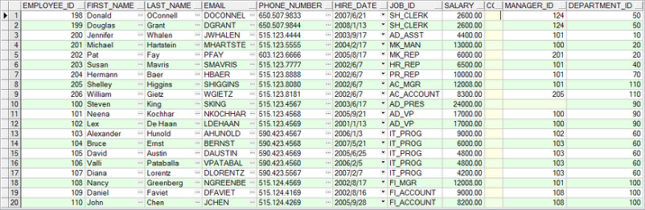</p>  
<p align="center">图2.1  EMPLOYEES表数据</p>  


- DEPARTMENTS表（见图2.2）


<p align="center">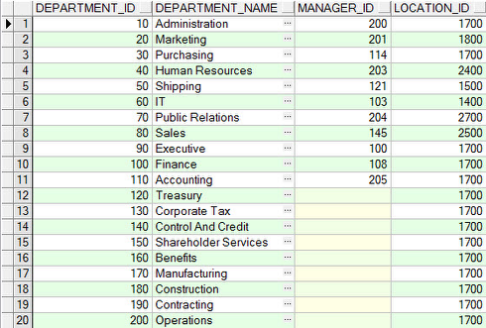</p>  
<p align="center">图2.2  DEPARTMENTS表数据</p>  


- JOBS表（见图2.3）


<p align="center">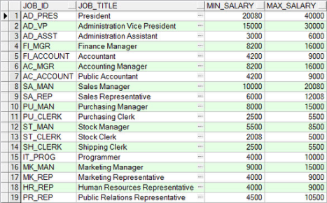</p>  
<p align="center">图2.3  JOBS表数据</p>  


- LOCATIONS表（见图2.4）


<p align="center">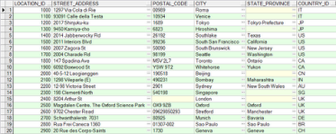</p>  
<p align="center">图2.4  LOCATIONS表数据</p>  


- COUNTRIES表和REGIONS表（见图2.5和图2.6）


<p align="center"></p>  
<p align="center"> 图2.5  COUNTRIES表数据 </p>  


<p align="center">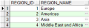</p>  
<p align="center">图2.6  REGIONS表数据</p>  


​                               

- JOB_HISTORY表（见图2.7）


<p align="center">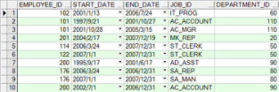</p>  
<p align="center">图2.7  JOB_HISTORY表数据</p>  


&emsp;&emsp;在数据库这门课程中，我们把每一行数据整体称为一条“记录”，而把每一列的标题称为一个“字段”（如EMPLOYEE_ID、START_DATE等）。

### 2.1.2  获取表结构  

&emsp;&emsp;获取了七个表的部分表数据之后，读者对这些表已经有了直观的认识，并且似乎已经感觉到这些表之间的联系。接下来，要更进一步，查看这几个表的表结构，重点是表里有哪些字段，这些字段有什么要求。由于篇幅关系，这里仅以EMPLOYEES为例查看表结构，其他表要求大家自己查看。

&emsp;&emsp;在PL/SQL Dev中获取表结构的方法也很简单，选择表对象EMPLOYEES，右击Edit，再切换到Columns选项卡，得到如图2.8所示的内容。


<p align="center"></p>  
<p align="center">图2.8  EMPLOYEES表结构</p>  


&emsp;&emsp;从图2.8中可以看出，EMPLOYEES表包含11个字段，分别是代表雇员编号字段EMPLOYEE_ID、雇员名（不含姓）字段FIRST_NAME、雇员姓字段LAST_NAME、邮箱字段EMAIL、电话字段PHONE_NUMBER、雇佣日期字段HIRE_DATE、职位编号字段JOB_ID、薪水字段SALARY、佣金百分比字段COMMISSION_PCT、所属经理编号字段MANAGER_ID和所属部门编号字段DEPARTMENT_ID。

&emsp;&emsp;数据库表中的每个字段都规定了特定的类型，存放在该字段中的值必须符合类型的要求，这和Java语言中的数据类型类似。Oracle中支持的数据类型，包括五个大类：字符型、数值型、日期时间型、大对象型、伪列型，每个大类中又包括很多详细的类型。这么多的类型都记忆下来比较困难，在学习阶段只需要记住一些日常开发中常使用到的类型就可以了。表2.2列出了这些Oracle常用数据类型。

表2.2  Oracle常用数据类型

| 类    型       | 含    义                                                     |
| -------------- | ------------------------------------------------------------ |
| CHAR(size)     | 存储固定长度的字符串。参数size指定了长度，如果存储的字符串长度小于size，用空格填充。默认长度为1，最长不超过2000字节 |
| VARCHAR2(size) | 存储可变长度的字符串。参数size指定了该字符串的最大长度。默认长度为1，最长不超过4000字节 |
| NUMBER(p,s)    | 存储变长的数字。既可以存储浮点数，也可以存储整数，p表示数字的最大位数（如果是小数包括整数部分、小数部分和小数点，p默认是38位），s表示小数位数 |
| DATE           | 存储定长的日期或时间。存储世纪、年、月、日、时、分、秒，存储范围从公元前4712年1月1日到公元后9999年12月31日 |
| TIMESTAMP      | 和DATE类型大致相同，不过TIMESTAMP精确到了秒后6位小数         |
| CLOB           | 存储单字节字符大数据。和VARCHAR2数据类型相似，可存储的数据最大可以达到4GB，可以用来存储非结构化的XML文档 |
| BLOB           | 存储无结构的二进制大数据。可存储的数据最大可以达到4GB，可以用来存储图像、视频、音频等信息 |
| ROWID          | 表中行的存储地址，该地址可以唯一标识数据库中的一行，可以使用 ROWID 伪列快速定位表中的一行 |
| ROWNUM         | 查询返回的结果集中行的序号，可以使用它来限制查询返回的行数   |

 

&emsp;&emsp;在学习了Oracle常用数据类型之后，再次查看图2.8显示的EMPLOYEES表中11个字段。可以发现，FIRST_NAME、LAST_NAME、EMAIL、PHONE_NUMBER和JOB_ID这些字段都是VARCHAR2类型，EMPLOYEE_ID、SALARY、COMMISSION_PCT、MANAGER_ID和DEPARTMENT_ID这些字段都是NUMBER类型，HIRE_DATE这个字段是DATE类型。

&emsp;&emsp;图2.8中第三列，指出该表中每个字段是否允许为空。从显示结果来看，EMPLOYEE_ID、LAST_NAME、EMAIL、HIRE_DATE、JOB_ID这五个字段不可以为空。

&emsp;&emsp;通过Columns选项卡，可以了解该表每个字段的属性，这是了解表结构的重点。同时也可以通过General、Keys、Checks、Indexes这四个选项卡（见图2.9～图2.12），分别了解该表的基本信息、键、约束和索引，这些内容会在后面的课程中详细介绍。


<p align="center">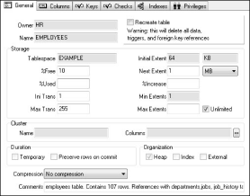</p>  
<p align="center">图2.9  General选项卡</p>  


<p align="center"></p>  
<p align="center">图2.10  Keys选项卡</p>  


<p align="center"></p>  
<p align="center">图2.11  Checks选项卡</p>  


<p align="center">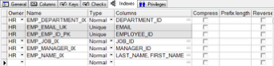</p>  
<p align="center">图2.12  Indexes选项卡</p>  


## 2.2  上机任务


目标：

&emsp;&emsp;（1）完成本章2.1节的任务。

&emsp;&emsp;（2）查看HR账户表中除EMPLOYEES表以外的其他表的表结构。


时间：20分钟。

 


形式：每个学员独立完成。

 


工具：PL/SQL Dev。


## 2.3  数据查询

 

&emsp;&emsp;在数据库操作中，查询是最常用的操作，也是最复杂的操作。根据不同的需求可以写出不同的SQL语句，甚至同一个需求也可以写出多个SQL语句。就像数学中的一题多解一样，其中肯定有一种高效率的写法。所以写好一个查询的SQL语句是非常重要的，它甚至可以影响程序的执行效率，进而决定程序的好坏。

&emsp;&emsp;为了从数据库中查询数据，需要使用SQL中的SELECT语句。有时候并不需要获取表中所有的数据，也可以使用SQL语言中的一些关键字来对行或列进行限制。本节将介绍如何使用SELECT语句获取指定表中的数据。

&emsp;&emsp;使用SELECT语句，可以进行列选择，即选择表中的列，这些列就是要获取的指定列；使用SELECT语句还可以进行行选择，即根据条件选择表中的行，并返回这些指定的行。使用SELECT语句还可以进行多表连接，这些数据原本存储在不同的表中，通过SELECT语句在它们之间建立起连接，形成一个满足特定连接需求的数据集合，关于多表连接的内容将会在后面的课程中介绍。SELECT语句的功能如图2.13所示。


<p align="center"></p>  
<p align="center">图2.13   SELECT语句功能</p>  


### 2.3.1  基本SELECT语句  

&emsp;&emsp;SELECT语句的基本语法形式如下：


```
SELECT   *|字段名|表达式   FROM  表名  [WHERE 条件 [ORDER BY 字段名]]
```


&emsp;&emsp;在最简单的形式中，SELECT语句必须包含一个SELECT子句，指定需要显示的字段；还需要一个FROM子句，指定从哪个表获取数据。

&emsp;&emsp;语法解释如下。

- *：选择表中的所有字段。

- 字段名：选择表中的字段名称，可以选择多个字段，各个字段间用逗号分隔。

- 表达式：由字段、函数等组成。

- 表名：指定包含字段的表。

- WHERE条件：查询的条件，可以通过该条件进行行选择。

- ORDER BY字段名：要求在查询的结果中进行排序，默认是升序ASC，若希望是降序则使用关键字DESC。

&emsp;&emsp;假设要通过SQL语句查询DEPARTMENTS表中所有列、所有行的数据，可以使用下面的语句：


```
SELECT * FROM DEPARTMENTS
```


&emsp;&emsp;要想让上面的SQL语句在PL/SQL Dev中执行，可以通过单击PL/SQL Dev左上角第一个图标新建一个SQL Window，如图2.14所示。在打开的SQL Window中输入SQL语句（这里SQL语句使用小写，SQL是不区分大小写的），并以“;”结尾，单击左上角第二排第二个图标（或按F8键）执行该SQL语句，返回需要查询的结果集，如图2.15所示。由于窗口显示内容的限制，可能仅显示了部分数据，通过单击和图标，可以显示下一页和到最后页的数据。


<p align="center">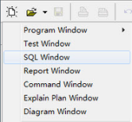</p>  
<p align="center">图2.14  新建一个SQL Window </p>  


<p align="center">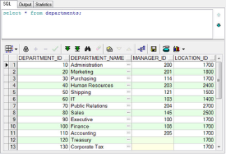</p>  
<p align="center">图2.15  执行SELECT语句</p>  


​                        

&emsp;&emsp;通过查询结果和之前对DEPARTMENTS表的了解，知道此表包括DEPARTMENT_ID、DEPARTMENT_NAME、MANAGER_ID和LOCATION_ID四个字段，如果仅想查询部门编号和部门名称这两个字段，可以编写如下的SQL语句（为了方便阅读，接下来编写的SQL语句中，SQL关键字将采用大写字母，非SQL关键字将采用小写字母，这也符合日常程序员编写SQL语句的习惯）。

 
```
SELECT department_id,department_name FROM departments
```
 

&emsp;&emsp;在SELECT子句中，所选择字段的显示顺序可以由程序员自己决定，例如想把部门名称字段显示在部门编号之前，则可以编写如下SQL语句：

 
```
SELECT department_name, department_id FROM departments
```
 

&emsp;&emsp;从现在开始，需要大量编写SQL语句了，在编写SQL语句之前，先了解一下作为软件开发人员，编写SQL语句应该遵循哪些规则。遵循了这些规则编写的SQL语句，容易阅读、容易编辑，但因为书籍篇幅问题，书中的SQL语句大多没有采用如下规则。

- SQL语句对大小写不敏感，但通常SQL关键字采用大写字母，非SQL关键字采用小写字母。

- SQL语句可以写成一行或多行，为了易于阅读和编辑，子句通常放在不同的行，且使用缩进。

&emsp;&emsp;例如上面的SQL语句，按SQL语句需遵循的规则，应该写成：

 
```
SELECT department_name, department_id 

FROM departments
```
 

### 2.3.2  算术表达式  

&emsp;&emsp;数据库表中存储的数据，可能并不是最终要显示的数据，会存在需要修改数据显示内容以达到显示所需数据的目的，这样就可能会用到算术表达式。一个算术表达式可以包含字段名、固定的数字值和算术运算符。

&emsp;&emsp;Oracle中的算术运算符，没有Java中的算术运算符丰富，只有“+”、“-”、“*”、“/”四个，其中“/”运算的结果是浮点数。求余运算只能借助函数MOD(x,y)来完成，这个函数的作用就是返回x除以y的余数。

&emsp;&emsp;要特别说明一点，在Oracle中，可以对DATE和TIMESTAMP类型进行加、减操作，具体加、减的含义和用法，在后面的课程中会讲到。

&emsp;&emsp;现在有这样的需求：过圣诞节了，公司决定给每个雇员发500元过节费，随薪水一起发放。现需要显示出每个员工的编号、名字和当月实发薪酬，可以编写如下SQL语句：

 
```
SELECT employee_id,first_name,salary+500 FROM employees
```
 

&emsp;&emsp;SQL语句中合成的计算列不是employees表中新的字段，显示的新列来源于对字段的计算而已。

&emsp;&emsp;如果需要显示每个雇员的月薪以及年薪，可以通过月薪*12+500元过节费的方式计算年薪并显示，其SQL语句如下：

 
```
SELECT employee_id,first_name,salary, salary*12+500 FROM employees
```
 

&emsp;&emsp;部分显示结果如图2.16所示。


<p align="center">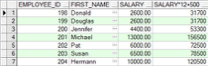</p>  
<p align="center">图2.16  SQL算数表达式</p>  


### 2.3.3  字段别名  

&emsp;&emsp;在显示月薪、年薪的例子中，年薪字段的标题为“SALARY*12+500”，这样的描述难以理解，不能满足用户的需求，接下来通过字段别名的方法解决这个问题。

&emsp;&emsp;在SELECT所选字段后面可以指定别名，字段名和别名之间用空格分开。在默认情况下，别名标题用大写字母显示，如果别名中包含空格或者特殊字符（如#或&），或者大小写敏感，需要将别名放在双引号中。

&emsp;&emsp;还是上面显示雇员编号、名字、月薪和年薪的例子，这次要求做两点改进，一是只需要显示雇员名字和年薪两个字段的数据，二是雇员名字字段显示的标题为Name而不是FIRST_NAME，年薪字段的标题改为Yearly Salary，其SQL语句如下：

 
```
SELECT first_name "Name",salary*12+500 "Yearly Salary" FROM employees
```


 

&emsp;&emsp;因为字段别名要求大小写敏感，而且带有空格，所以使用了双引号，部分显示结果如图2.17所示。


<p align="center">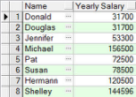</p>  
<p align="center">图2.17  SQL字段别名</p>  


&emsp;&emsp;也可以使用可选关键字AS表示别名，SQL语句如下，功能与之前的SQL语句没有差别，但为了阅读方便，推荐软件开发人员使用该关键字。

 
```
SELECT first_name AS "Name",salary*12+500 AS "Yearly Salary" FROM employees
```

### 2.3.4  连字运算符  

&emsp;&emsp;在实际编程过程中，因为业务需求，可能需要将两个或多个字段连接成一个字段显示，这就要用到连字运算符“||”。使用连字运算符，可以进行字段与字段、字段与表达式、字段与常数值之间的连接，来创建一个字符表达式，连字运算符两边的字段被合并成一个单个的列输出。

&emsp;&emsp;继续调整上面的案例，如果想将first_name和last_name合并成一个字段显示，且字段标题设置为Name，其SQL语句如下：

 
```
SELECT first_name || last_name AS "Name",salary*12+500 AS "Yearly Salary" FROM employees
```
 

&emsp;&emsp;部分显示结果如图2.18所示。

&emsp;&emsp;从显示结果可以看到，连字运算符“||”连接了first_name和last_name两个字段。但是在将这两个字段连接时，中间没有空格，并不是理想的结果。针对这样的情况，可以使用连字运算符“||”将字段和字符串常量（包括数字、日期类型）进行连接以达到目的，具体SQL语句如下，执行结果如图2.19所示。


<p align="center"></p>  
<p align="center">图2.18  SQL连字运算符之非理想结果</p>  


<p align="center">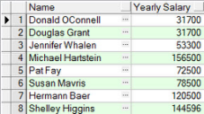</p>  
<p align="center"> 图2.19  SQL连字运算符之理想结果</p>  


​                 

 
```
SELECT first_name || ' ' || last_name AS "Name",salary*12+500 AS "Yearly Salary" FROM employees
```
 

&emsp;&emsp;需要注意的是，如果连接的是数字，则可以不用单引号；如果是字符串或日期类型，则必须使用单引号；如果字符串常量中包含了单引号，则可以使用两个单引号表示一个单引号常量。

### 2.3.5  去除重复行  

&emsp;&emsp;如果需要查询显示employees表中员工的部门编号，其SQL语句非常简单：

 
```
SELECT department_id FROM employees
```
 

&emsp;&emsp;部分显示结果如图2.20所示。可以看出，部门编号存在大量的重复，这说明SELECT语句默认显示所有的行，包括相同的行，如果想除去相同的行，需要使用DISTINCT关键字，具体SQL语句如下：

 
```
SELECT DISTINCT department_id FROM employees
```
 

&emsp;&emsp;结果如图2.21所示。


<p align="center">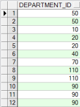</p>  
<p align="center">图2.20  SELECT存在重复的行</p>  


<p align="center">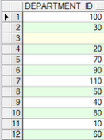</p>  
<p align="center">图2.21  SQL DISTINCT关键字</p>  


​                            

&emsp;&emsp;为了在结果中除去相同的行，在SELECT子句中的SELECT关键字后面紧跟DISTINCT关键字。在DISTINCT关键字后面，可以指定多个字段，DISTINCT关键字影响所有被选定的字段组合的结果。


## 2.4  上机任务


目标：完成本章2.3节的任务。

 


时间：30分钟。

 


形式：每个学员独立完成，小组组长检查。

 


工具：PL/SQL Dev。


## 2.5  限定返回行

&emsp;&emsp;从数据库取回数据的时候，可能需要根据条件限制所显示的数据行。本节将通过WHERE关键字及其子句，完成限定返回行的任务。

### 2.5.1  限定行初步  

&emsp;&emsp;继续操作employees表，如果仅需要查询部门编号为60的所有雇员，则可以使用如下SQL语句：

 
```
SELECT * FROM employees WHERE department_id = 60
```
 

&emsp;&emsp;执行该SQL语句，按要求仅查询出了五个雇员的信息。

&emsp;&emsp;使用WHERE子句，可以限制查询满足条件的行，WHERE子句能够比较字段值、文字值、算术表达式或函数，内部由字段名、比较条件和比较值三个部分组成。

&emsp;&emsp;在WHERE子句中字符串和日期必须包含在单引号中，数字常数不需要。尤其需要注意的是，虽然说SQL语句是大小写不敏感的，但是在使用WHERE子句进行条件限定时，这个比较值是大小写敏感的。

&emsp;&emsp;例如要查询departments表中部门名称为“IT”的部门信息，SQL语句应该是：

 
```
SELECT * FROM departments WHERE department_name = 'IT'
```
 

&emsp;&emsp;通过该SQL语句，正常查询出所需要的信息，如图2.22所示。但是如果把WHERE子句写成WHERE department_name = 'it'，执行SQL，没有行返回。

&emsp;&emsp;那么如何使比较值大小写不敏感呢？可以使用单行函数UPPER和LOWER来解决这个问题，在后续课程中会讲到。

&emsp;&emsp;在WHERE子句中，比较条件不仅有“=”，还包括“>”、“>=”、“<”、“<=”、“<>”、“!=”、“^=”，其中最后三个均可代表不等于。 

&emsp;&emsp;回到employees表，如果希望查询出薪水大于等于12000元的雇员的名字和薪水，则可以用下面的SQL语句：

 
```
SELECT first_name, salary FROM employees WHERE salary >= 12000
```
 

执行SQL语句，结果如图2.23所示。


<p align="center">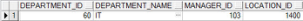</p>  
<p align="center">图2.22  SQL WHERE子句 </p>  


<p align="center"></p>  
<p align="center">图2.23  WHERE子句比较条件</p>  


​                                      

### 2.5.2  限定行进阶  

&emsp;&emsp;前面提交了几个简单的比较条件，“=”、“>”、“>=”、“<”、“<=”、“<>”、“!=”、“^=”。接下来介绍其他几个条件。

- BETWEEN…AND…条件

&emsp;&emsp;使用BETWEEN条件可以查询显示上下限之间的行。例如希望查询出雇员表中薪水在6000～12000元的雇员的名字和薪水，可以用下面的SQL语句：

 
```
SELECT first_name, salary FROM employees WHERE salary BETWEEN 6000 AND 12000
```
 

&emsp;&emsp;BETWEEN…AND…本质上是由Oracle转变为一对AND条件：(a >= 下限) AND(a <= 上限)，所以使用BETWEEN…AND…并没有性能的提高，只是逻辑上简单而已。

- IN条件

&emsp;&emsp;IN条件也称为成员条件，用以查询出所选字段中符合指定的一组值中的一个。例如希望查询出雇员表中部门编号是60或90的雇员信息，可以用下面的SQL语句：

 
```
SELECT * FROM employees WHERE department_id IN(60,90)
```
 

&emsp;&emsp;在IN条件中可以使用任何数据类型，下面的例子从employees表中查询雇员的名字、薪水和职位编号字段，且仅查询职位编号是AD_VP、IT_PROG或FI_ACCOUNT的雇员，SQL语句如下：

 
```
SELECT job_id, first_name, salary FROM employees WHERE job_id IN('AD_VP','IT_PROG','FI_ACC OUNT')
```
 

&emsp;&emsp;同样的，IN(value1,value2,value3)本质上是由Oracle转变为一组OR条件：a = value1 OR a = value2 OR a = value3，所以使用IN 条件也没有得到性能的提高。

- LIKE条件

&emsp;&emsp;假设希望搜索employees里所有以D开头的雇员的名字和薪水信息，这时候就需要用到LIKE条件。LIKE条件查询通常也称为通配符查询，可以使用两个通配符来构造需要匹配的字符模板，其中“%”表示零个或多个字符，“_”表示一个字符，这里提到的字符既可以是文字也可以是数字。上面的需求可以用如下的SQL语句实现：

 
```
SELECT first_name, salary FROM employees WHERE first_name LIKE 'D%'
```
 

&emsp;&emsp;执行SQL语句，结果显示了雇员名字中以D开头的9个工程师的名字和薪水。

&emsp;&emsp;“%”和“_”通配符可以被组合使用，例如LIKE '%s_' 表示匹配倒数第二个位置字符为s的字符串。不过，当确实需要匹配“%”和“_”这两个字符的时候，可以使用ESCAPE选项，该选项指定换码符是什么。如果想要搜索employees表里job_id包含“AD_”的雇员职位编号、名字和薪水信息，可以用下面的SQL语句：

 
```
SELECT job_id, first_name, salary FROM employees WHERE job_id LIKE '%AD$_%' ESCAPE '$' 
```
 

&emsp;&emsp;其中ESCAPE选项指定美元符“$”为换码符，即不将美元符后面的“_”当作通配符看待。执行SQL语句，结果如图2.24所示。


<p align="center">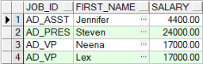</p>  
<p align="center">图2.24 “%”和“_”通配符组合使用</p>  


- NULL条件

&emsp;&emsp;NULL条件，包括IS NULL条件和IS NOT NULL条件。IS NULL条件用于判断空值，在Oracle中，空值的含义为难以获得的、未指定的、未知的或者不适用的。这种学术的描述对软件开发人员意义不大，但判断空值时不可以使用“=”进行判断，因为NULL不能等于或不等于任何值。

&emsp;&emsp;如果要查询没有佣金的雇员的职位编号、名字和佣金百分比，用下面的SQL语句：

 
```
SELECT job_id,first_name,commission_pct FROM employees WHERE commission_pct IS NULL
```
 

&emsp;&emsp;部分显示结果如图2.25所示。


<p align="center">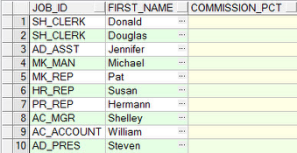</p>  
<p align="center">图2.25  NULL条件使用</p>  


- 逻辑条件

&emsp;&emsp;前面使用的都是单个的比较条件，有时候往往一个比较条件难以满足查询的需求，这时候可以使用逻辑条件将多个比较条件组合起来使用。SQL语言的三个逻辑运算符分别是AND、OR和NOT，其含义顾名思义，就是与、或和非。

&emsp;&emsp;如果要从雇员表中查询出部门编号为50，且薪水大于等于5000元的雇员全部信息，SQL语句如下：

 
```
SELECT * FROM employees WHERE department_id = 50 AND salary >= 5000
```
 

&emsp;&emsp;关于逻辑条件中的NOT运算符，需要注意的是，它通常需要和其他比较运算符一起使用，通常有IN、BETWEEN、LIKE和NULL。

 
```
...WHERE job_id NOT IN ('ST_CLERK', 'AD_VP'，'SA_REP') 

...WHERE salary NOT BETWEEN 6000 AND 12000 

...WHERE last_name NOT LIKE '_S%' 

...WHERE commission_pct IS NOT NULL
```
 

- 优先规则

&emsp;&emsp;优先规则定义表达式求值和计算的顺序，默认的优先顺序如下：

&emsp;&emsp;（1）算术运算。

&emsp;&emsp;（2）连字操作。

&emsp;&emsp;（3）比较操作。

&emsp;&emsp;（4）IS [NOT] NULL、LIKE、[NOT] IN。

&emsp;&emsp;（5）[NOT] BETWEEN。

&emsp;&emsp;（6）NOT逻辑条件。

&emsp;&emsp;（7）AND逻辑条件。

&emsp;&emsp;（8）OR逻辑条件。

&emsp;&emsp;和Java语言一样，在编写SQL语句时，可以用圆括号括住想要先计算的表达式来覆盖默认的优先顺序。作为软件开发人员，为了使自己编写的SQL语句具有良好的可读性，在碰到优先规则不明确的情况时，建议直接使用圆括号标识优先顺序。


## 2.6  上机任务


目标：完成本章2.5节的任务。

 


时间：30分钟。

 


形式：每个学员独立完成，小组组长检查。

 


工具：PL/SQL Dev。

 


## 2.7  排序


&emsp;&emsp;前面介绍了采用SELECT语句，通过各种方式查询出所需的行、列数据。不过取回行的顺序是由Oracle数据库服务器决定的，本节将会介绍如何对查询出来的数据进行排序显示。

### 2.7.1  排序初步  

&emsp;&emsp;要在一个不明确顺序的查询结果中对行进行排序，可以使用ORDER BY子句，它必须位于SQL语句的最后。指定一个表达式，或者一个字段名，作为排序条件。ORDER BY子句的语法形式如下：

 
```
ORDER BY {column, expr} [ASC|DESC]
```
 

&emsp;&emsp;其中ORDER BY {column, expr}指定需要排序的字段或表达式，ASC以升序排列，DESC以降序排列，默认以升序排列。

&emsp;&emsp;针对不同的数据类型，其默认升序的含义如下：

- 对于数字类型，小的值在前面显示。

- 对于日期类型，早的日期在前面显示。

- 对于字符类型，依字母顺序显示，a在前，z最后。

- 对于空值，升序排序时显示在最后，降序排序时显示在最前面。

&emsp;&emsp;如果要查询出雇员表的职位编号、名字和薪水信息，且按薪水从低到高的顺序进行排列显示，其SQL语句如下：

 
```
SELECT job_id,first_name,salary FROM employees ORDER BY salary
```
 

&emsp;&emsp;执行该SQL语句，部分显示结果如图2.26所示。

&emsp;&emsp;如果要查询出雇员表的职位编号、名字、薪水和雇佣日期信息，且以雇佣日期降序进行排列，其SQL语句如下：

 
```
SELECT job_id,first_name,salary,hire_date FROM employees ORDER BY hire_date DESC
```
 

&emsp;&emsp;执行该SQL语句，部分显示结果如图2.27所示。


<p align="center">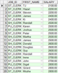</p>  
<p align="center">图2.26  ORDER BY子句使用</p>  


<p align="center">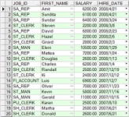</p>  
<p align="center">图2.27  ORDER BY子句降序排列</p>  


​                         

### 2.7.2  排序进阶  

&emsp;&emsp;上面我们使用了字段名进行排序，在ORDER BY子句中，不仅可以使用字段，还可以使用字段别名进行排序。将上面的案例进行些许的调整，看如何使用字段别名进行排序。

 
```
SELECT job_id,first_name,salary,hire_date AS hdate FROM employees ORDER BY hdate DESC
```
 

&emsp;&emsp;该案例中，给hire_date字段设定别名为hdate，在ORDER BY子句中对别名hdate进行降序排序，排序结果没有发生变化。

&emsp;&emsp;接下来介绍本章最后一个知识点：多重排序。所谓多重排序，也叫多列排序，即先以一个字段对查询结果进行排序，然后在这个排序的基础上再对另一个字段进行排序，最终显示经多次排序后的查询结果。其中ORDER BY列表的顺序就是排序的顺序。

&emsp;&emsp;在ORDER BY子句中，多个指定的字段名之间用逗号分开。如果想要倒序排序一个字段，在该字段名后面增加DESC。可以用没有包括在SELECT子句中的字段排序，但排序的字段必须是表中的字段。

&emsp;&emsp;针对雇员表，需要显示雇员的职位编号、名字和薪水信息。先用职位编号顺序排序，再用薪水降序排序，其SQL语句如下，部分显示结果如图2.28所示。

 
```
SELECT job_id,first_name,salary FROM employees ORDER BY job_id, salary DESC
```
 


<p align="center">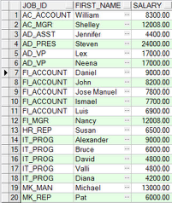</p>  
<p align="center">图2.28  多重排列</p>  


 


## 2.8  上机任务


目标：完成本章2.7节的任务。

 


时间：10分钟。

 


形式：每个学员独立完成，小组组长检查。

 


工具：PL/SQL Dev。


## 2.9  本章练习

 

1  在SQL语言中，要去除重复的行应该使用（    ）关键字。（选择一项）

A．DISTINCT

B．BETWEEN

C．ESCAPE

D．ORDER BY

2  对数据库查询出来的数据进行排序，需要使用的关键字是        ，如果想逆序排序，需要增加的关键字是        。

 

 

 

3  写SQL语句完成如下功能：操作employees表，将last_name和job_id字段连接，中间用逗号隔开，并且用Name and Job作为字段标题。

 

 

 

4  写SQL语句完成如下功能：操作employees表，选定查询department_id和job_id字段，并去掉重复的行。

 

 

 

5  SQL语句中有哪两个通配符，含义分别是什么？

 

 

